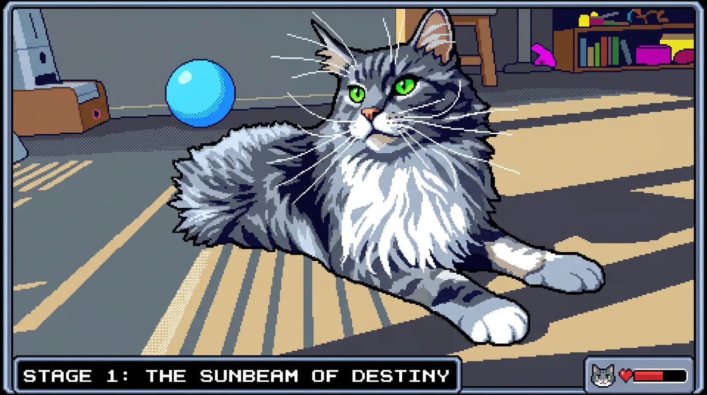
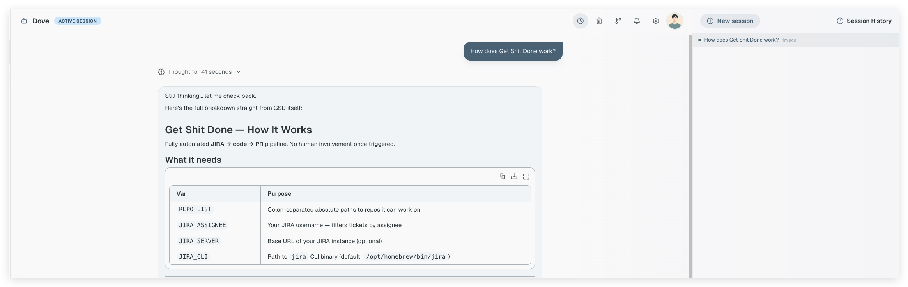

<p align="center">
  
</p>

<h1 align="center">DovePaw</h1>

<p align="center">
  <strong>Personal AI agent orchestration runtime for Claude Code and the Claude Agent SDK.</strong><br/>
  Build private TypeScript agents, connect them with A2A, and run autonomous engineering workflows in the background on macOS.
</p>

<p align="center">
  <a href="https://www.typescriptlang.org/"></a>
  <a href="https://www.npmjs.com/package/@anthropic-ai/claude-agent-sdk"></a>
  <a href="https://google.github.io/A2A/"></a>
  <a href="https://nextjs.org/"></a>
  
</p>

<p align="center">
  <a href="https://support.claude.com/en/articles/15036540-use-the-claude-agent-sdk-with-your-claude-plan">⚠️ <strong>Pricing change — June 15, 2026:</strong> Agent SDK usage moves to separate monthly credits (Pro $20 · Max $100–200 · Team/Enterprise $20–200). Credits require opt-in and drain first; once exhausted, requests charge usage credits or stop.</a>
</p>

---

## What is DovePaw?

**DovePaw** is a macOS desktop app for building, scheduling, and orchestrating private Claude Code agents. It gives you a personal runtime for TypeScript-based AI agent workflows, powered by the Claude Agent SDK, A2A protocol, launchd scheduling, and an Electron UI.

Instead of running one-off prompts in a terminal, DovePaw lets you turn repeat engineering work into reusable agents: triaging Dependabot PRs, patching security vulnerabilities, reviewing pull requests, generating engineering digests, checking UI changes in an embedded browser, and handing work between specialized agents.

The goal is simple: keep your agents private, keep the deterministic parts in code, and let Claude handle the judgment-heavy parts.

---

<p align="center">
  
</p>

---

At the centre is **Dove**: a Claude Agent SDK orchestrator for personal AI agent automation. Dove knows which agents are installed, what each one is responsible for, and when to hand work off. You talk to Dove; Dove routes the request to the right Claude Code agent; the agent runs the workflow in the background, on a schedule, or from chat.

**What DovePaw helps you automate:**

- Repeat software engineering tasks such as Dependabot triage, security patching, pull request review, ticket implementation, and documentation writing
- Scheduled Claude Code workflows that run unattended through macOS launchd
- Multi-agent handoffs where one agent can invoke, await, or delegate work to another agent over A2A
- Private engineering automation that stays in your own repos, with only the agents you install allowed to run

**Why a dedicated app instead of running Claude Code directly?**

- **Settings UI** — manage repos, env vars, agent schedules, and agent links from a browser tab instead of editing JSON files under `~/.dovepaw/` by hand
- **Persistent sidebar** — all your agents in one place; click any agent to open its conversation without hunting for a terminal session
- **Embedded browser panel** — quick look-ups and UI verification in a dedicated Chromium panel; agents can drive it via the `dovepaw-browser` skill without touching your Chrome browser or interrupting your personal tabs
- **Background daemons stay alive** — the Electron menubar process keeps all A2A servers running; close the chatbot tab and agents keep going
- **Session history** — every agent run is stored and resumable; pick up a long-running job from where it left off

> Full background: [Building DovePaw — A Personal Engineering Blog Series](https://medium.com/@ywian/building-dovepaw-a-personal-engineering-blog-series-3634f3185b90)

---

## Agent Script Workflows

Each Claude Code agent is a `main.ts` file that defines a workflow — anything from a single skill call to a multi-step pipeline across several repositories. You decide the shape. The pattern is always the same: **TypeScript for the deterministic parts, Claude CLI for the judgment.**

Simple workflow — just invoke a skill:

```typescript
await spawnClaudeWithSignals({ prompt: `/security-audit ${repo}` });
```

Full pipeline — loop repos, glue multiple skills, parallelize:

```typescript
// Phase 1: parallel analysis across all repos
await Promise.all(
  repos.map((repo) => spawnClaudeWithSignals({ prompt: buildAnalysisPrompt(repo), cwd: repo })),
);

// Phase 2: sequential fix pass
for (const repo of reposThatNeedFix(results)) {
  await spawnClaudeWithSignals({ prompt: `/patch-skill fix ${repo}` });
}
```

You don't ask Claude to loop over a list. You loop in TypeScript and ask Claude once per item. The two layers stay separate.

Every workflow follows the same shape:

```
Configuration   — env vars, paths, logger
buildPrompt()   — compose what Claude CLI receives
main()          — gather data → spawnClaudeWithSignals() → handle output
```

`spawnClaudeWithSignals()` from `@dovepaw/agent-sdk` is the only place Claude runs. Everything before it is TypeScript.

**Agents are dual-mode.** When the chatbot triggers one, the user's instruction arrives as `process.argv[2]`. When launchd fires on schedule with no argument, the agent runs in batch mode across all configured repos. Same script, two entry points.

```typescript
// agent-local/my-agent/main.ts
import { spawnClaudeWithSignals, createLogger } from "@dovepaw/agent-sdk";

const log = createLogger("my-agent");
const instruction = process.argv[2]; // set by chatbot; undefined in batch mode

async function buildPrompt(repo: string) {
  return `Analyse ${repo} and report findings.`;
}

async function main() {
  const repos = instruction ? [instruction] : process.env.REPO_LIST!.split(","); // batch mode

  for (const repo of repos) {
    const prompt = await buildPrompt(repo);
    await spawnClaudeWithSignals({ prompt, cwd: repo });
  }
}

main();
```

<p align="center">
  
</p>

→ Run `/sub-agent-builder` in Claude Code to scaffold a new workflow interactively — it drops the files into `~/.dovepaw/tmp/` so the agent appears in Dove's sidebar immediately, no install step needed.

→ See [docs/agent-workflows.md](docs/agent-workflows.md) for the full workflow spectrum, SDK helpers, and multi-step pipeline patterns.

---

## Why A2A?

Each agent runs as an independent Express process connected to Dove via the [A2A protocol](https://a2a-protocol.org/) over SSE. This gives DovePaw a clean orchestration layer for multi-agent workflows without coupling agents directly together. Three tools, one agent:

| Tool           | Behaviour                                          |
| -------------- | -------------------------------------------------- |
| `ask_<name>`   | Blocking — Dove waits for the agent to finish      |
| `start_<name>` | Fire-and-forget — returns a session ID immediately |
| `await_<name>` | Polling — retrieves a prior `start_*` result       |

This trio gives Dove fine-grained control over pacing. A quick lookup uses `ask_*`. A long-running job uses `start_*` + `await_*` so Dove can do other work while it runs.

**Why a protocol instead of direct function calls?**

- **Cron/launchd just fires an HTTP trigger** — the scheduler doesn't need to manage processes, env vars, or Claude CLI; it posts one A2A message and the server handles the rest
- Each agent is a separate OS process — isolated, independently restartable, no shared memory
- Ports are OS-assigned at startup and published to `~/.dovepaw/` — no port config, no conflicts
- Any agent can invoke any other agent the same way — the same A2A call whether Dove or another agent is the caller
- Agents can be added, removed, or restarted without touching DovePaw itself

→ See [docs/architecture.md](docs/architecture.md) for the full three-layer runtime diagram.

---

## Scheduled Agents — Run Autonomously on a Cron

Every Claude Code agent can run on a schedule. The easiest way is through the **Settings UI** — open any agent's settings page, toggle scheduling on, and set the time. DovePaw turns that schedule into a macOS launchd job and triggers the agent through A2A.

For manual setup, add a `schedule` field to `agent.json`:

```json
{
  "name": "my-agent",
  "schedulingEnabled": true,
  "schedule": { "type": "calendar", "hour": 9, "minute": 0 }
}
```

```bash
npm run build
npm run electron:dev
```

The scheduler fires one A2A HTTP trigger. The A2A server picks it up, spawns the agent script, and the workflow runs exactly as it would from the chatbot — same code, same dual-mode entry, no special path.

**Real examples running on this setup:**

| Schedule      | Example agent   | What it does                                                  |
| ------------- | --------------- | ------------------------------------------------------------- |
| Daily 9am     | `pr-triager`    | Reviews and merges safe Dependabot PRs across all repos       |
| Daily 8am     | `vuln-scanner`  | Scans for new CVEs, patches, opens fix PRs                    |
| Weekly Monday | `digest-writer` | Drafts a weekly engineering summary from recent commits       |
| Nightly       | `repo-janitor`  | Cleans stale branches, closes resolved issues, updates labels |

Scheduled runs are unattended — no terminal, no human in the loop. Results land in session history; open the agent's conversation in Dove to review what ran overnight.

---

## Agent Hints Define the Handoff Boundary

The `description` field in `agent.json` is the communication contract.

Dove reads it as the MCP tool description. That description is how Dove decides _when_ to invoke an agent and _what_ to send it. Writing it well is the most important thing you do when building an agent.

```json
{
  "name": "security-patcher",
  "description": "Patches Dependabot security alerts in a GitHub repo. Invoke when asked to fix, patch, or resolve security vulnerabilities, CVEs, or Dependabot alerts. Accepts a repo name or 'all' to run across all configured repos. Do NOT invoke for feature work, bug fixes, or dependency upgrades that are not security-related.",
  "doveCard": {
    "title": "Security Patcher",
    "description": "Fix Dependabot security alerts across your repos"
  }
}
```

Three things the description must do:

1. **State what the agent does** — Dove matches this against the user's intent
2. **State when to invoke** — trigger phrases, input formats, scope
3. **State what to exclude** — hard boundaries that prevent mis-routing

**Agent links wire the handoff graph.** Beyond the description, you can declare directional connections between agents in `~/.dovepaw/agent-links.json`. Agent A can invoke agent B only if a link exists. Connectivity is gated on heartbeat — if B's A2A server isn't running, the link is inactive and Dove won't attempt the route.

```
security-patcher → pr-reviewer
dependabot-merger → security-patcher
blog-writer → pr-reviewer
```

This keeps each agent focused on one thing. The links define the flow — not Dove's code, not the agent scripts.

→ See [docs/agent-links.md](docs/agent-links.md) for the full agent links reference.

---

## Embedded Browser, Right in Your Workflow

DovePaw runs as an Electron app. Alongside the chatbot window, there's an embedded Chromium browser panel — a slim, persistent browser tab that lives inside the same window.

Any agent can drive it via the `dovepaw-browser` skill. No switching apps. No external browser automation setup.

```bash
# From inside an agent or skill:
PORT=$(python3 -c "import json; d=json.load(open('$HOME/.dovepaw/.browser-bridge-port.json')); print(d['port'])")
BRIDGE="http://127.0.0.1:${PORT}"

# Navigate to a page
curl -s -X POST "${BRIDGE}/command" \
  -H 'Content-Type: application/json' \
  -d '{"action":"navigate","args":{"url":"https://your-app.com"},"session":"my-agent"}'

# Take a screenshot (use the helper — avoids base64 flooding context)
bash "$SKILL_PATH/../scripts/screenshot.sh" -o /tmp/before.png
```

**What makes it useful:**

- **Per-agent sessions** — each agent gets its own browser tab, isolated from others running in parallel
- **Skill-driven** — `/dovepaw-browser` is a Claude Code skill; invoke it from any agent script or directly in chat
- **Persistent panel** — the browser tab survives between agent runs; state is preserved across a session
- **Toggle visibility** — show the panel only when you want to watch what the agent is doing

Typical use cases: verifying a UI change before a PR, scraping a page as part of a research agent, logging into an internal tool for a one-off task.

---

## Plugin System — Your Agents, Your Repos

Agents are packaged as **plugin repos** — ordinary git repos with a `dovepaw-plugin.json` manifest. DovePaw clones them into `~/.dovepaw/plugins/` and wires everything at startup. Adding or removing a Claude Code agent is just install or uninstall — no changes to DovePaw itself.

```bash
npm run plugin:add owner/my-agents        # GitHub slug, uses gh CLI auth
npm run plugin:add https://github.com/owner/private-agents  # full git URL
npm run plugin:add ../my-agents           # local path during development
```

Your agent code stays in your repos, under your access control. Private infrastructure, private APIs, private repos — nothing sensitive has to go public.

**Try it now** — install the test agents plugin to verify your setup end-to-end:

```bash
npm run plugin:add PixelPaw-Labs/DovePaw-Test-Agents
npm run build
npm run electron:dev
```

[DovePaw-Test-Agents](https://github.com/PixelPaw-Labs/DovePaw-Test-Agents) is a reference plugin with simple agents you can poke at to confirm the full stack is wired correctly before building your own.

Use the built-in `/sub-agent-builder` skill in Claude Code to scaffold a new agent end-to-end from a description. It generates `agent.json`, `main.ts`, and the plugin manifest. You write the logic.

---

## Getting Started

> **macOS only.** DovePaw uses launchd for daemon scheduling and Electron for the menubar app.  
> **Prerequisite:** Claude Code CLI installed and authenticated, or `ANTHROPIC_API_KEY` set.

```bash
npm install
npm run build
npm run electron:dev
```

Click the menubar icon to open Dove.

`npm run build` is only needed on first setup or after adding/removing agents. Day-to-day:

```bash
npm run electron:dev
```

**Adding an agent after first setup:**

```bash
npm run plugin:add owner/my-plugin
npm run build
npm run electron:dev
```

→ See [docs/getting-started.md](docs/getting-started.md) for a step-by-step walkthrough with screenshots.

---

## Docs

| Document                                           | Contents                                                      |
| -------------------------------------------------- | ------------------------------------------------------------- |
| [docs/architecture.md](docs/architecture.md)       | Three-layer runtime, tech stack, design decisions             |
| [docs/agent-workflows.md](docs/agent-workflows.md) | Workflow spectrum: single skill to full pipeline, SDK helpers |
| [docs/agent-links.md](docs/agent-links.md)         | Wiring agents together, handoff graph                         |
| [docs/getting-started.md](docs/getting-started.md) | Step-by-step setup with screenshots                           |

---

## If You Find This Interesting

This is a personal project — built on nights and weekends, shaped by real problems I wanted to stop doing manually. Not a framework, not a product. Just something that works well for me.

If it sparks ideas for your own setup, feel free to fork it. The plugin system is designed for that — your agents, your repos, your rules.

If you find it useful, a ⭐ goes a long way.
