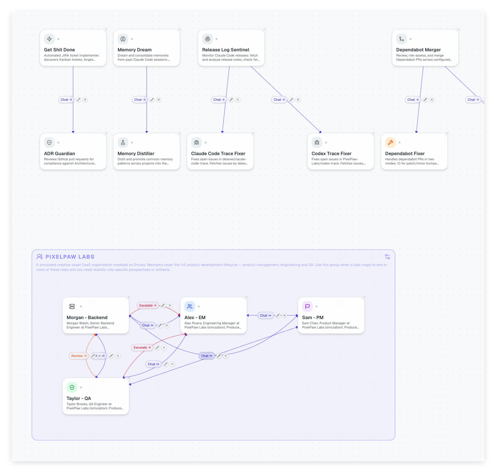

# Agent Links and Handoff Boundaries

## The Description is the Contract

The `description` field in `agent.json` is the most important thing you write when building an agent. It becomes the MCP tool description that Dove reads at runtime — this is how Dove decides _when_ to invoke an agent and _what_ to send it.

A good description has three parts:

1. **What the agent does** — Dove matches this against the user's intent
2. **When to invoke** — trigger phrases, expected input formats, scope
3. **What to exclude** — hard boundaries that prevent mis-routing

```json
{
  "name": "dependabot-merger",
  "description": "Reviews and merges Dependabot PRs across configured repos. Invoke when asked to process, merge, triage, or review Dependabot PRs or dependency updates. Accepts a repo name or 'all'. Do NOT invoke for security alerts, vulnerability patching, or feature-related dependency changes — those go to security-patcher."
}
```

The exclusion line (`Do NOT invoke for...`) is as important as the rest. Without it, Dove may route ambiguous requests to the wrong agent.

## Agent Links

Beyond the description, you can declare directional connections between agents in `~/.dovepaw/agent-links.json`. A link declares that agent A can invoke agent B — and _how_ (the strategy).

```json
[
  { "source": "security-patcher", "target": "pr-reviewer", "strategy": "ask" },
  { "source": "dependabot-merger", "target": "security-patcher", "strategy": "start" },
  { "source": "blog-writer", "target": "pr-reviewer", "strategy": "ask" }
]
```

**Identity.** A link is uniquely identified by `(source, target, strategy)`. The same pair of agents can have multiple links with different strategies — `ask` for a blocking handoff, `start` for fire-and-forget.

**Connectivity gate.** Links are only active when the target agent's A2A server is running. Dove checks heartbeat before routing — no silent failures when an agent is offline.

**Dove's link view.** Dove sees all active links and uses them when deciding how to chain work. If a user asks Dove to "patch security alerts then review the PRs", Dove can follow the `security-patcher → pr-reviewer` link without you wiring anything in code.

## Managing Links

Links are stored in `~/.dovepaw/agent-links.json` and managed through the Settings UI or directly in the file. The file lives outside the repo — links are runtime wiring, not source configuration.

**Links guide; they do not force.** A link declares that a handoff path is _available_ between two agents — it shapes the boundary of who _can_ talk to whom. It does not force the source agent to invoke the target. At runtime, the source agent decides whether to hand off based on its own handoff rule: the target's `description` (the MCP tool contract — what it does, when to invoke, what to exclude) plus the strategy on the link (`ask`, `start`). If the source's current task doesn't match the target's description, the agent skips the link even though it exists. If multiple links could apply, the agent picks the one whose description best fits the work in hand.

Two consequences worth being explicit about:

- **The description is the soft gate.** A vague or overly broad `description` will cause unwanted handoffs even when the link itself looks reasonable on the graph. Tighten the description, not the link list.
- **The heartbeat is the only hard gate.** If the target's A2A server is offline, the link is inactive and the source cannot route to it regardless of intent. This is the one place where links _do_ restrict — everything else is guidance the agent interprets per task.

From the Settings UI: open any agent's settings page → Agent Links tab → add or remove links.

The canvas view shows every agent and the strategies wired between them — individual agents at the top, groups (with their members and intra-group links) below.



## The Handoff Pattern

A typical multi-agent handoff flow:

```
User → Dove
Dove → start_dependabot_merger (fire-and-forget, returns session ID)
  dependabot_merger: loops repos, merges safe PRs
  dependabot_merger → ask_security_patcher (blocking, for unsafe PRs)
    security_patcher: patches CVEs, opens fix PR
    security_patcher → ask_pr_reviewer (blocking)
      pr_reviewer: reviews, approves, or flags
    security_patcher ← result
  dependabot_merger ← result per repo
Dove → await_dependabot_merger (retrieves final report)
Dove → User: summary
```

Each agent stays focused on one concern. The links, not the code, define the flow.
