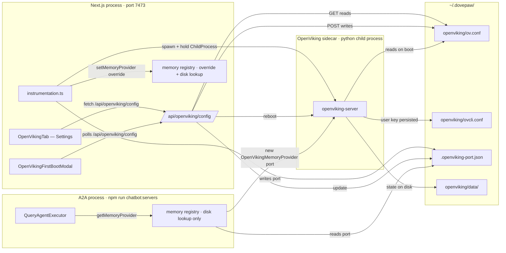
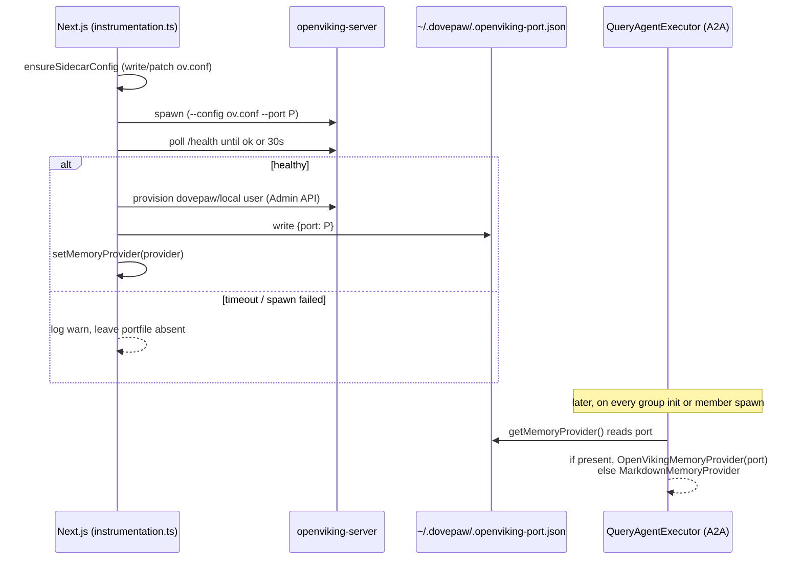
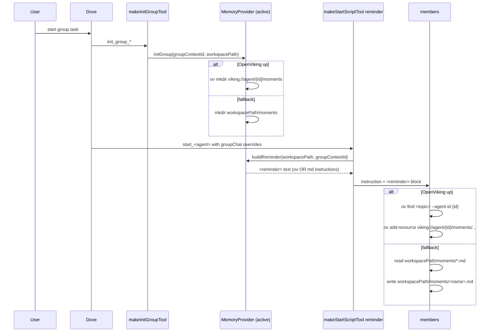

# Memory management

How DovePaw stores and retrieves group-chat "moments" — the shared scratchpad
agents use to coordinate within a group task.

## TL;DR

- Two providers behind a single `MemoryProvider` interface:
  - `OpenVikingMemoryProvider` — semantic recall via the OpenViking sidecar.
  - `MarkdownMemoryProvider` — filesystem fallback (always available).
- The Next.js process owns the OpenViking sidecar lifecycle. The A2A process
  reads the live port from `~/.dovepaw/.openviking-port.json`.
- `getMemoryProvider()` lazily resolves the active provider per call. Order:
  in-memory override → port file on disk → markdown fallback.
- A first-boot modal nudges the user to `/settings` → "OpenViking" tab.
- The Settings tab POSTs to `/api/openviking/config`, which writes the config
  to `~/.dovepaw/openviking/ov.conf` and reboots the sidecar in-process.

## Architecture



## Provider interface

```mermaid
classDiagram
  class MemoryProvider {
    <<interface>>
    +initGroup(groupContextId, workspacePath) Promise~void~
    +buildReminder(workspacePath, groupContextId) string
  }

  class MarkdownMemoryProvider {
    +initGroup() mkdir moments/
    +buildReminder() "Read/save .md files"
  }

  class OpenVikingMemoryProvider {
    +port: number
    +proc: ChildProcess
    +boot(port)$ Promise~OpenVikingMemoryProvider~
    +shutdown() void
    +initGroup() ov mkdir viking://agent/{id}/moments
    +buildReminder() "Use ov find / ov add-resource"
  }

  MemoryProvider <|.. MarkdownMemoryProvider
  MemoryProvider <|.. OpenVikingMemoryProvider
```

A provider implements two methods. `initGroup` materialises any per-group
state (a vector namespace, a directory, or a future provider's equivalent).
`buildReminder` produces the `<reminder>` block injected into every member's
instruction so the agent knows how to read and write memory in the active
provider's idiom.

## getMemoryProvider() resolution

```mermaid
flowchart TD
  call[caller invokes getMemoryProvider]
  q1{override set via setMemoryProvider?}
  q2{~/.dovepaw/.openviking-port.json exists?}
  q3{port file parses + has positive port?}
  ov[return new OpenVikingMemoryProvider port]
  md[return new MarkdownMemoryProvider]
  override[return the override instance]

  call --> q1
  q1 -- yes --> override
  q1 -- no --> q2
  q2 -- no --> md
  q2 -- yes --> q3
  q3 -- no --> md
  q3 -- yes --> ov
```

The override path is what `instrumentation.ts` sets after a successful sidecar
boot — the override holds the `ChildProcess` handle so SIGTERM works. The disk
path is what every other process (the A2A child) uses to discover the same
sidecar without IPC. Resolution is per-call: every `getMemoryProvider()`
invocation re-checks state, so a sidecar reboot is picked up by the next
member's MCP tool invocation with no extra coordination.

## Boot lifecycle



`ensureSidecarConfig` writes the server config with a generated `root_api_key`
and `storage.workspace: ~/.dovepaw/openviking/data` so the sidecar's vector DB

- queue never land in the cwd of the spawning process. If an existing config
  is valid but missing `storage.workspace`, it's patched in place so user
  customisations (embedder, vlm) are preserved.

## Group-chat moment flow



The branch is decided at the moment each member spawns: the reminder text the
agent reads always matches the provider currently registered.
`makeInitGroupTool` also catches errors from `initGroup` and falls back to
`mkdir(moments/)` as a defence in depth — if a future provider fails partway
through, the group still gets a usable workspace.

## Settings + first-boot modal

```mermaid
flowchart LR
  user[User opens chatbot]
  modal{First-boot modal: source == "dovepaw"?}
  modalShow[Show modal: Configure / Not now / Don't ask again]
  settings[Settings page → OpenViking tab]
  get[GET /api/openviking/config]
  src1{source}
  prefill[Form prefilled from ~/.openviking/ov.conf]
  empty[Form blank with no-config banner]
  loaded[Form prefilled from ~/.dovepaw/openviking/ov.conf]
  save[POST /api/openviking/config]
  validate{zod schema OK?}
  err400[400 with issues]
  write[Write ~/.dovepaw/openviking/ov.conf]
  reboot[Boot new sidecar in-process]
  ok{boot ok?}
  okRunning[Update port file + setMemoryProvider]
  okBroken[Config saved, sidecar down]

  user --> modal
  modal -- no --> modalShow
  modalShow -- Configure --> settings
  modal -- yes --> user

  settings --> get
  get --> src1
  src1 -- dovepaw --> loaded
  src1 -- user-global-prefill --> prefill
  src1 -- empty --> empty

  loaded --> save
  prefill --> save
  empty --> save
  save --> validate
  validate -- no --> err400
  validate -- yes --> write
  write --> reboot
  reboot --> ok
  ok -- yes --> okRunning
  ok -- no --> okBroken
```

The GET handler returns one of three `source` values so the UI can show the
right banner: `dovepaw` (editing the DovePaw-scoped config), `user-global-prefill`
(reusing fields from `~/.openviking/ov.conf` if the user already runs OpenViking
elsewhere), `empty` (no config yet). The POST handler preserves `root_api_key`
from any existing file when the body omits it — the UI never round-trips
secrets it didn't capture.

## Code layout

```
chatbot/
├── instrumentation.ts                       Next.js startup hook
├── lib/
│   ├── memory/
│   │   ├── types.ts                         MemoryProvider interface
│   │   ├── markdown.ts                      MarkdownMemoryProvider
│   │   ├── openviking.ts                    OpenVikingMemoryProvider
│   │   ├── instrumentation-helpers.ts       bootOpenVikingSidecar()
│   │   ├── index.ts                         getMemoryProvider / setMemoryProvider
│   │   └── __tests__/
│   └── openviking-prefill.ts                USER_GLOBAL_OV_CONF path constant
├── app/
│   ├── layout.tsx                           mounts OpenVikingFirstBootModal
│   └── api/
│       └── openviking/config/route.ts       GET + POST handlers
└── components/
    ├── openviking/first-boot-modal.tsx
    └── settings/openviking-tab.tsx
```

## Adding a new provider

1. Create `chatbot/lib/memory/<name>.ts` exporting a class that implements
   `MemoryProvider`.
2. Wire it from `instrumentation.ts` (or wherever its lifecycle belongs) by
   calling `setMemoryProvider(new YourProvider(...))`.
3. Decide whether your provider needs a disk fallback path in
   `getMemoryProvider()` — if it does, follow the OpenViking pattern of
   writing a small JSON state file under `~/.dovepaw/` that the resolver can
   parse with zod.

Call sites (`makeInitGroupTool`, `makeStartScriptTool`,
`QueryAgentExecutor`) don't need to change — they only see the interface.

## Known limitations

1. **Default OpenViking embedder requires `llama-cpp-python`.** If the user
   hasn't configured a remote embedding provider in `ov.conf`, the sidecar
   will fail to boot and the registry falls back to `MarkdownMemoryProvider`.
   The Settings UI exists to fix exactly this — pick a remote provider
   (OpenAI, voyage, jina, gemini, ollama) and save.
2. **In-process reboot orphans the previous sidecar handle.** POST
   `/api/openviking/config` always spawns a new sidecar; the prior one becomes
   orphaned to the OS, not to DovePaw. Cleanup runs on SIGINT / SIGTERM /
   `exit` — a hard crash leaves the python process running.
3. **In-flight `ov` commands against the old port fail when a reboot happens
   mid-task.** The new provider is reachable immediately, but commands already
   issued to the old sidecar surface as errors to the agent. Acceptable
   because reboots are user-initiated and rare.
4. **Provider resolution is per-call.** Every `getMemoryProvider()` invocation
   touches the filesystem (`existsSync` + a small JSON parse). Cheap but not
   free; in tight loops a caller should resolve once and hold the reference.
