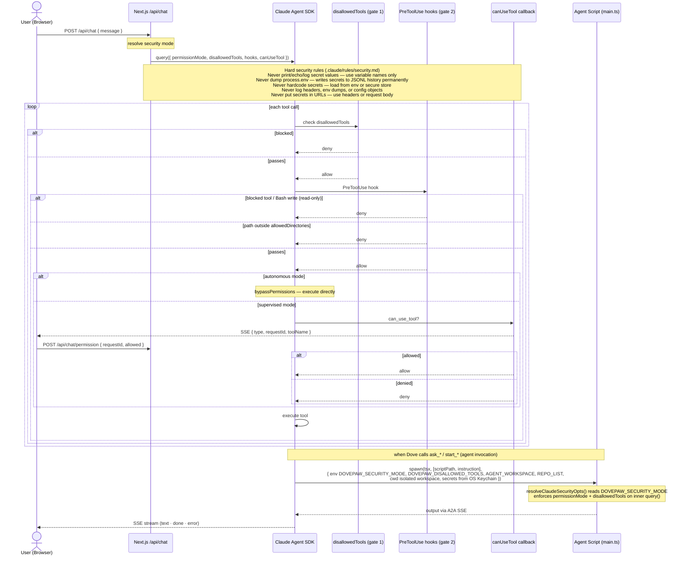

# Security

Dove operates in one of three modes, configured in Settings → Dove. The mode controls what tools Dove and its sub-agents can use, and whether the user is asked to approve actions before they happen.

## Dove modes

| Mode                       | SDK permission mode | Effect                                                                                                                                                                       |
| -------------------------- | ------------------- | ---------------------------------------------------------------------------------------------------------------------------------------------------------------------------- |
| **read-only**              | `default`           | Blocks all write tools via SDK `disallowedTools` + PreToolUse hooks. Write-capable Bash patterns (redirects, `rm`, `mv`, interpreters) are caught by a secondary regex gate. |
| **supervised** _(default)_ | `acceptEdits`       | File edits are auto-approved; Bash commands and other tool calls prompt the user in the browser before executing.                                                            |
| **autonomous**             | `bypassPermissions` | All tool use is auto-approved. Suitable for fully-trusted local use only.                                                                                                    |

## Permission flow



## PreToolUse hooks (enforcement layer)

PreToolUse hooks run inside the SDK's tool-dispatch loop and act as a second gate independent of the SDK's own permission model.

**Read-only enforcement.** When Dove mode is `read-only`, the hooks block every tool on the `disallowedTools` list (e.g. `Write`, `Edit`, `TodoWrite`, `CronCreate`) and inspect every `Bash` call for write patterns (output redirects `>`, `sed -i`, destructive commands). A tool that reaches the hook and matches is denied with an explanatory reason — it cannot be bypassed by the agent.

**Directory restriction.** Both Dove and each agent sub-process are given an `allowedDirectories` list (Dove: the project `cwd` plus any additional directories it needs; sub-agents: the workspace path plus the agent source and persistent state directories). Any `Edit`, `Write`, `NotebookEdit`, or `Bash` write call targeting a path outside that list is denied by a PreToolUse hook before the file is touched:

```
"<resolved_path>" is outside the allowed directories: ~/.dovepaw/workspaces/<agent>-<taskId>/...
You should stop and reconsider if you really need to access this path.
```

The agent is instructed to ask the user for explicit permission before retrying.

**ScheduleWakeup guard.** A hook blocks `ScheduleWakeup` while any `await_*` tool call is pending, preventing agents from scheduling a wake-up to defer polling.

## Interactive permissions (`canUseTool`)

In `supervised` mode, Dove uses a `canUseTool` callback instead of auto-approving everything. When a tool call needs approval, the server sends a `permission` SSE event to the browser:

```json
{
  "type": "permission",
  "requestId": "...",
  "toolName": "Bash",
  "toolInput": { "command": "..." },
  "title": "..."
}
```

The user approves or denies via `POST /api/chat/permission`:

```json
{ "requestId": "...", "allowed": true }
```

Until the user responds, the agent is paused. If the browser disconnects, pending permissions are aborted and the agent stops waiting.

## Sub-agent isolation

Agents launched by Dove run as SDK sub-agents with a permission mode inherited from Dove's security mode: `read-only` propagates fully (blocking all writes); `supervised` and `autonomous` both map to `acceptEdits` (no interactive approval UI for sub-agents). Each sub-agent runs with:

- An isolated workspace directory under `~/.dovepaw/workspaces/<alias>-<taskId>/` (see Spec [05-a2a-spawn](specs/05-a2a-spawn.md))
- A sanitised environment — clean PATH, `CLAUDECODE` unset, secrets resolved from OS Keychain at spawn time and injected as env vars only for the child process
- `allowedDirectories` restricted to the workspace, the agent's source directory, and its persistent state directory

→ Engineering reference: [docs/specs/02-security-guardrails.md](specs/02-security-guardrails.md).
