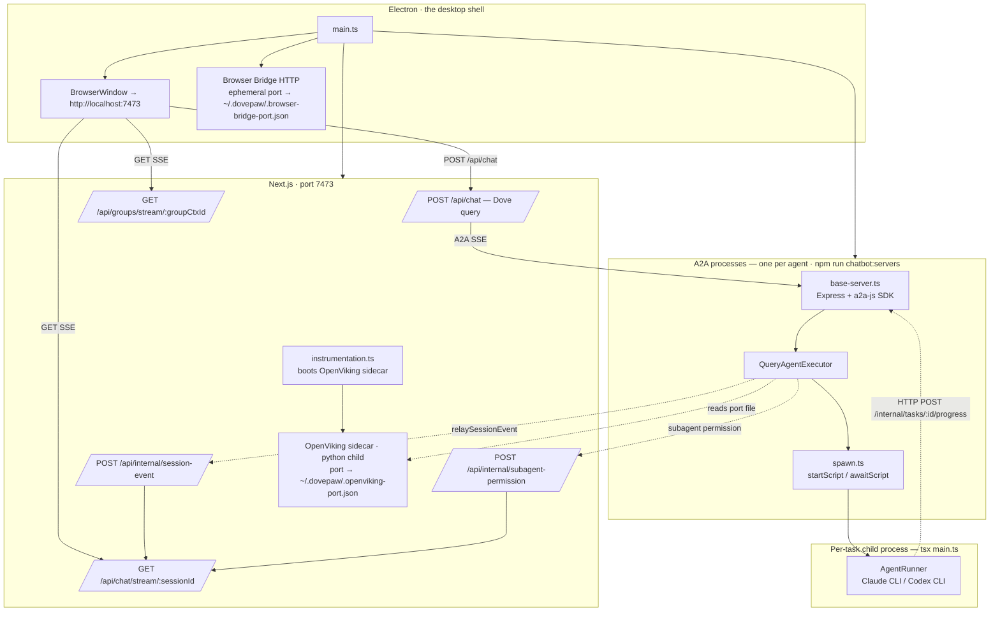
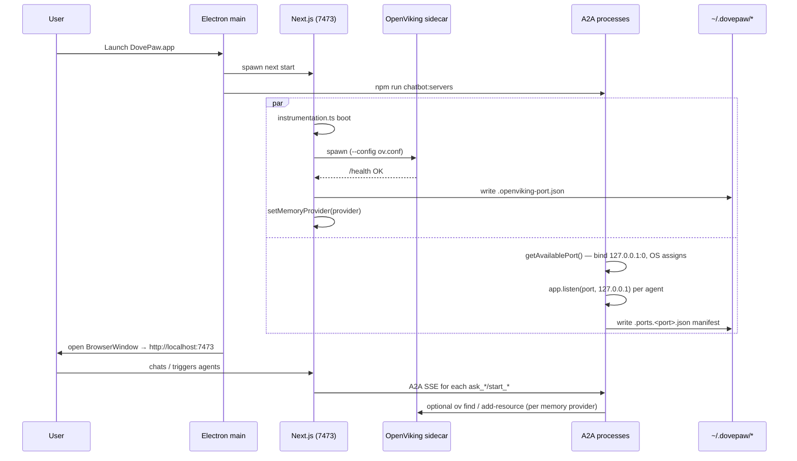

# Spec 00 · Topology Overview

The physical and logical layout DovePaw assumes. Read this before any other spec.

> **Why this matters.** Every other spec asks "which process owns this?" The answer is almost always one of three: Electron, Next.js, or an A2A process. Memorise the three boxes and most of the rest of the system falls out.

## 1. Three OS processes (plus a sidecar)

| Process            | Job                                                                                      | What it must never do                                                                                             |
| ------------------ | ---------------------------------------------------------------------------------------- | ----------------------------------------------------------------------------------------------------------------- |
| Electron           | UI shell + bridge servers. Spawns Next.js and A2A children at app start.                 | Run agent logic                                                                                                   |
| Next.js (7473)     | Browser-facing HTTP/SSE, Dove orchestrator query(), DB writes, OpenViking sidecar owner. | Spawn agent scripts directly                                                                                      |
| A2A (per agent)    | Receive A2A tasks, run sub-agent `query()`, spawn child scripts.                         | Publish SSE to browser (must relay via HTTP — see [ADR-0004](../adr/0004-a2a-to-chatbot-event-relay-via-http.md)) |
| Agent script child | Do the real work; emit progress via HTTP POST to A2A server.                             | Import DovePaw internals — language-neutral contract                                                              |

## 2. Data directories (host filesystem)

All runtime state lives outside the repo under `~/.dovepaw/` (override with `DOVEPAW_DATA_DIR`).

```mermaid
flowchart TB
  ROOT[~/.dovepaw/]
  ROOT --> SET[settings.json — global settings]
  ROOT --> SAGENTS[settings.agents/<name>/agent.json<br/>per-agent file — usually a symlink into the plugin repo]
  ROOT --> AGLINKS[agent-links.json — link topology & groups]
  ROOT --> PLUG[plugins/<owner-repo>/ — cloned plugin sources]
  ROOT --> PREG[plugins.json — plugin registry]
  ROOT --> WORK[workspaces/.<agent>/<alias>-<shortId>/ — per-task scratch]
  ROOT --> GROUP[group-tasks/<groupCtxId>.json]
  ROOT --> STATE[agents/state/.<agent>/ — long-lived agent notes]
  ROOT --> LOGS[agents/logs/.<agent>/]
  ROOT --> CRON[cron/ — compiled daemon scripts and node_modules]
  ROOT --> PORTS[.ports.<port>.json — A2A port manifest per Next port]
  ROOT --> OVDIR[openviking/ ov.conf · ovcli.conf · data/]
  ROOT --> OVPORT[.openviking-port.json — live sidecar port]
  ROOT --> TMP[tmp/<agent>/agent.json — Dove-created session agents]
```

See [`lib/paths.ts`](../../lib/paths.ts) — the only place these paths are constructed. **Never hardcode any of these elsewhere.**

## 3. The `agents/` symlink trick

`DovePaw/agents` is a symlink to `~/.dovepaw/plugins/`.

- Build (`tsup`) and A2A servers see every installed plugin's agents under one consistent root.
- No manual wiring per plugin.
- `settings.agents/<name>/agent.json` is itself a symlink back to `<plugin>/agents/<name>/agent.json` — UI edits write through into the plugin source, surviving plugin updates.

## 4. Sequence: cold start

## 5. Boundaries that are load-bearing

| Boundary                                                   | Defended by                                      | Cost of breaking it                                                                                                                                      |
| ---------------------------------------------------------- | ------------------------------------------------ | -------------------------------------------------------------------------------------------------------------------------------------------------------- |
| Browser SSE only from Next.js                              | `relaySessionEvent` everywhere in A2A code       | Events silently dropped — [ADR-0004](../adr/0004-a2a-to-chatbot-event-relay-via-http.md)                                                                 |
| Agent script runs as child process                         | `spawn.ts` is the sole spawn site                | Crash kills the A2A server — [ADR-0007](../adr/0007-agent-logic-runs-as-child-process-not-inline-in-a2a-server.md)                                       |
| Dove never spawns scripts directly                         | All paths route through A2A                      | No `taskId`, no resume, no progress — [ADR-0006](../adr/0006-orchestrate-agents-via-a2a-server-not-direct-script-spawn.md)                               |
| Sub-agents are workers unless `senderAgentId` is undefined | `isDirectChat` gate in `query-agent-executor.ts` | Restores the deleted cascade — [ADR-0009](../adr/0009-orchestrator-owned-await-chain.md)                                                                 |
| `ScheduleWakeup` denied while await pending                | `buildAgentHooks` PreToolUse hook                | `await_*` result is silently lost — [ADR-0002](../adr/0002-do-not-use-claude-code-loop-or-schedulewakeup-for-agent-polling-in-bounded-query-sessions.md) |

## Related

- [Spec 01 — Hook injection](01-hook-injection.md)
- [Spec 05 — A2A spawn](05-a2a-spawn.md)
- [Spec 08 — Plugin lifecycle](08-plugin-lifecycle.md)
- ADRs [0004](../adr/0004-a2a-to-chatbot-event-relay-via-http.md), [0006](../adr/0006-orchestrate-agents-via-a2a-server-not-direct-script-spawn.md), [0007](../adr/0007-agent-logic-runs-as-child-process-not-inline-in-a2a-server.md)
