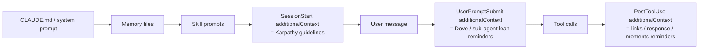
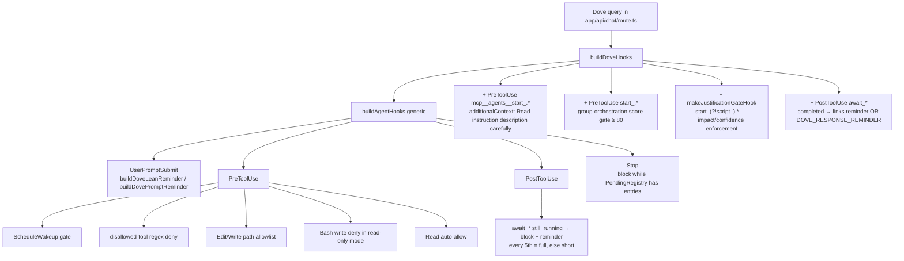
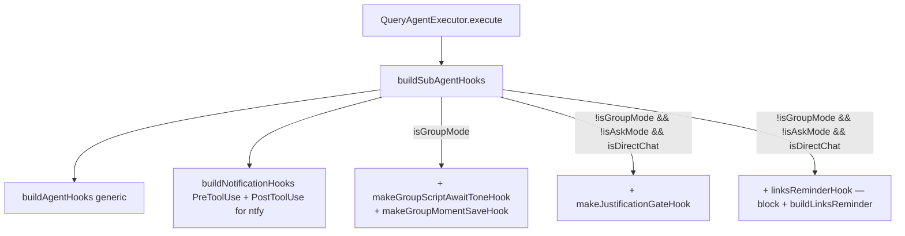
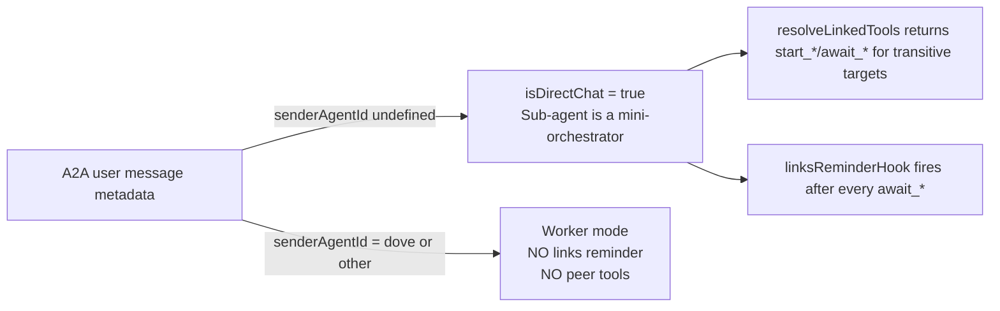
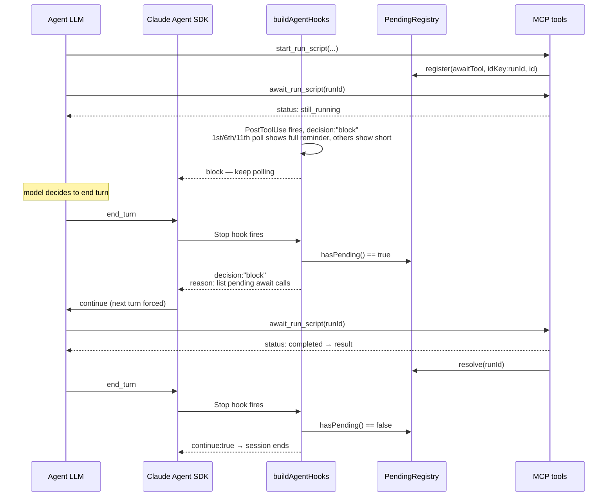
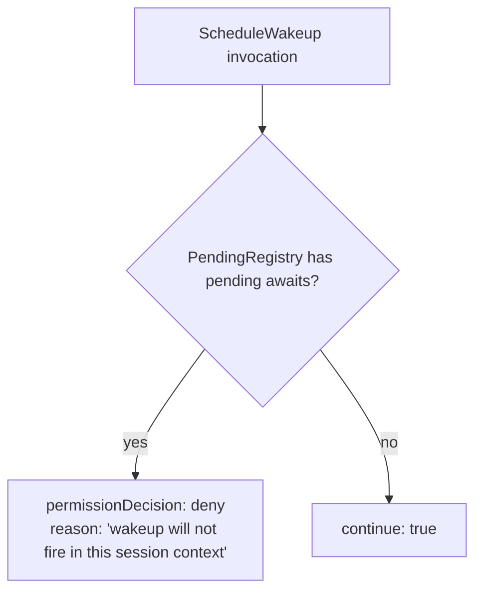
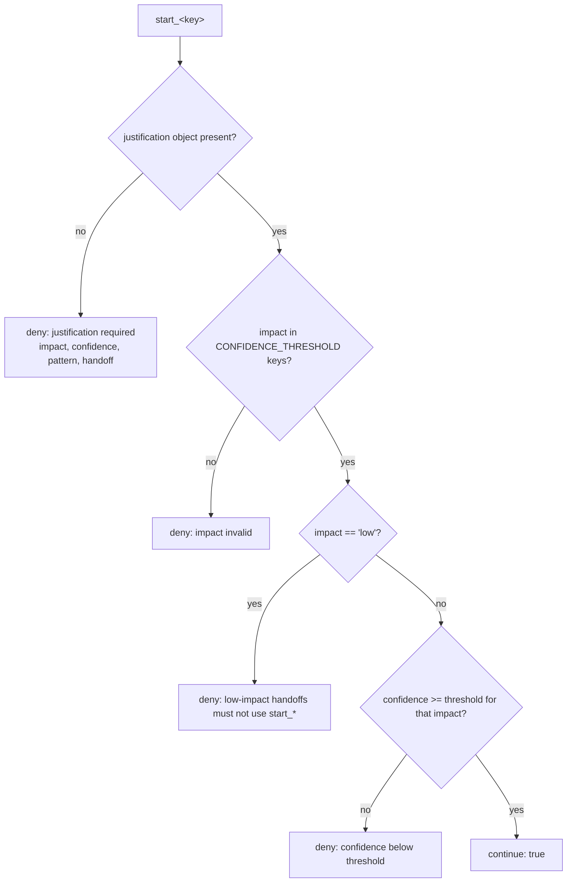
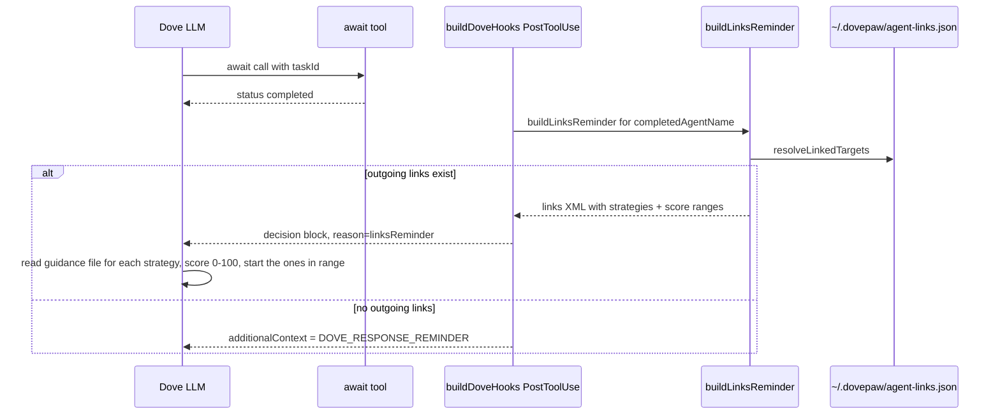

# Spec 01 · Hook Injection End-to-End

How DovePaw uses Claude Agent SDK hooks to (a) inject reminders at the right context distance, (b) gate non-determinism (`ScheduleWakeup`, missing justification), and (c) defer permission round-trips to the browser without blocking the agent.

> **Reading order.** This spec is dense. Section 1 is the cheat-sheet table; sections 2–5 are the actual flows; section 6 covers the determinism gates that make agents safe to leave alone.

## 1. Hook surface (cheat-sheet)

| Event                                      | Source                                                                  | Destination                                                                                                                 | Payload shape                       | Built by                                                                                      |
| ------------------------------------------ | ----------------------------------------------------------------------- | --------------------------------------------------------------------------------------------------------------------------- | ----------------------------------- | --------------------------------------------------------------------------------------------- |
| `SessionStart`                             | `.claude/hooks/karpathy-guidelines.sh` (shell)                          | Dove + every workspace-clone Claude session                                                                                 | `additionalContext` system-reminder | Shell script, see [ADR-0003](../adr/0003-inject-karpathy-guidelines-via-sessionstart-hook.md) |
| `UserPromptSubmit`                         | SDK hook in `buildAgentHooks` / `buildDoveHooks` / `buildSubAgentHooks` | This-turn additional context                                                                                                | `additionalContext`                 | `dove-lean-reminder.ts`, `subagent-reminder.ts`                                               |
| `PreToolUse: ScheduleWakeup`               | `buildAgentHooks`                                                       | `permissionDecision: "deny"` while pending await ops                                                                        | hookSpecificOutput                  | `chatbot/lib/hooks.ts`                                                                        |
| `PreToolUse: Edit\|Write`                  | `buildAgentHooks`                                                       | Allow/deny by canonical-path against allowed dirs                                                                           | hookSpecificOutput                  | `chatbot/lib/hooks.ts`                                                                        |
| `PreToolUse: Bash` (read-only mode)        | `buildAgentHooks`                                                       | Deny if `bashHasWriteOperation(cmd)`                                                                                        | hookSpecificOutput                  | `lib/security-policy.ts`                                                                      |
| `PreToolUse: <disallow regex>`             | `buildAgentHooks`                                                       | Plain deny ("Tool is not permitted in this mode.")                                                                          | hookSpecificOutput                  | `chatbot/lib/hooks.ts`                                                                        |
| `PreToolUse: Read`                         | `buildAgentHooks`                                                       | Always allow (skip user prompt)                                                                                             | hookSpecificOutput                  | `chatbot/lib/hooks.ts`                                                                        |
| `PreToolUse: start_*` (Dove)               | `buildDoveHooks`                                                        | additionalContext "Read instruction…" + group-orchestration score gate (≥ 80)                                               | hookSpecificOutput                  | `chatbot/lib/hooks.ts`                                                                        |
| `PreToolUse: start_(?!script_)*`           | `makeJustificationGateHook`                                             | Deny unless `justification` valid + confidence ≥ impact threshold                                                           | hookSpecificOutput                  | `chatbot/lib/hooks.ts`                                                                        |
| `PostToolUse: await_*` (still_running)     | `buildAgentHooks`                                                       | `decision: "block"` with reminder — full on the 1st, 6th, 11th… still-running response (`count % 5 === 1`); short otherwise | block + reason                      | `chatbot/lib/hooks.ts`                                                                        |
| `PostToolUse: await_*` (completed)         | `buildDoveHooks` / `buildSubAgentHooks`                                 | If outgoing links → block + links reminder; else additionalContext DOVE_RESPONSE_REMINDER                                   | block + reason / additionalContext  | `chatbot/lib/hooks.ts`                                                                        |
| `PostToolUse: await_script_<self>` (group) | `makeGroupMomentSaveHook` + `makeGroupScriptAwaitToneHook`              | Save-moments reminder; "respond in your own voice"                                                                          | block + reason / additionalContext  | `agent-link-hooks.ts`                                                                         |
| `Stop`                                     | `buildAgentHooks`                                                       | `decision: "block"` while `PendingRegistry` has entries                                                                     | block + reason                      | `chatbot/lib/hooks.ts`                                                                        |
| `canUseTool` (Dove)                        | `buildDoveCanUseTool`                                                   | Browser SSE `permission` or `question` event                                                                                | allow/deny via SSE round-trip       | `chatbot/lib/hooks.ts`                                                                        |
| `canUseTool` (sub-agent, direct chat only) | `buildSubagentCanUseTool`                                               | POST `/api/internal/subagent-permission` to Next.js                                                                         | allow/deny via HTTP long-poll       | `chatbot/lib/hooks.ts`                                                                        |

## 2. Reminder injection — context-distance recap

Reminders only reach the model via three SDK fields:

- `SessionStart additionalContext` — once per session, before _any_ user message
- `UserPromptSubmit additionalContext` — every user turn
- `PostToolUse additionalContext` / `decision:"block" reason` — after specific tool calls

Earlier-in-context = lower recency. DovePaw deliberately pushes "behavioural" guidance late:



The reminder bullets all use **Bad/Correct** style ([see `MEMORY.md`](../../.claude/projects/-Users-yang-liu-Envato-others-DovePaw/memory/feedback_reminder_bad_correct_style.md)), e.g.:

```text
- **Bad:** Answer from memory when an agent can provide the information.
  **Correct:** ALWAYS call `mcp__agents__ask_*` for the relevant agent, then WAIT…
```

## 3. Dove top-level query — hook tree



## 4. Sub-agent query — hook tree

`buildSubAgentHooks` extends `buildAgentHooks` with: notifications, group-mode hooks, and (for direct chat) the links reminder + justification gate.



### isDirectChat gating ([ADR-0009](../adr/0009-orchestrator-owned-await-chain.md))



## 5. The Stop hook + PendingRegistry — the "you can't stop yet" loop

Every `start_*` and `start_script_*` tool registers an entry in a `PendingRegistry` (one per execution — never module-global, see [ADR-0009](../adr/0009-orchestrator-owned-await-chain.md) discussion). Every `await_*` that returns `completed` / `canceled` / `failed` / `rejected` calls `.resolve(id)`. The `Stop` hook blocks until the registry is empty.



### Why this matters

Without this hook, an agent could call `start_*`, see "task started", and exit before retrieving the result. The result would be permanently lost (no result-cache lives past the SDK's `query()` resolution). **This is exactly the ScheduleWakeup failure mode** that ADR-0002 fixed via the matching `PreToolUse` deny.

## 6. Determinism gates

Three hooks exist purely to deter non-deterministic agent behaviour:

### 6.1 ScheduleWakeup deny



Source: [ADR-0002](../adr/0002-do-not-use-claude-code-loop-or-schedulewakeup-for-agent-polling-in-bounded-query-sessions.md). The wakeup primitive belongs to long-lived CLI sessions; bounded `query()` sessions discard it on resolution.

### 6.2 Justification gate



`CONFIDENCE_THRESHOLD` is the single source of truth and lives in [`chatbot/lib/query-tools.ts`](../../chatbot/lib/query-tools.ts):

| Impact   | Threshold | Meaning                                       |
| -------- | --------- | --------------------------------------------- |
| `high`   | 70        | Pivotal handoff; recipient blocked without it |
| `medium` | 85        | Self-contained output; normal progression     |
| `low`    | ∞         | Never hand off; share via message instead     |

Cross-link: [Spec 04 — Handoff pattern](04-handoff-pattern.md) consumes the same constant for tool descriptions.

### 6.3 Group orchestration score gate

Only registered when `includeGroupReminder: true` (Dove with eligible groups). Denies `start_*` when:

- `groupOrchestrationScore` field is missing — the reminder explicitly asks the model whether it is in a group context
- `groupOrchestrationScore < 80`

The denial reason in both branches includes the `GROUP_ORCHESTRATOR_REMINDER` rules verbatim, e.g. _"Never pre-assign handoffs inside member instructions — Dove decides who's next after each member completes."_

## 7. PostToolUse links reminder (Dove path)



The XML reminder includes one `<guidance strategy="X">MUST read `…/handoff-guidance/X.md`</guidance>` line per distinct strategy. The actual markdown files live in [`lib/handoff-guidance/`](../../lib/handoff-guidance/). The model reads them mid-turn — **not** preloaded — keeping the guidance close to the decision point.

## 8. Workspace-clone hook propagation

When a sub-agent's workspace clones a repo, `writeWorkspacePermissions` writes a per-clone `.claude/settings.local.json` with:

- `Write(/**)`, `Edit(/**)`, `Bash(*)` permissions
- `UserPromptSubmit` hook running the Karpathy script (base64-embedded so the clone doesn't depend on a relative path)
- `PermissionRequest: Edit|Write` hook auto-allowing — this bypasses Claude Code's hardcoded `.claude/` self-edit protection ([upstream issue 37765](https://github.com/anthropics/claude-code/issues/37765))

The fresh workspace itself also gets a tiny `.claude/settings.json` containing **only** the `ScheduleWakeup → python sleep` replacement hook. Inside a workspace clone the SDK is bounded by `additionalDirectories`, so the hook's deny path can be safely swapped for a real sleep without losing the determinism property.

## 9. MCP `structuredContent` parsing

PostToolUse hooks read `tool_response` to determine `status`. SDK serialises in-process MCP `structuredContent` as a **JSON string**, while external MCP servers return objects. `getMcpStructured()` in `chatbot/lib/hooks.ts` handles both shapes — used by every await-status check (see [MEMORY.md entry](../../.claude/projects/-Users-yang-liu-Envato-others-DovePaw/memory/project_mcp_tool_response_json_string.md)).

## Related

- [Spec 02 — Security guardrails](02-security-guardrails.md) — the disallowed-tool regex matcher is built here
- [Spec 03 — Orchestrator behaviour](03-orchestrator-behaviour.md) — `isDirectChat` gate uses these hooks
- [Spec 04 — Handoff pattern](04-handoff-pattern.md) — links reminder + justification gate consumer
- [Spec 05 — A2A spawn](05-a2a-spawn.md) — `start_run_script` registers into the same PendingRegistry
- ADRs [0002](../adr/0002-do-not-use-claude-code-loop-or-schedulewakeup-for-agent-polling-in-bounded-query-sessions.md), [0003](../adr/0003-inject-karpathy-guidelines-via-sessionstart-hook.md), [0009](../adr/0009-orchestrator-owned-await-chain.md)
