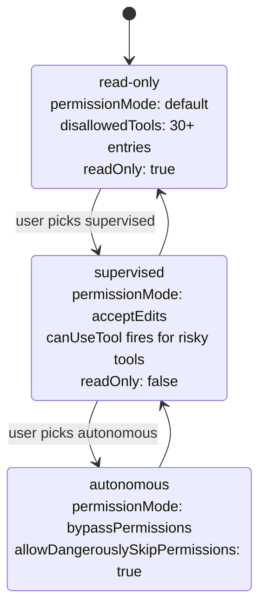
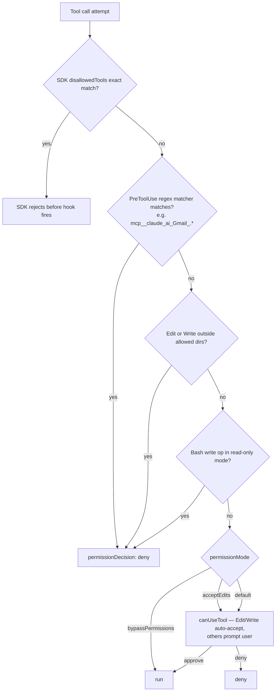
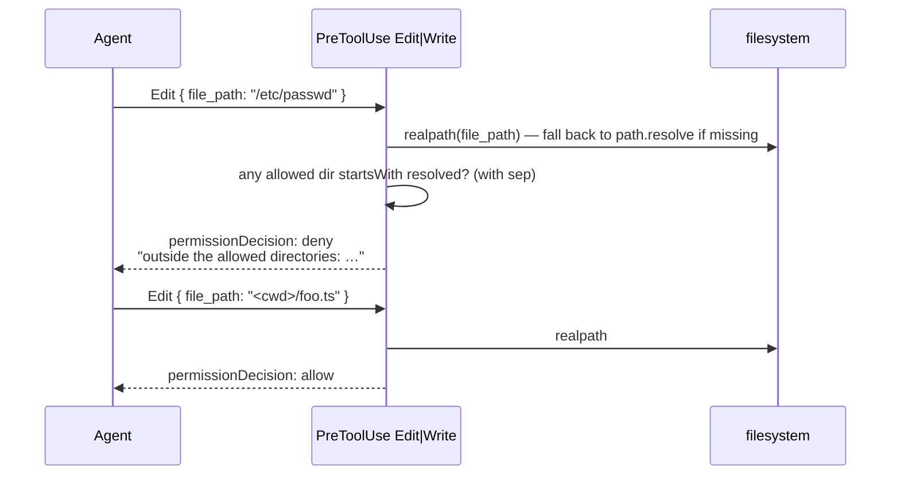
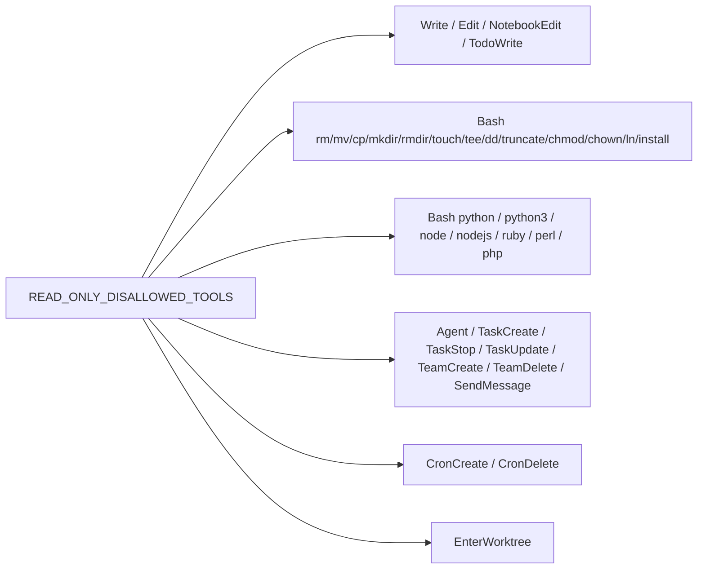
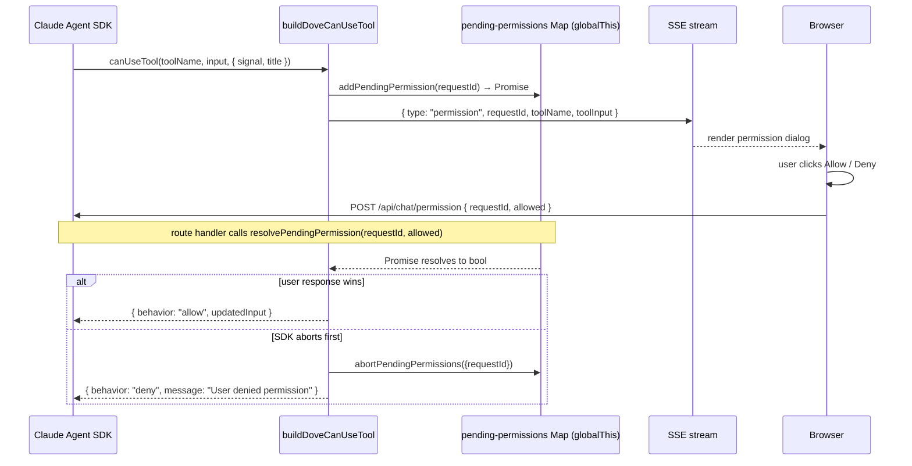
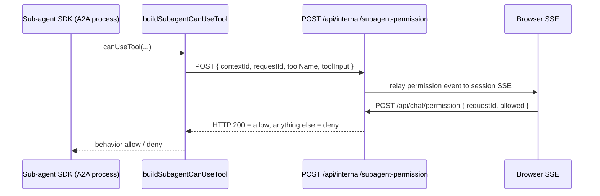

# Spec 02 · Security & Permission Guardrails

How DovePaw decides whether a tool call may proceed, and how it asks the user when a decision is genuinely required.

> **Two layers, never one.** SDK `disallowedTools` is exact-name matching only. The PreToolUse hook re-evaluates the same list as a regex for prefixed/grouped patterns. Either layer alone is insufficient.

## 1. Security modes

Three modes, set globally via Dove settings (`effectiveDoveSettings(globalSettings).securityMode`). The exact shape and behaviour lives in [`lib/security-policy.ts`](../../lib/security-policy.ts) and [`packages/agent-sdk/src/security-policy.ts`](../../packages/agent-sdk/src/security-policy.ts).

| Mode         | `permissionMode`    | `allowDangerouslySkipPermissions` | `readOnly` | `settingSources`       | `disallowedTools`                          |
| ------------ | ------------------- | --------------------------------- | ---------- | ---------------------- | ------------------------------------------ |
| `read-only`  | `default`           | false                             | true       | project + local        | `READ_ONLY_DISALLOWED_TOOLS` (~30 entries) |
| `supervised` | `acceptEdits`       | false                             | false      | project + user + local | `[]`                                       |
| `autonomous` | `bypassPermissions` | true                              | false      | project + user + local | `[]`                                       |



`buildSecurityEnv()` exports the mode into the child process as `DOVEPAW_SECURITY_MODE` (and optionally `DOVEPAW_ALLOW_WEB_TOOLS=1`). `AgentRunner` reads these to compute the right `ClaudeRunner` / `CodexRunner` options ([`packages/agent-sdk/src/agent-runner.ts`](../../packages/agent-sdk/src/agent-runner.ts)).

## 2. Two-layer enforcement



`ALWAYS_DISALLOWED_TOOLS` is a regex-only list — patterns like `mcp__claude_ai_Gmail_.*` cover every variant of a service (plain / Workato / Testing Admin Only). SDK exact-matching would miss every one of them; only the hook gate catches them.

## 3. Edit/Write path allowlist



Allowed dirs:

- **Dove**: `AGENTS_ROOT` + `getLaunchdAdditionalDirs()` + `DOVEPAW_TMP_DIR` + `DOVEPAW_DIR`
- **Sub-agent**: `cwd` (workspace) + scheduler dirs + `agentPersistentLogDir/StateDir/ConfigDir` + `agentSourceDir`

The hook resolves both stored and requested paths with `realpath` — handles macOS case-insensitivity and symlinks. New writes (file doesn't exist yet) fall back to `path.resolve`.

## 4. Read-only mode disallow list



`bashHasWriteOperation()` is the inline check for Bash payloads that survive the prefix filter — regex `>\s*\S|sed\s+[^|&;]*-i` after stripping quoted strings. Defends against `echo x > /tmp/y` and `sed -i ...`.

## 5. Browser permission round-trip (Dove)



Key correctness properties:

- The `Map<requestId, resolver>` lives on `globalThis.__dovePendingPermissions` so Next.js HMR doesn't lose it mid-prompt (see [`chatbot/lib/pending-permissions.ts`](../../chatbot/lib/pending-permissions.ts)).
- `abortPendingPermissions` takes a **set scoped to the current query**, not all entries — cancelling one tab can't deny prompts open in another.
- `AskUserQuestion` reuses the same plumbing via `pending-questions.ts` — same race against `signal.abort`.

## 6. Sub-agent permission round-trip (cross-process)

The sub-agent runs in an A2A process. It can't reach the in-process Map. It POSTs to the Next.js process instead, which then runs the same Dove-side round-trip.



Only enabled when `userMessage.metadata.directUserChat === true`. Worker-mode sub-agents (called by Dove) don't get `canUseTool` at all — they run under `permissionMode: "acceptEdits"` and rely on the hook gates above for safety.

## 7. Notes on `canUseTool` reliability

`canUseTool` is **not** invoked for every tool call — the SDK skips it when `permissionMode` permits the action. This means `canUseTool` cannot be relied on as a security gate. **PreToolUse hooks are the only reliable gate.** All deny decisions for security live in `buildAgentHooks`, never in `canUseTool`.

## 8. Always-disallowed tools (every mode, every agent)

`ALWAYS_DISALLOWED_TOOLS` is layered on top of the mode-specific list at every call site:

```text
mcp__claude_ai_Assets_.*
mcp__claude_ai_Gmail_.*
mcp__claude_ai_Google_(Calendar|Drive|Sheets)_.*
mcp__claude_ai_(HubSpot|Jira|Confluence|Slack|Slack_Workato|Envato_Creative_Companion)_.*
```

These are claude.ai-side remote MCP integrations that DovePaw chose not to expose. They are blocked unconditionally by the hook regex matcher.

## Related

- [Spec 01 — Hook injection](01-hook-injection.md) (the disallow + path hooks are part of `buildAgentHooks`)
- [Spec 05 — A2A spawn](05-a2a-spawn.md) (mode env vars flow to AgentRunner)
- [Spec 03 — Orchestrator](03-orchestrator-behaviour.md) (`directUserChat` metadata path)
