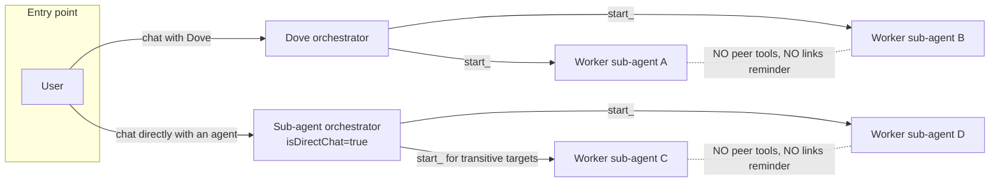
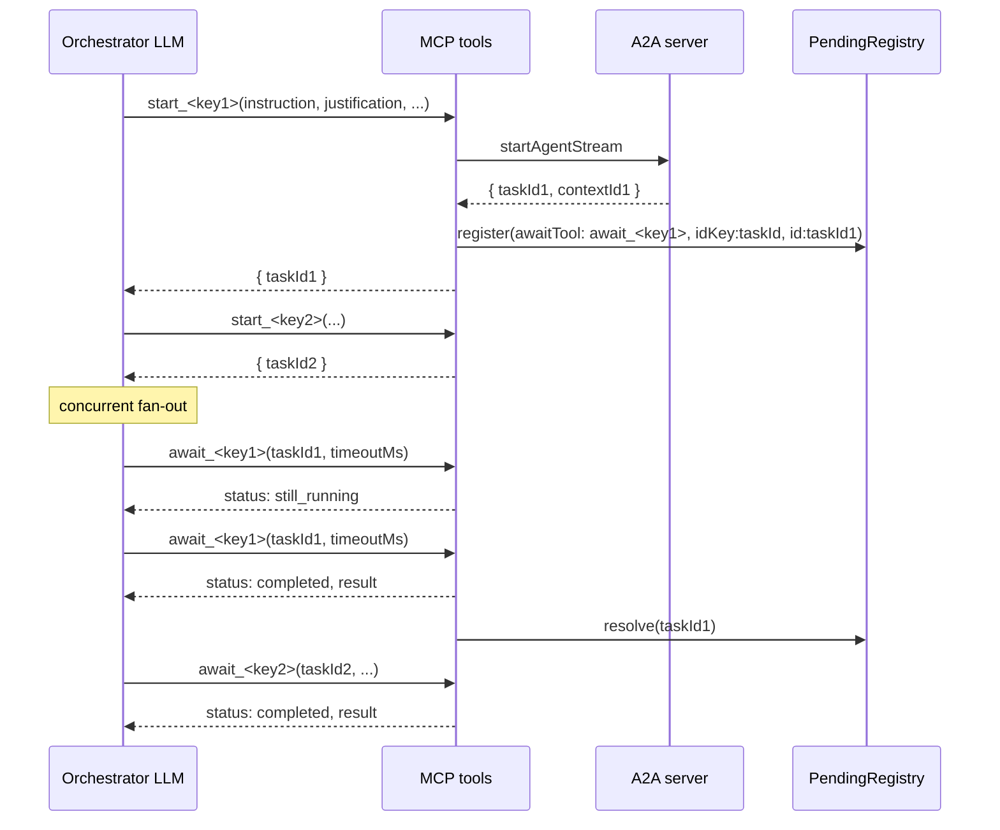
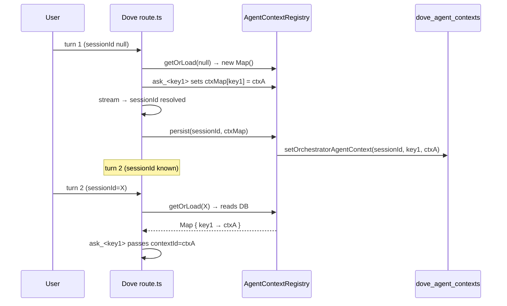
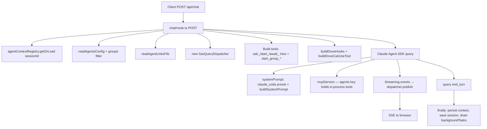
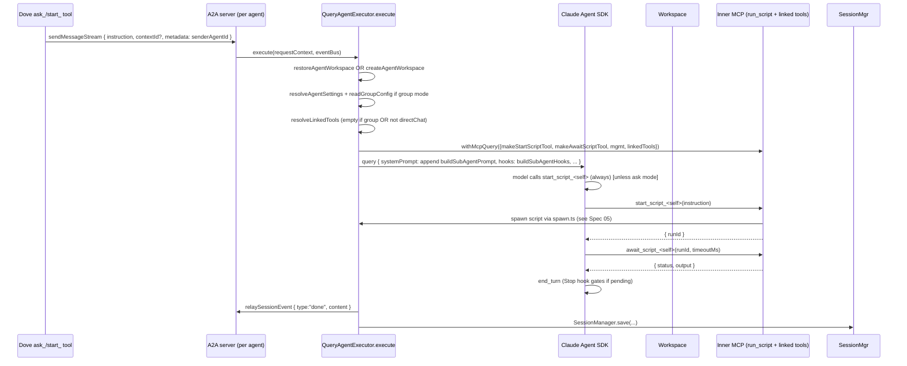
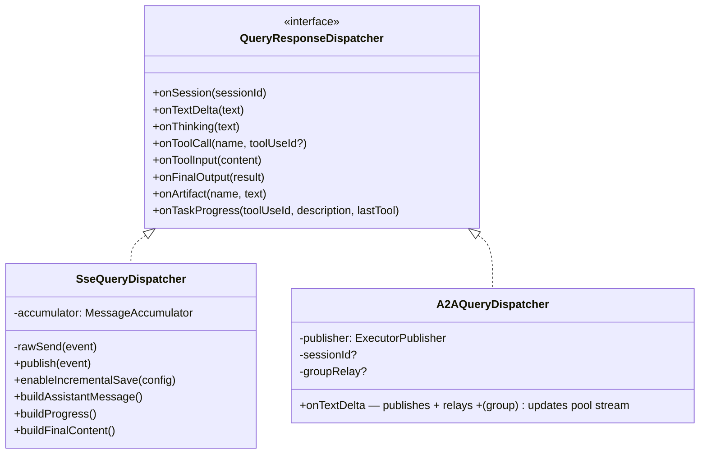
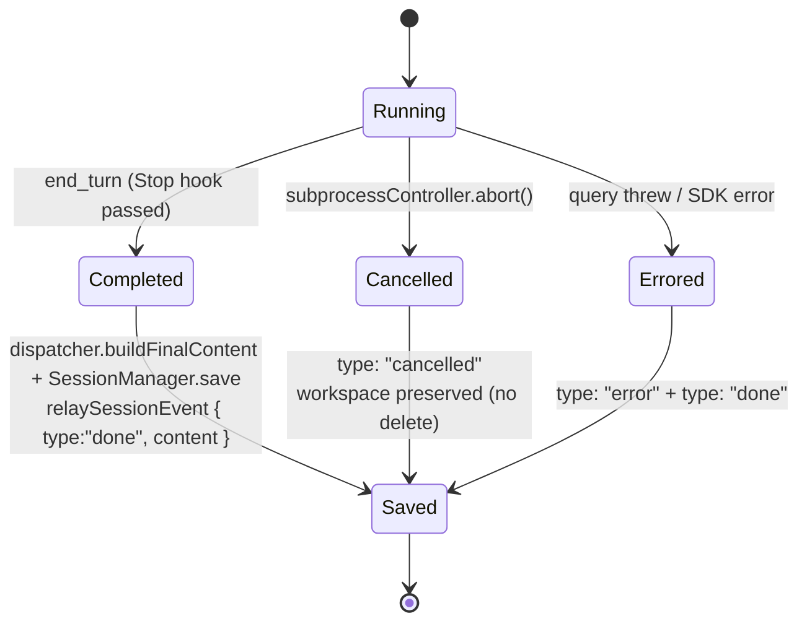

# Spec 03 · Orchestrator Behaviour

The single principle: **whoever starts the conversation owns the chain.** Sub-agents below the orchestrator are workers — they cannot invoke peers. Sub-agents started _directly_ by the user become mini-orchestrators with the same powers as Dove for the agents below them.

> Anchor: [ADR-0009 — Orchestrator-owned await chain](../adr/0009-orchestrator-owned-await-chain.md). This spec describes the runtime that ADR established.

## 1. Two orchestrator modes

The single switch is `senderAgentId` in A2A message metadata:

| `senderAgentId` value               | Mode                                    | Receives peer `start_*`/`await_*` tools? | Receives links reminder hook? | Receives `canUseTool` (browser bridge)? |
| ----------------------------------- | --------------------------------------- | ---------------------------------------- | ----------------------------- | --------------------------------------- |
| `undefined` (user → agent directly) | mini-orchestrator (`isDirectChat=true`) | yes (transitive BFS)                     | yes                           | yes                                     |
| `"dove"`                            | worker                                  | no                                       | no                            | no                                      |
| any other agent name                | worker                                  | no                                       | no                            | no                                      |

The decision lives in `QueryAgentExecutor.execute()` — `const isDirectChat = senderAgentId === undefined`. `resolveLinkedTools(...)` early-returns `[]` when `isGroupMode || !isDirectChat`.

## 2. Tool trio per agent

Every visible agent contributes three Dove-side MCP tools (see [`chatbot/lib/query-tools.ts`](../../chatbot/lib/query-tools.ts)):

| Tool          | Returns                                                                          | When to use                                                  |
| ------------- | -------------------------------------------------------------------------------- | ------------------------------------------------------------ |
| `ask_<key>`   | `taskId` immediately, agent responds async; auto-resumes prior context           | Conversational Q&A; default for "tell me / what is"          |
| `start_<key>` | `taskId` immediately + structured                                                | Fire-and-forget; combine with `await_*` for parallel fan-out |
| `await_<key>` | `still_running` (poll again) or `completed/failed/canceled/rejected` with result | Collect a `start_*`/`ask_*` result                           |

> The `_script` variants (`start_script_<key>`, `await_script_<key>`) live one layer deeper — they're the **sub-agent's** tools for executing its own script. See [Spec 05](05-a2a-spawn.md).

## 3. Context auto-resume — `agentContextRegistry`

For `ask_*`, Dove auto-passes the prior contextId when re-asking the same agent in the same Dove session — so the sub-agent sees the conversation history without Dove having to thread it. The map is per-Dove-session and **persisted to `dove_agent_contexts` SQLite table** for survival across Next.js restarts.

Deletion paths cascade in both directions: `deleteSession(sessionId)` removes the rows; `agentContextRegistry.delete(sessionId)` clears the cache and DB rows.

## 4. The complete Dove turn

## 5. Reminders specific to Dove

Two `UserPromptSubmit` reminders, picked by `includeGroupReminder`:

- **No groups configured** → `DOVE_LEAN_REMINDER` (use ask/start/await; sub-agent-builder for new agents)
- **Groups configured** → `DOVE_PROMPT_REMINDER` — adds the `start_group_*` discipline ("never call individual agents for team requests; never call `await_group_*`")

The injected text is interpolated with the optional `behaviorReminder` from Dove settings.

After every Dove `await_*` completion:

- If the completed agent has outgoing links → `decision:"block"` with the links XML reminder
- Otherwise → `additionalContext` with `DOVE_RESPONSE_REMINDER` (first-person speech rules, no internal tool names)

## 6. Sub-agent (`QueryAgentExecutor`) flow

The inner system prompt comes from `buildSubAgentPrompt()` — it embeds the agent's persona/description, its file boundaries, and the management tool table for that single agent. In group mode it appends "no narration about tool execution" discipline.

## 7. Streaming dispatcher — two transports

- **Dove path** uses `SseQueryDispatcher` — directly writes the SSE response and also calls `publishSessionEvent` so background reconnect endpoints can replay.
- **Sub-agent path** uses `A2AQueryDispatcher` — publishes to the A2A event bus (for `await_*` callers to drain) **and** relays events to Next.js via `relaySessionEvent` so the chat stream endpoint can serve live updates ([ADR-0004](../adr/0004-a2a-to-chatbot-event-relay-via-http.md)).

`MessageAccumulator` builds the SessionMessage / progress entries for SQLite — both dispatchers reuse it so persisted output is identical regardless of transport.

## 8. The end-of-turn finalisation

**STOP vs DELETE workspace policy.** `cancelTask` only aborts the in-flight controller — it does **not** delete the workspace. Workspace cleanup is owned exclusively by the explicit DELETE path (`POST /session/clear` in `base-server.ts`), invoked when the user removes the session from history. STOP therefore preserves the workspace and the session can be resumed.

## Related

- [Spec 01 — Hook injection](01-hook-injection.md) — the orchestrator's behaviour is enforced via hooks
- [Spec 04 — Handoff pattern](04-handoff-pattern.md) — what the links reminder triggers next
- [Spec 05 — A2A spawn](05-a2a-spawn.md) — the layer below `start_script_*`
- [Spec 07 — Group vs single mode](07-group-vs-single.md) — when orchestration is delegated to `start_group_*`
- [Spec 11 — Abort pipeline](11-abort-pipeline.md) — full STOP/DELETE/SIGTERM cascade end-to-end
- [ADR-0009](../adr/0009-orchestrator-owned-await-chain.md) — the rationale
