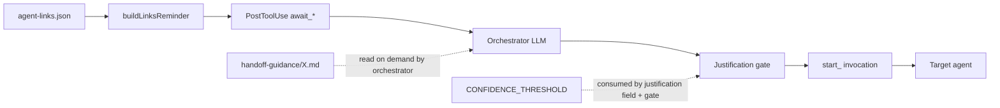
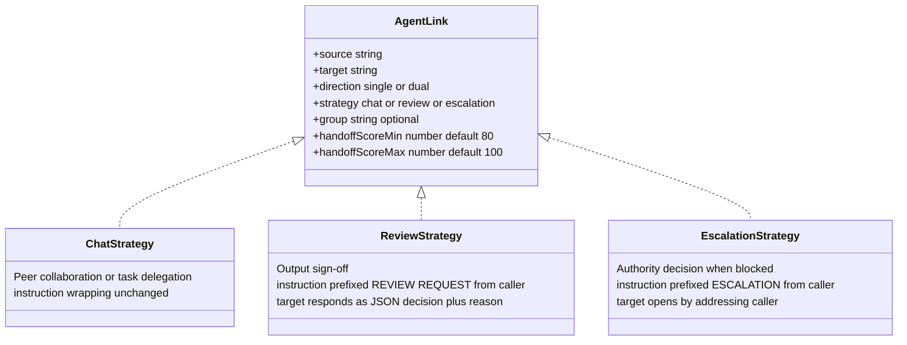
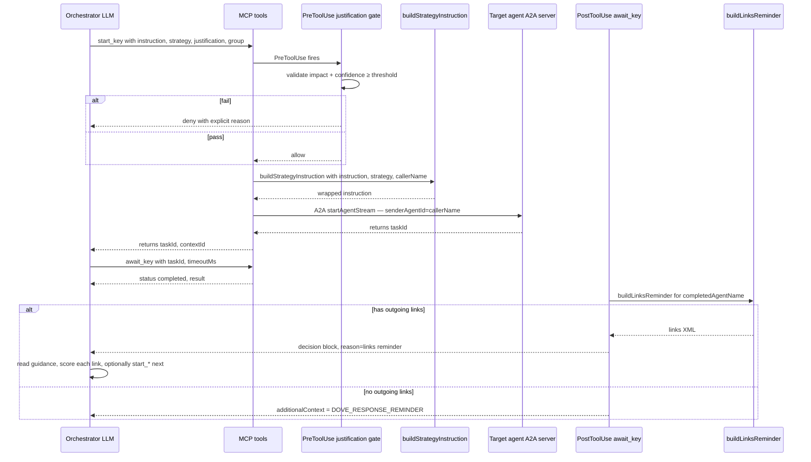
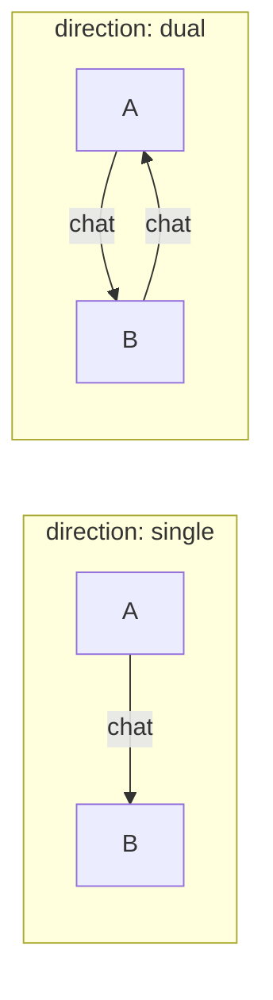

# Spec 04 · Handoff Pattern

How agents pass work to each other. Three strategies (`chat`, `review`, `escalation`), one shared link topology, and a strict justification gate that prevents low-quality handoffs from firing.

> Anchor: links are _possible_ connections, never _automatic_ ones. Every handoff must clear a scope check, a confidence threshold, and a per-link score window.

## 1. The four moving parts



1. **Storage** — `~/.dovepaw/agent-links.json` (see [`lib/agent-links.ts`](../../lib/agent-links.ts))
2. **Reminder** — `buildLinksReminder` builds an XML block listing outgoing links after every `await_*` completion (see [Spec 01](01-hook-injection.md))
3. **Decision** — the orchestrator reads the strategy's markdown guidance, scores 0–100, and decides
4. **Gate** — `makeJustificationGateHook` denies any `start_*` whose `justification` is missing or below the impact threshold

## 2. Link strategies



Strategy controls two things and two only:

- **Instruction wrapping** — `buildStrategyInstruction` in `query-tools.ts` rewrites the LLM's prose before sending
- **Guidance file path** — the reminder's `<guidance>` element points to `lib/handoff-guidance/<strategy>.md`

The MCP tool itself is the same `start_<key>`/`await_<key>` pair regardless of strategy. The orchestrator passes `strategy` as a tool argument; the link's strategy is informational (it lives in the reminder so the LLM picks the right strategy when calling).

## 3. The four guidance files (when / when-not)

Each markdown file leads with the same **scope check** (re-read the original instruction; does the target agent's description match this domain?) then a `When ✅ / When not ❌` list. They live at:

- [`lib/handoff-guidance/chat.md`](../../lib/handoff-guidance/chat.md)
- [`lib/handoff-guidance/review.md`](../../lib/handoff-guidance/review.md)
- [`lib/handoff-guidance/escalate.md`](../../lib/handoff-guidance/escalate.md)

The guidance files share text with `lib/agent-link-patterns.ts` (`HANDOFF_PATTERNS`, `REVIEW_PATTERNS`, `ESCALATE_PATTERNS`) so the in-tool-description text and the file contents stay aligned.

## 4. The justification field

`justificationField` (in `chatbot/lib/query-tools.ts`) is added to every Dove-side `start_<key>` tool:

```text
{
  impact: "high" | "medium" | "low"   // gates the threshold
  pattern: string                     // "Detection → Resolution" / "Aggregation → Action" / "Blocked by gap" / "Phase handoff"
  handoff: string                     // one sentence describing the concrete output being handed off
  confidence: number                  // 0–100; threshold-gated by impact
}
```

The same `CONFIDENCE_THRESHOLD` constant drives **both** the field's description string and the `makeJustificationGateHook` deny decision — single source of truth, no drift possible.

| impact | confidence threshold | description                                               |
| ------ | -------------------- | --------------------------------------------------------- |
| high   | ≥ 70                 | pivotal — recipient blocked without it                    |
| medium | ≥ 85                 | self-contained — recipient can engage fully               |
| low    | never                | preliminary / tangential — share via message, not handoff |

## 5. End-to-end sequence



## 6. Links reminder shape

```text
<links>
<guidance strategy="chat">MUST read `…/handoff-guidance/chat.md` to understand the pattern before scoring</guidance>
<guidance strategy="review">MUST read `…/handoff-guidance/review.md` to understand the pattern before scoring</guidance>
<tools>
  <tool>
    <scoreKey>codebase_analyst</scoreKey>
    <toolKey>codebase_analyst</toolKey>
    <strategy>chat</strategy>
    <range>80–100</range>
  </tool>
  <tool>
    <scoreKey>oncall_responder__review</scoreKey>
    <toolKey>oncall_responder</toolKey>
    <strategy>review</strategy>
    <range>90–100</range>
  </tool>
</tools>
<check>For each tool: read its guidance file, score 0–100. If the score falls within the stated range, you MUST START the agent immediately using start_* — no exceptions, no reasoning about whether to skip.</check>
</links>
```

`scoreKey` is unique per (agent, strategy) pair so the LLM tracks per-strategy scores separately. `toolKey` maps to the actual `start_<toolKey>` invocation.

## 7. Direction semantics



`resolveLinkedTargets(name, links)` includes a link when `link.source === name` OR `(link.direction === "dual" && link.target === name)`. The returned `targetName` is the _other_ end of the edge.

`resolveTransitiveTargets(name, links)` is a BFS used to compute the full set for direct-chat mini-orchestrators ([Spec 03](03-orchestrator-behaviour.md)). The starting agent is never included.

## 8. Group-context propagation

When the orchestrator is inside a group chat (has a `groupContextId`), every `start_*` _must_ pass `group: { contextId, groupOrchestrationScore }`. This:

- Publishes `agent_status` events to the group SSE pool
- Triggers a sender bubble (`{ type:"group_member", isSender:true, text: "@<agent>\n\n<instruction>" }`)
- Passes `groupMeta` through A2A `extraMetadata` so the called sub-agent enters group mode

The `groupOrchestrationScore` (≥ 80) is the gate that enforces the group-orchestrator rules ("never pre-assign handoffs in member instructions"; "don't stop after one round"). It is _separate_ from `justification.confidence`, which measures handoff quality.

## 9. Score windows in practice

```mermaid
gantt
  dateFormat X
  axisFormat %s
  title Score window decision (0–100 scale)
  section example
    handoffScoreMin=80, handoffScoreMax=100 : 0, 80
    must start_* when scored in this range : 80, 100
    section another link
    handoffScoreMin=60, handoffScoreMax=90 : 0, 60
    must start_* when scored in this range : 60, 90
    skip if higher : 90, 100
```



The window mechanism allows a link like _"escalate to security-architect when 90–100 confidence (i.e. only when really sure)"_ alongside _"chat with codebase-analyst when 60–90 (i.e. when uncertain enough to want a second opinion)"_. The orchestrator scores once per link; ranges decide the action.

## 10. The full set of agents the orchestrator might call

For Dove: `agents.filter((a) => a.doveVisible !== false)` — `doveVisible: false` agents are not exposed at all.

For a direct-chat sub-agent orchestrator: `resolveTransitiveTargets(self, links)` filtered to currently online agents (`resolveAgentPort(key) !== null`). Offline agents are silently skipped — better than letting the orchestrator hit a dead port.

## Related

- [Spec 01 — Hook injection](01-hook-injection.md) — justification gate, links reminder mechanism
- [Spec 03 — Orchestrator behaviour](03-orchestrator-behaviour.md) — Dove vs mini-orchestrator
- [Spec 07 — Group vs single mode](07-group-vs-single.md) — `group` field, group-orchestration score gate
- [Spec 09 — Agent links & canvas](09-agent-links-canvas.md) — link storage + UI
- [ADR-0009](../adr/0009-orchestrator-owned-await-chain.md) — why workers can't peer-handoff
