# Spec 05 · A2A Spawn → Child Process Flow

The path from "Dove decides to run agent X" all the way down to "the OS started a `tsx main.ts` child." Three indirections — A2A protocol, `QueryAgentExecutor`, `spawn.ts` — each justified by a separate ADR.

> Anchor ADRs: [0006](../adr/0006-orchestrate-agents-via-a2a-server-not-direct-script-spawn.md) (use A2A, not direct spawn) and [0007](../adr/0007-agent-logic-runs-as-child-process-not-inline-in-a2a-server.md) (always a child process, never inline).

## 1. The full layer cake

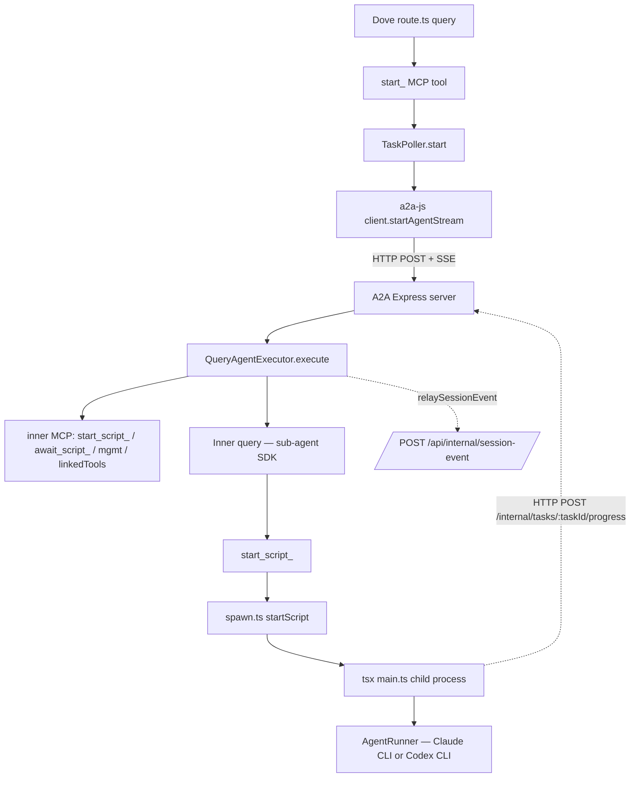

Every transition is justified:

| Boundary            | Required for                                                                            |
| ------------------- | --------------------------------------------------------------------------------------- |
| Dove → A2A          | Per-agent process isolation, A2A lifecycle, scheduler entry-point uniformity (ADR-0006) |
| A2A → child process | Crash isolation, env sanitation, plugin trust boundary, language agnosticism (ADR-0007) |

## 2. Dynamic port discovery

A2A ports are OS-assigned and written to a manifest:

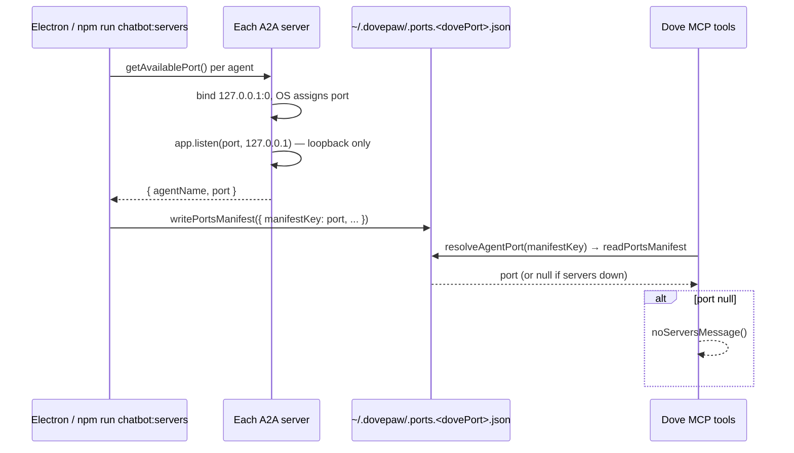

A `null` port produces a user-facing reminder to run `npm run chatbot:servers` — never throws.

## 3. The A2A server (per agent)

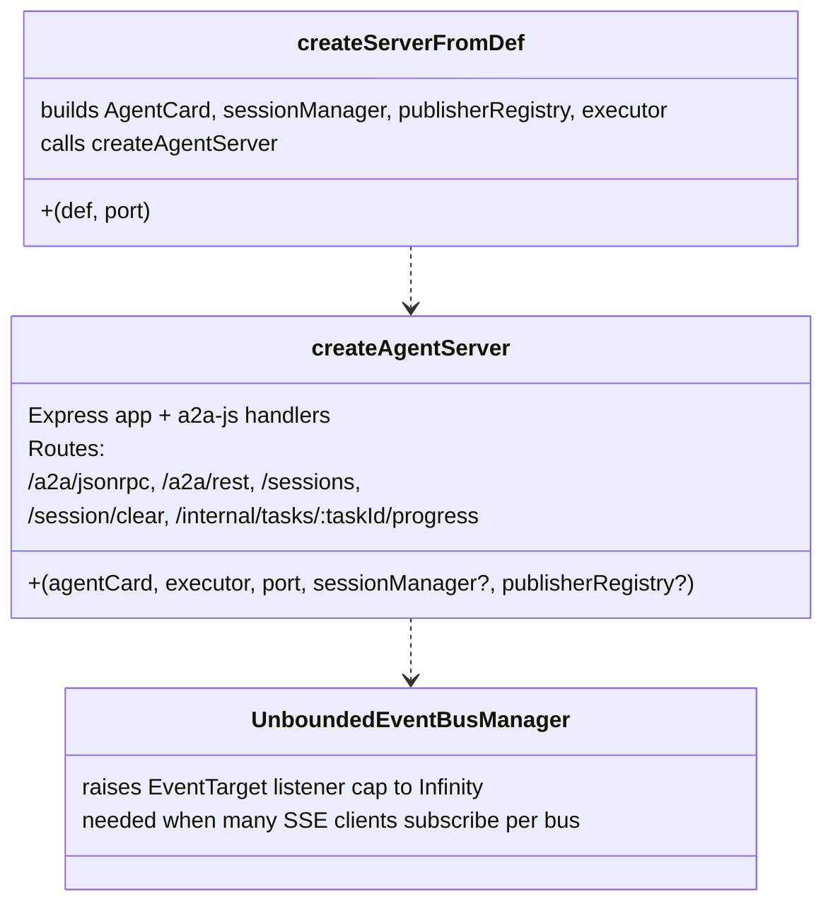

The `/internal/tasks/:taskId/progress` endpoint is how child processes push progress upward — they post `{ message, artifacts }` and the server publishes a status update on the matching A2A event bus.

## 4. QueryAgentExecutor — the heart

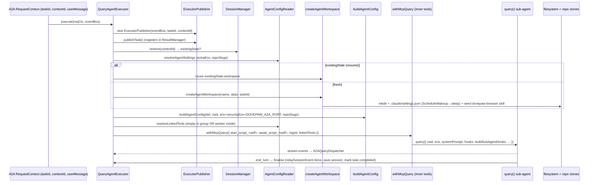

`existingState` decides resume vs fresh — `subagentSessionId` is passed to `query({ resume })` and the workspace dir is reused.

`buildSubAgentPrompt()` produces the inner system prompt — embeds persona, agent's file boundaries, and the per-agent management tool table (install/uninstall/load/unload/status/logs).

## 4.1 Full chain — A2A request → agent script's first line

The §4 and §5 diagrams cover the executor and the spawn separately. This one stitches them with every filesystem side effect called out in order, so a reader can answer "what exactly was written to disk between Dove's `start_<key>` and `tsx main.ts` starting?" without cross-referencing.

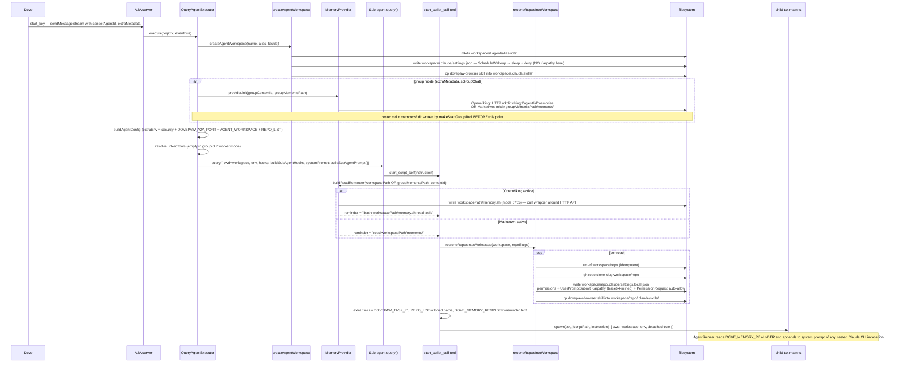

The disk-write order, top to bottom, on a fresh group-mode invocation with OpenViking active and one repo to clone:

1. `workspace/` (mkdir)
2. `workspace/.claude/settings.json` (ScheduleWakeup hook only)
3. `workspace/.claude/skills/dovepaw-browser/` (skill seed)
4. OpenViking namespace `viking://agent/<contextId>/memories` (HTTP, not disk)
5. `workspace/memory.sh` (OpenViking provider only)
6. `workspace/<repo>/` (gh clone)
7. `workspace/<repo>/.claude/settings.local.json` (Karpathy + permissions + PermissionRequest)
8. `workspace/<repo>/.claude/skills/dovepaw-browser/` (skill seed)

The group-only artifacts (`groupMomentsPath/members/roster.md`, `groupMomentsPath/moments/`) live in a _separate_ directory — the group moments workspace — written by `makeStartGroupTool` before any member's `QueryAgentExecutor.execute()` runs. See [Spec 07 §4](07-group-vs-single.md).

## 5. `start_script_<self>` → spawn.ts

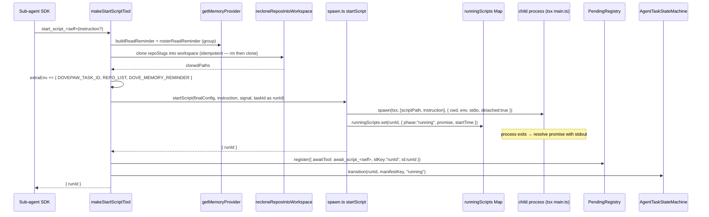

Worth highlighting:

- **`detached: true`** — the child gets its own process group so `process.kill(-pid, "SIGTERM")` cleans up Claude CLI subprocesses spawned by the script.
- **`OPENVIKING_CLI_CONFIG_FILE` env** — set only when the sidecar's port file exists; falls through to the user's global `~/.openviking/ovcli.conf` otherwise.
- **`runId = taskId`** — the script's runId is identical to the A2A taskId, so workspace dir `<alias>-<first8 of taskId>` and the runId share a traceable suffix.

## 6. `await_script_<self>` lifecycle

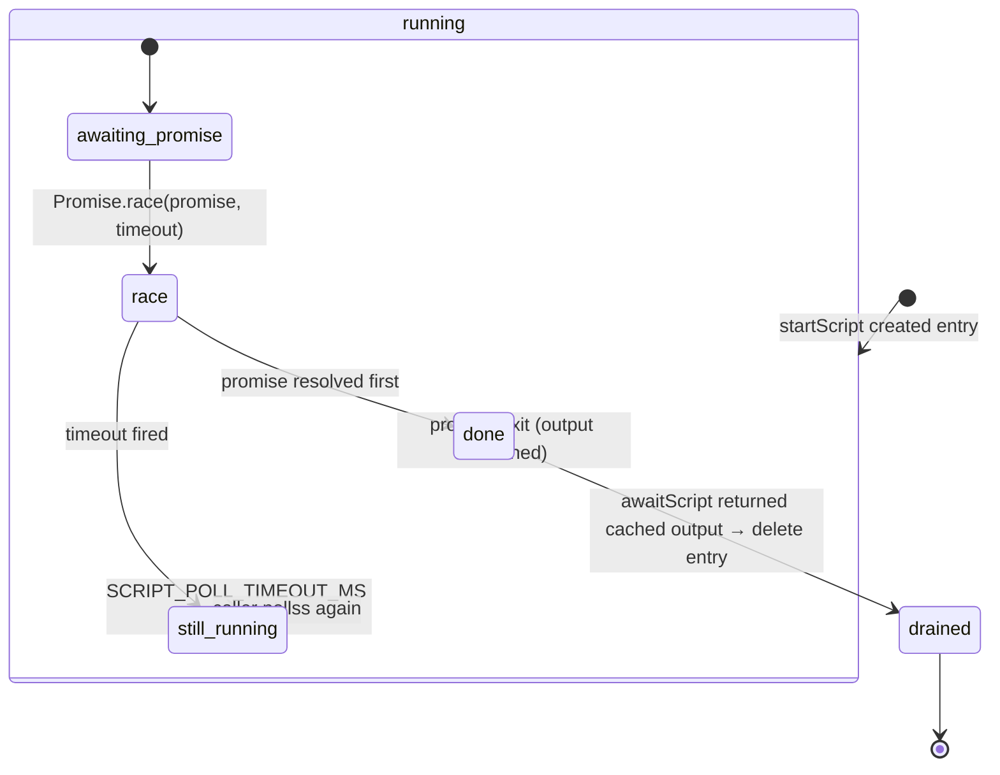

The cache (`phase:"done"`) is critical — `awaitScript` was failing with `not_found` when a script completed between polls. The two-phase state cleans up only after the caller actually read the output.

## 7. Env sanitation in the child

The child receives an explicitly-constructed env, never `process.env` mutation:

```text
{ ...process.env,                           // base
  ...openvikingEnv,                         // ovcli redirect (if sidecar up)
  ...config.extraEnv,                       // includes:
    // AGENT_WORKSPACE (cwd)
    // REPO_LIST (comma-joined clone paths)
    // DOVEPAW_TASK_ID (A2A taskId)
    // DOVEPAW_A2A_PORT
    // DOVEPAW_SECURITY_MODE / DOVEPAW_DISALLOWED_TOOLS / DOVEPAW_ALLOW_WEB_TOOLS
    // DOVE_MEMORY_REMINDER (textual reminder for AgentRunner to append to system prompt)
    // user-configured envVars
}
```

The child must not see `CLAUDECODE=1` — that would suppress nested Claude CLI invocations. The sub-agent's `query()` already sets `DOVEPAW_SUBAGENT=1` so the Karpathy shell hook skips its own injection inside agent processes.

## 8. AgentRunner — Claude vs Codex routing

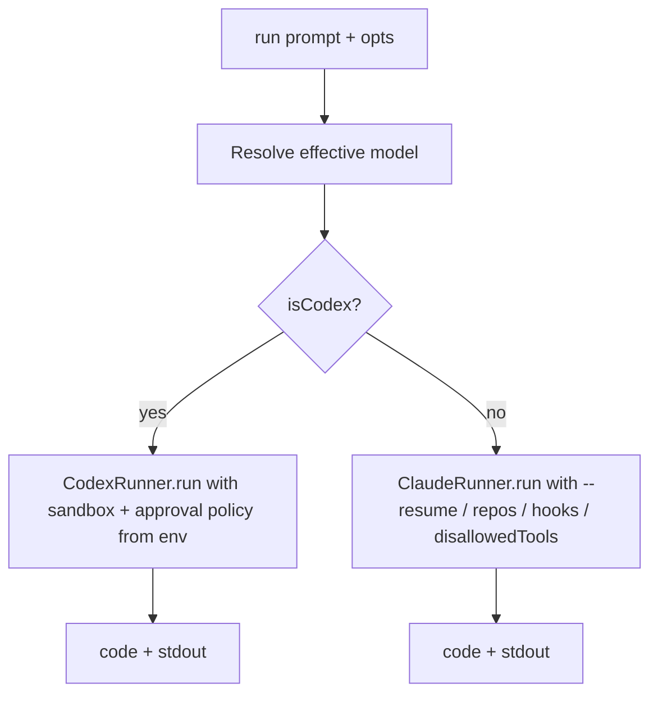

`isCodexModel`: model is `"codex"` or starts with `"gpt"`. Everything else (including blank) is Claude.

`resolveClaudeSecurityOpts()` reads `DOVEPAW_SECURITY_MODE` from env and:

- picks `permissionMode` from the strategy
- concatenates `disallowedTools` (mode + web tools)
- installs a `Bash` PreToolUse hook in read-only mode (same `bashHasWriteOperation` check)

Critical Codex notes:

- `env` field on `CodexOptions` _replaces_ `process.env` — always spread `...process.env` explicitly
- `approvalPolicy` maps to `"on-request"` for read-only/supervised, `"never"` for autonomous
- `webSearchEnabled` honours `DOVEPAW_ALLOW_WEB_TOOLS=1`

## 9. Workspace lifecycle

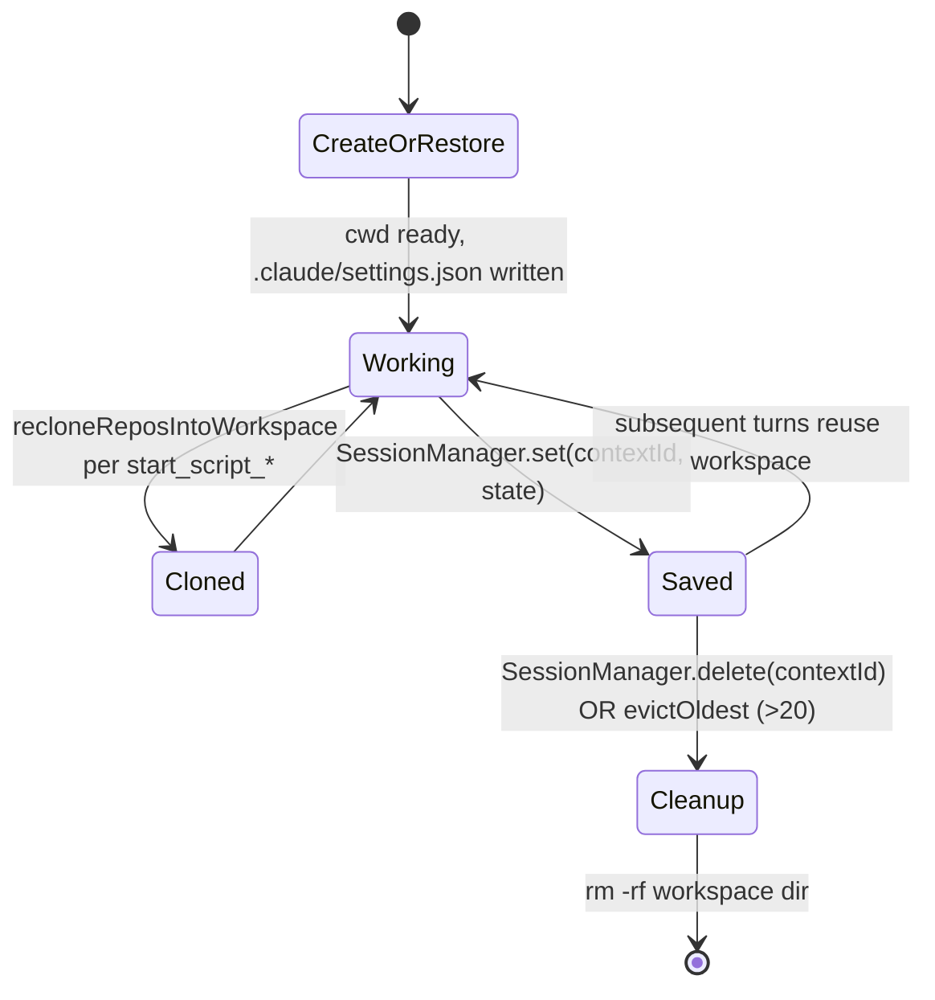

`MAX_SESSIONS = 20` — when the in-memory session map exceeds that, the oldest entry's workspace is removed. Evict is opportunistic — never blocks the new session.

`STOP` (user-pause) does **not** delete the workspace — only the trash-icon delete cascades to `SessionManager.delete()`.

## 10. Workspace hooks — two distinct surfaces

The per-task workspace dir and the repo clones inside it get **different** `.claude/` configs. Confusing the two is a common reading error, so this section keeps them strictly separated.

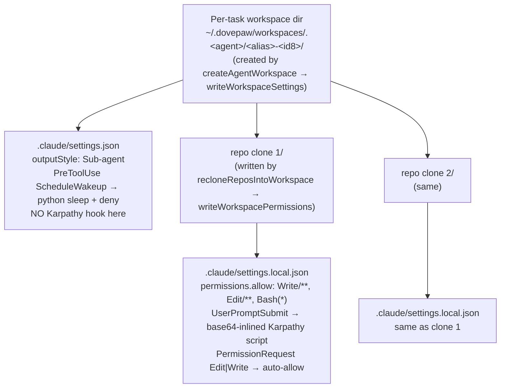

### Workspace dir — `<workspace>/.claude/settings.json`

Written once at workspace creation by `writeWorkspaceSettings(workspacePath)`:

```text
{
  "outputStyle": "Sub-agent",
  "hooks": {
    "PreToolUse": [
      { "matcher": "ScheduleWakeup",
        "hooks": [{ "type":"command",
          "command": "python3 -c \"... time.sleep(delaySeconds) ...\"
                     && printf '{\"hookSpecificOutput\":{\"permissionDecision\":\"deny\", ...}}'" }]
      }
    ]
  }
}
```

This is the **only** hook the workspace itself owns. The Karpathy `UserPromptSubmit` hook is **not** present at this layer.

### Repo clone — `<workspace>/<repo-name>/.claude/settings.local.json`

Written by `writeWorkspacePermissions(clonePath)` after each `gh repo clone`:

- `permissions.allow`: `Write(/**)`, `Edit(/**)`, `Bash(*)`
- `UserPromptSubmit` → Karpathy script inlined as `echo <base64> | base64 -d | bash` (path-independent, survives the clone being copied anywhere)
- `PermissionRequest` matching `Edit|Write` → auto-allow (the only way to bypass Claude Code's hardcoded `.claude/` self-edit block — see [upstream issue 37765](https://github.com/anthropics/claude-code/issues/37765))

These settings exist so nested Claude CLI invocations the agent script makes inside its clones can write freely without per-call permission prompts, _and_ still get the Karpathy reminder at every user turn inside that nested session.

### Sub-agent's own `query()` call — neither

The outer sub-agent SDK call inside `QueryAgentExecutor` reads neither of the above. Its hooks come from `buildSubAgentHooks` directly (see [Spec 01](01-hook-injection.md)). `DOVEPAW_SUBAGENT=1` is set in the spawn env, which short-circuits the Karpathy shell script even if it ran.

## 11. Cancellation

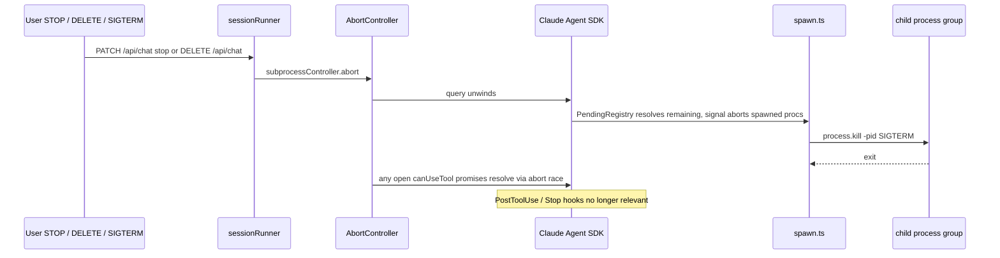

`subprocessController` is separate from the SSE `connectionController` — a browser disconnect does **not** kill the child process. Only explicit STOP/DELETE or process exit does.

## Related

- [Spec 00 — Topology](00-topology-overview.md)
- [Spec 01 — Hook injection](01-hook-injection.md) (workspace's ScheduleWakeup hook and PostToolUse Stop blocker)
- [Spec 02 — Security guardrails](02-security-guardrails.md) (env-driven security mode in AgentRunner)
- [Spec 03 — Orchestrator behaviour](03-orchestrator-behaviour.md) (the layer above)
- [Spec 06 — Memory management](06-memory-management.md) (`DOVE_MEMORY_REMINDER` injection)
- ADRs [0006](../adr/0006-orchestrate-agents-via-a2a-server-not-direct-script-spawn.md), [0007](../adr/0007-agent-logic-runs-as-child-process-not-inline-in-a2a-server.md)
