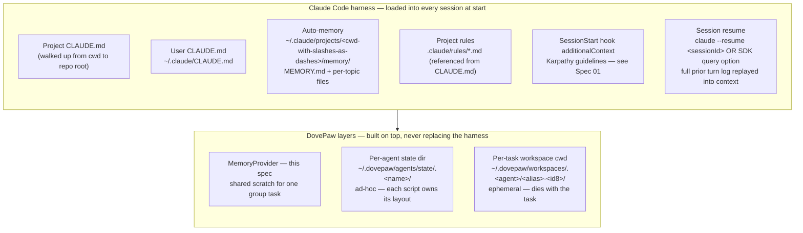
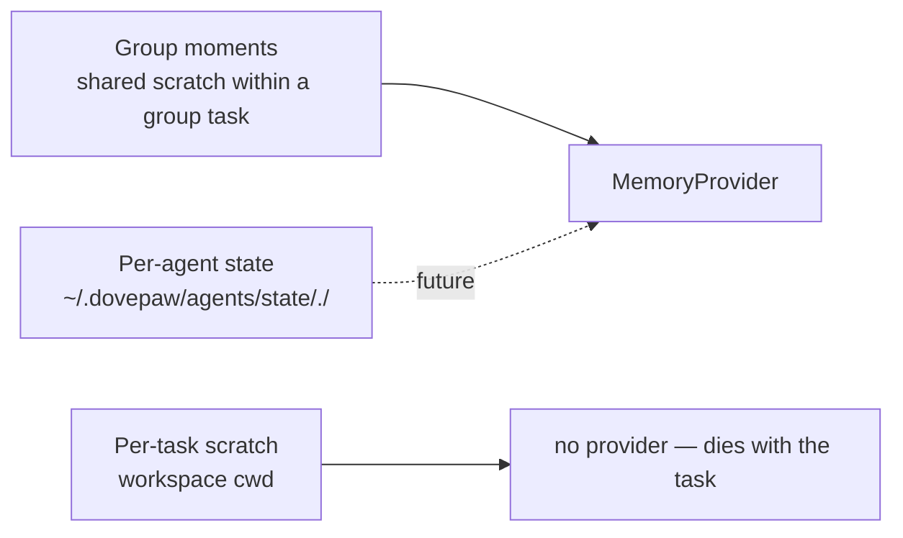
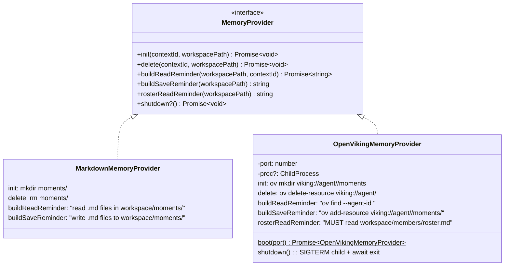
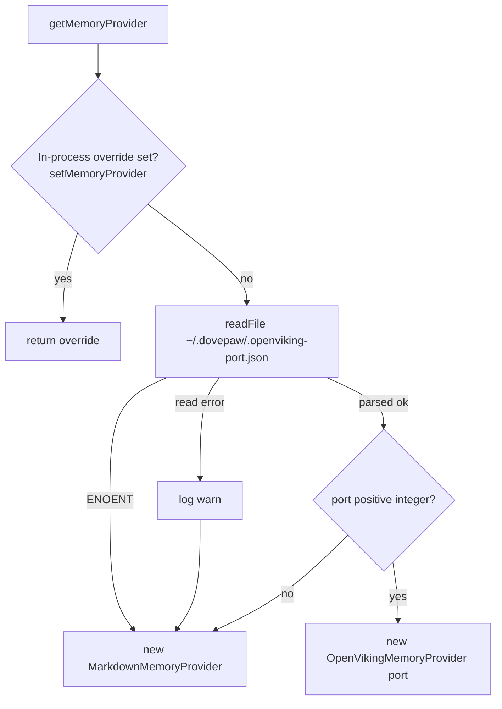
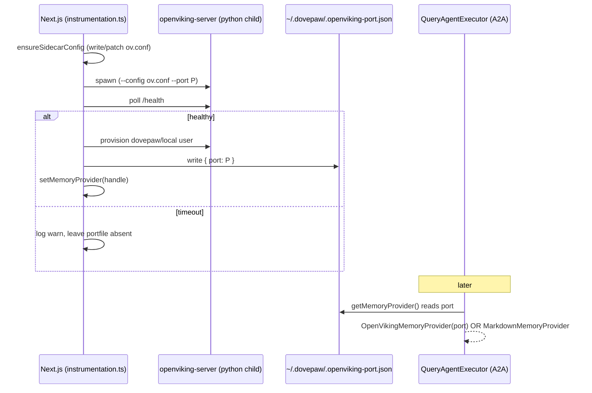
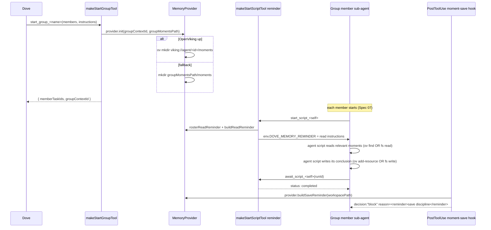
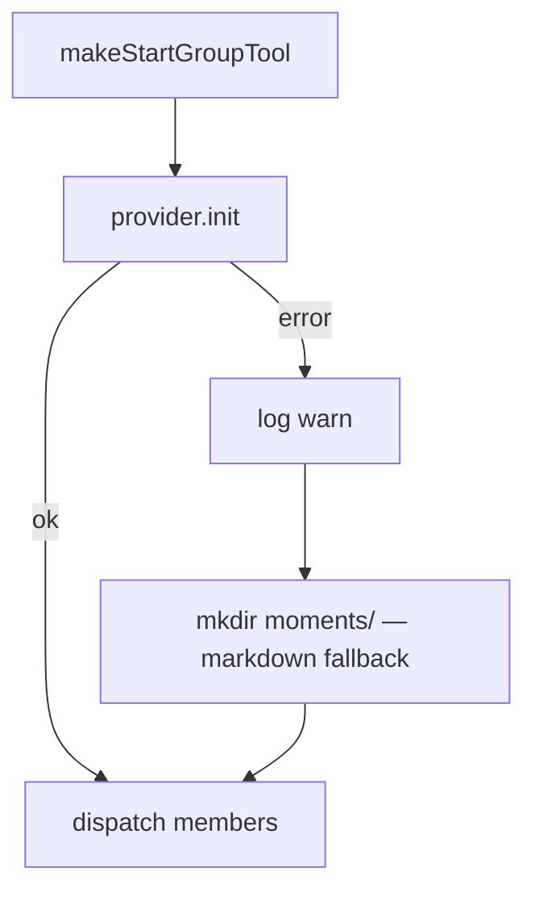

# Spec 06 · Memory Management

How agents share persistent state. DovePaw's `MemoryProvider` is the **top** layer of a much larger memory stack — most "memory" an agent reads during a session is loaded by the Claude Code harness itself (project `CLAUDE.md`, user `CLAUDE.md`, auto-memory files, `SessionStart` context, session resume). DovePaw doesn't reimplement any of those — it inherits them and adds only one layer of its own: shared scratch between agents in the same group task.

> Anchor: [ADR-0008 — Queryable memory layer for shared agent state](../adr/0008-pluggable-memory-provider-for-shared-agent-state.md). See also [`docs/memory-management.md`](../memory-management.md) for the original tour.

## 1. The layered memory stack



| Layer                                   | Owner                                 | Persists across                               | Shape                                                                                                              |
| --------------------------------------- | ------------------------------------- | --------------------------------------------- | ------------------------------------------------------------------------------------------------------------------ |
| Project `CLAUDE.md`                     | Claude Code harness                   | Repo lifetime                                 | Markdown, baked into system prompt verbatim                                                                        |
| User `~/.claude/CLAUDE.md`              | Claude Code harness                   | User's machine                                | Markdown, baked into system prompt verbatim                                                                        |
| Auto-memory (`MEMORY.md` + topic files) | Claude Code harness                   | Per-project history on this machine           | Index + per-topic markdown, lazily loaded on demand                                                                |
| `SessionStart` `additionalContext`      | Claude Code harness (via hook script) | This session only                             | `<system-reminder>` block right before the first user turn (Karpathy guidelines — [Spec 01](01-hook-injection.md)) |
| Session resume (`--resume <sessionId>`) | Claude CLI / SDK                      | Until pruned by Claude CLI                    | Full prior turn log replayed                                                                                       |
| `MemoryProvider` (this spec)            | DovePaw, on every `start_group_*`     | Group session lifetime                        | Vector namespace OR `moments/` markdown dir                                                                        |
| `agentPersistentStateDir`               | Agent scripts, ad-hoc                 | Forever (until manually cleared)              | Per-agent — each script picks its own layout                                                                       |
| Workspace cwd                           | A2A executor, per task                | Until cleanup or eviction (`MAX_SESSIONS=20`) | Ephemeral scratch + clones of `REPO_LIST` repos                                                                    |

### What this means concretely for DovePaw

- **`DovePaw/CLAUDE.md`** is a symlink to `AGENTS.md` — the architecture overview that every Dove session loads automatically (Dove's `query()` is invoked with `cwd: AGENTS_ROOT`). Editing the file propagates to every future session at next start, no code change required. This is the cheapest "memory" channel in the system.
- **Sub-agent sessions do not inherit `DovePaw/CLAUDE.md` by default** because their cwd is the per-task workspace dir, not `AGENTS_ROOT`. The agent's persona, file boundaries, and management tool table are baked into the system prompt explicitly by `buildSubAgentPrompt()` ([Spec 03 §6](03-orchestrator-behaviour.md)). The user's `~/.claude/CLAUDE.md` is still loaded because it is cwd-independent.
- **Workspace clones get a per-clone `.claude/settings.local.json`** written by `writeWorkspacePermissions` ([Spec 05 §10](05-a2a-spawn.md)). It inlines the Karpathy `SessionStart` hook as a base64-embedded shell script — so the harness-level reminder is preserved inside isolated repo clones too, where the repo's own `CLAUDE.md` may differ from DovePaw's.
- **Sub-agent session continuity** uses `subagentSessionId` stored in `SessionManager` and passed to `query({ resume })`. The Claude Agent SDK's session log is the load-bearing primitive — DovePaw only stores the pointer, not the turn content. Restoring the workspace dir on the same OS path is what makes resume work; see [MEMORY.md note](../../.claude/projects/-Users-yang-liu-Envato-others-DovePaw/memory/project_claude_cli_continue_cwd.md).
- **The `MemoryProvider` interface is intentionally narrow.** It owns **only** the multi-agent shared scratch that has no Claude Code equivalent. Single-agent recall is `--resume` + auto-memory; cross-session knowledge is project `CLAUDE.md` + auto-memory; behavioural guardrails are `SessionStart` `additionalContext`. None of these belong in `MemoryProvider`.

## 2. Three storage classes



Only **group moments** flow through `MemoryProvider` today. Per-agent state remains ad-hoc (each script writes to its own state dir); the ADR explicitly leaves that absorption for later.

## 3. Provider interface



## 4. `getMemoryProvider()` resolution (per-call)



Resolution is **per call** — the resolver re-reads the port file every time. This is the price of cross-process discovery without IPC: a sidecar reboot is picked up by the next group-tool invocation.

## 5. Lifecycle ownership

- **Next.js owns the sidecar.** `instrumentation.ts` spawns the python `openviking-server`, polls `/health` for up to 30s, then provisions a `dovepaw/local` user via Admin API, writes the port file, and calls `setMemoryProvider(provider)` with a handle that includes the `ChildProcess` (so SIGTERM works).
- **A2A reads the port file.** No in-process override — it always goes through the disk path.



## 6. Group-chat moment flow



The reminder text the agent reads is generated at the moment each member spawns — it always matches whichever provider is registered _right now_, never a stale snapshot.

The PostToolUse `makeGroupMomentSaveHook` fires after **every** `await_script_*` completion in group mode. It blocks with a save-discipline reminder. Combined with `makeGroupScriptAwaitToneHook` ("respond in your own voice"), this is how a group member writes a useful artifact and stays in persona.

## 7. The MOMENTS_PATTERN (shared writing style)

Every save reminder includes the [`MOMENTS_PATTERN`](../../chatbot/lib/memory/types.ts) — a terse-writing style guide:

```text
All substance stays. Only fluff dies.

Resource rules:
- One resource per item.
- Name clearly (e.g. "auth-decision", "api-schema").

Core rules:
- Drop articles: a, an, the.
- Drop filler: just, really, basically, actually, simply.
- ...
Preferred pattern: [thing] [action] [reason]. [next step].
```

Trigger condition (when to write) lives in the per-call reminder — the constant itself owns only the _style_ rules ([MEMORY.md](../../.claude/projects/-Users-yang-liu-Envato-others-DovePaw/memory/project_pattern_constant_style_only.md)).

## 8. Failure modes & defence in depth



`makeStartGroupTool` catches `init` errors and `mkdir(moments/)` as defence in depth. Even if a future backend fails partway through, the group still has a usable workspace dir.

If the sidecar dies mid-group:

- In-flight `ov` commands fail (the agent sees the error)
- The next `getMemoryProvider()` call falls back to Markdown automatically
- Group keeps progressing — degraded but functional

## 9. Settings tab + first-boot modal

```mermaid
flowchart LR
  user[User opens chatbot] --> modal{First-boot modal — source==dovepaw?}
  modal -- yes already configured --> bg[no modal]
  modal -- no --> show[Show: Configure / Not now / Don't ask again]
  show -- Configure --> settings[Settings → OpenViking tab]
  settings --> get[GET /api/openviking/config]
  get --> src{source}
  src -- dovepaw --> loaded[prefilled from ~/.dovepaw/openviking/ov.conf]
  src -- user-global-prefill --> prefill[prefilled from ~/.openviking/ov.conf]
  src -- empty --> empty[blank with banner]
  loaded --> save[POST /api/openviking/config]
  prefill --> save
  empty --> save
  save --> val{zod schema OK?}
  val -- no --> err400[400 with issues]
  val -- yes --> write[Write ~/.dovepaw/openviking/ov.conf]
  write --> reboot[Spawn new sidecar in-process]
  reboot --> ok{healthy?}
  ok -- yes --> upd[update port file + setMemoryProvider]
  ok -- no --> broken[Config saved, sidecar down — markdown fallback]
```



The POST handler preserves `root_api_key` from any existing file if the body omits it — the UI never round-trips secrets it didn't capture.

## 10. Adding a new provider

1. Create `chatbot/lib/memory/<name>.ts` implementing `MemoryProvider`.
2. Wire its lifecycle from `instrumentation.ts` (or the most appropriate process), and call `setMemoryProvider(new YourProvider(...))`.
3. If the provider needs a disk-discovery path (like OpenViking's port file), add a branch in `getMemoryProvider()` that reads its small JSON state file and parses with zod.

Call sites (`makeStartGroupTool`, `makeStartScriptTool`, sub-agent hooks) never need changes — they only see the interface.

## 11. Known limitations (from ADR-0008 + memory-management.md)

| Limitation                                              | Workaround                                                               |
| ------------------------------------------------------- | ------------------------------------------------------------------------ |
| Default OpenViking embedder requires `llama-cpp-python` | Pick a remote provider in Settings → OpenViking                          |
| In-process reboot orphans the previous python child     | Cleanup runs on SIGINT/SIGTERM/exit — hard crash leaves it running       |
| In-flight `ov` against the old port fails on reboot     | Next provider is reachable immediately; failed command surfaces to agent |
| Per-call provider resolution touches FS each time       | Cheap (`existsSync` + small JSON parse); resolve once in tight loops     |

## Related

- [Spec 05 — A2A spawn](05-a2a-spawn.md) (`makeStartScriptTool` is where the read reminder is injected)
- [Spec 07 — Group vs single mode](07-group-vs-single.md) (group setup calls `provider.init`)
- [`docs/memory-management.md`](../memory-management.md) (the original tour with more detail)
- [ADR-0008](../adr/0008-pluggable-memory-provider-for-shared-agent-state.md)
