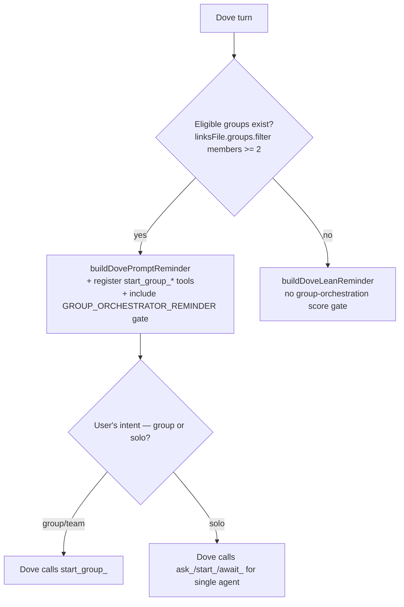
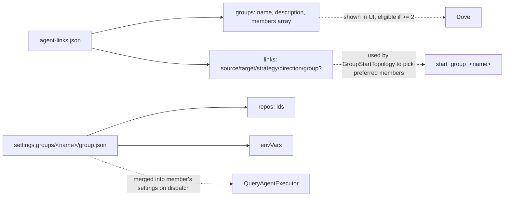
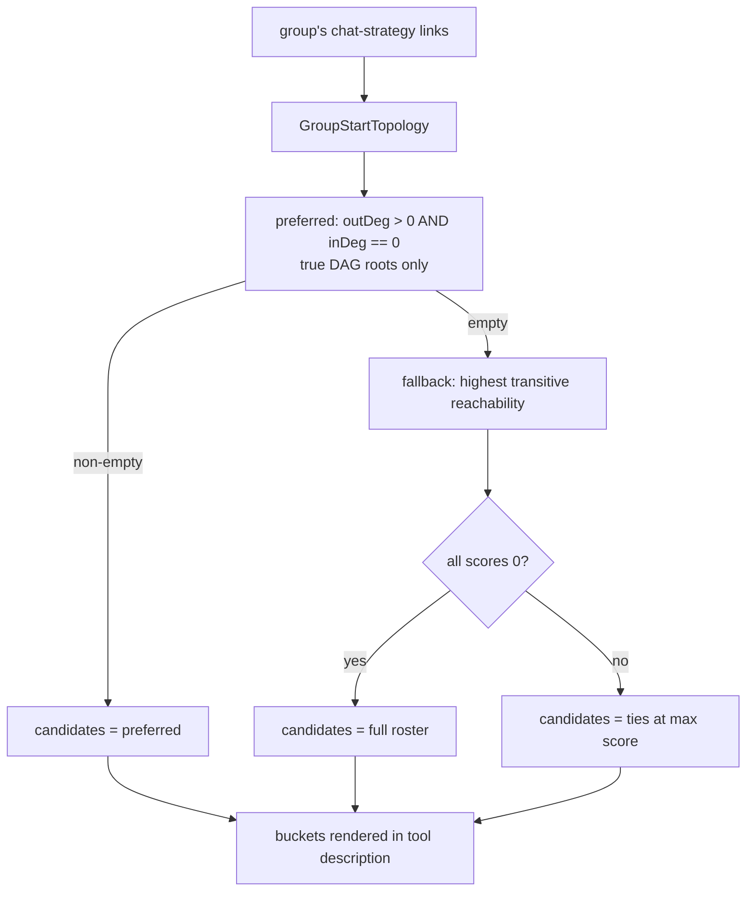
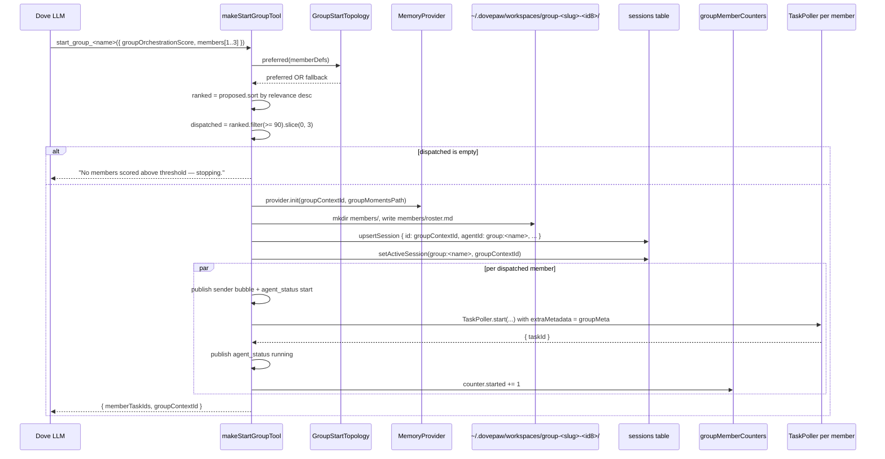
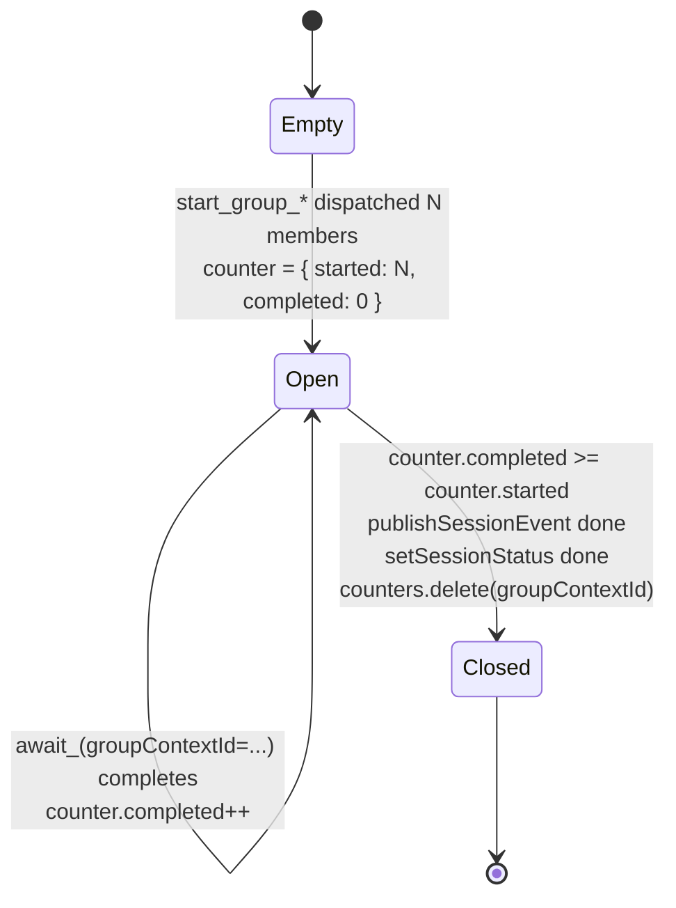
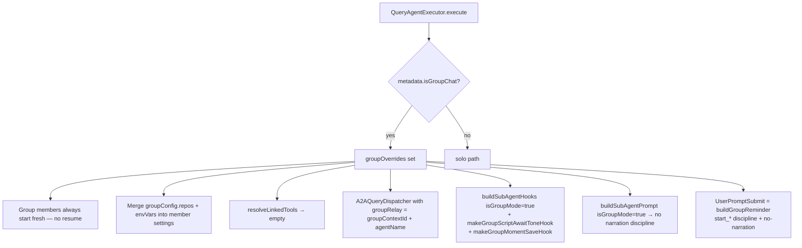
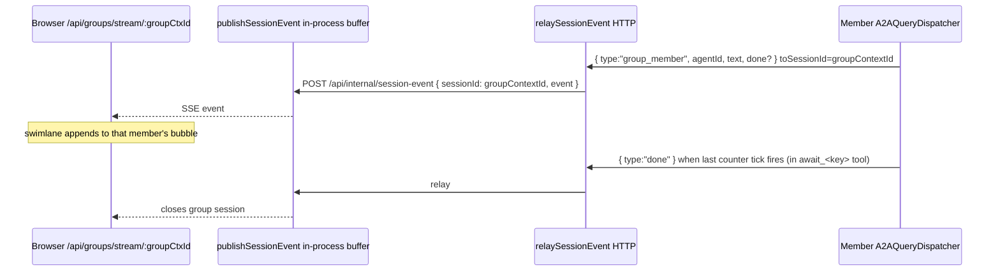
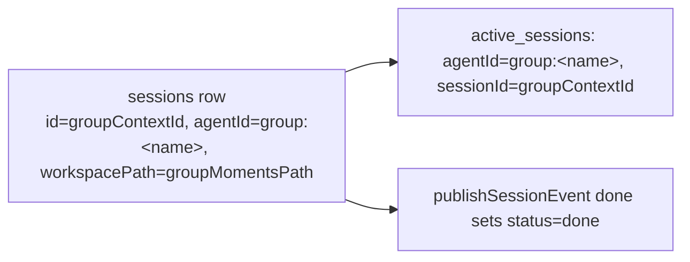

# Spec 07 · Group vs Single Agent Mode

A group is a named collection of agents that can be invoked together via a single `start_group_<name>` MCP tool. Dove fans out to 1–3 relevant members; each member runs in its own A2A task but shares one moments workspace and one group SSE stream.

> Anchor ADRs: [0009](../adr/0009-orchestrator-owned-await-chain.md) (the group barrier is a counter, not a ledger) and [0010](../adr/0010-group-start-topology-transitive-reachability-fallback.md) (start-topology selection).

## 1. The two-axis decision

Group mode is **not** a global switch — it's per-call. Dove can interleave solo calls and group calls in the same turn.

## 2. Storage layout

- Group membership and group description live in `agent-links.json` (`linksFile.groups`).
- Group-shared repos + env vars live in `~/.dovepaw/settings.groups/<name>/group.json` (see [`lib/group-config.ts`](../../lib/group-config.ts)).
- Eligible for Dove: `members.length >= 2`.

## 3. Member selection — preferred vs reachability fallback (ADR-0010)

Why this matters: bidirectional / cyclic groups have no pure DAG root. The old isolated-node fallback returned an empty bucket, the LLM saw nothing, and the eligibility gate was bypassed. Now reachability picks the most structurally central members.

`reachability(name, visited)` is a cycle-safe DFS — each member's score is an independent DFS from that member's node. `dual` links expand in both directions in the adjacency list (mirroring `outDeg`/`inDeg`).

## 4. `start_group_*` flow

Each dispatched member's A2A `extraMetadata` carries `{ isGroupChat, groupContextId, groupMomentsPath, groupName }`. The receiving `QueryAgentExecutor.resolveGroupChatOverrides()` reads these and switches into group mode.

The eligibility threshold `GROUP_MEMBER_RELEVANCE_THRESHOLD = 90` blocks tangential members. The cap of 3 dispatched per call bounds concurrent token spend.

## 5. Group completion counter (ADR-0009)

No ledger, no checkpoint, no recovery file — just a `Map<groupContextId, { started, completed }>` in [`chatbot/lib/group-member-counter.ts`](../../chatbot/lib/group-member-counter.ts) (isolated from the rest to avoid a circular import).

**Failure mode** (acknowledged in ADR-0009): if `start_group_*` registers members but no `await_<memberKey>(groupContextId=…)` is ever issued, the SSE stream stays open. The Stop hook usually prevents this — but if a future code path bypasses it, the only diagnostic is server logs.

## 6. Member-side runtime — group mode switches

`A2AQueryDispatcher.groupRelay` does two things:

- Relays each text delta as `{ type:"group_member", agentId, text: accumulated, done:false }` to the group SSE pool — the swimlane shows live deltas
- On every `onToolCall`, **discards** accumulated `groupStreamText` (only post-tool text reaches the pool — keeps prose clean)
- On `onFinalOutput`, sends `{ done:true }` to close the bubble

A member's SQLite session is independent — moments are the shared layer.

## 7. The pool SSE stream

**Never filter group pool events by `event.text` truthiness** — `done:true` may carry empty text and must pass through to clear bubble IDs ([MEMORY.md](../../.claude/projects/-Users-yang-liu-Envato-others-DovePaw/memory/project_group_chat_done_event_filter.md)).

## 8. Group-orchestrator score gate (Spec 01 cross-ref)

The PreToolUse `start_*` gate is registered on Dove **whenever at least one eligible group exists** (`eligibleGroups.length > 0` in `route.ts`) — not only when a particular call happens inside a group session. That means **every** Dove-side `start_*` call in such a workspace must clear the gate, including ones for solo agents.

The gate logic (in `buildDoveHooks`, group branch):

| Tool input shape                      | Decision                                                                                                                                                                                                            |
| ------------------------------------- | ------------------------------------------------------------------------------------------------------------------------------------------------------------------------------------------------------------------- |
| `group.groupOrchestrationScore >= 80` | allow                                                                                                                                                                                                               |
| `group.groupOrchestrationScore < 80`  | deny — "score is X, must be >= 80" + group-orchestrator rules                                                                                                                                                       |
| `group` field missing entirely        | deny — asks the model whether it is in a group; if YES recall with the field, if NO recall without (but the next attempt without the field will be denied again — this forces explicit orchestrator-mode reasoning) |

Reminders verbatim from `GROUP_ORCHESTRATOR_REMINDER`:

Rules covered (from `dove-lean-reminder.ts`):

- Don't claim "no handoffs needed" when independent outputs ≠ convergence
- Don't pre-assign handoffs inside member instructions
- Don't stop after one round
- These rules do **not** bypass `justification.confidence`

## 9. Group session DB representation

When the user revisits the group session from history, the chat page mounts the swimlane component and reads from this row.

## 10. Cleanup

- On `done` event from the last member completion → `setSessionStatus(groupContextId, "done")` and `groupMemberCounters.delete(groupContextId)`.
- On user delete → cascades through `deleteSession(groupContextId)` (which cascades to `dove_agent_contexts`).
- `delete` of any member's contextId removes its row from the DB; the group session is unaffected.
- `provider.delete(groupContextId, groupMomentsPath)` should be called by the route handler — verify in code before relying on it.

## Related

- [Spec 03 — Orchestrator behaviour](03-orchestrator-behaviour.md) (Dove is the only group orchestrator)
- [Spec 04 — Handoff pattern](04-handoff-pattern.md) (`group` field on `start_*`, group-orch score gate)
- [Spec 06 — Memory management](06-memory-management.md) (`provider.init` lifecycle)
- [Spec 09 — Agent links & canvas](09-agent-links-canvas.md) (group definitions + topology source)
- ADRs [0009](../adr/0009-orchestrator-owned-await-chain.md), [0010](../adr/0010-group-start-topology-transitive-reachability-fallback.md)
