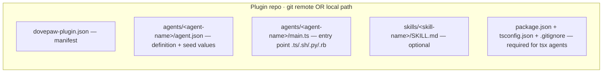
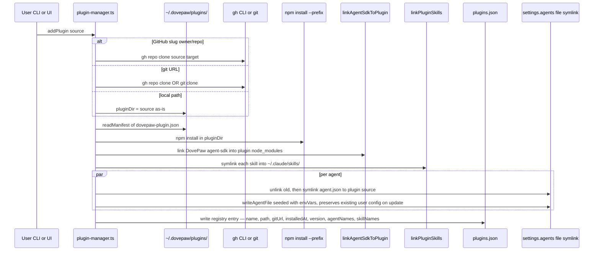
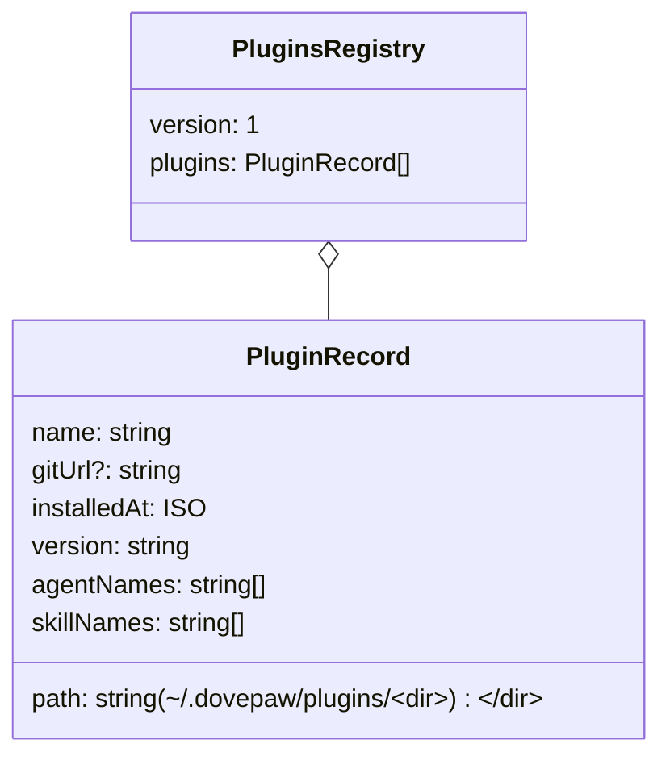
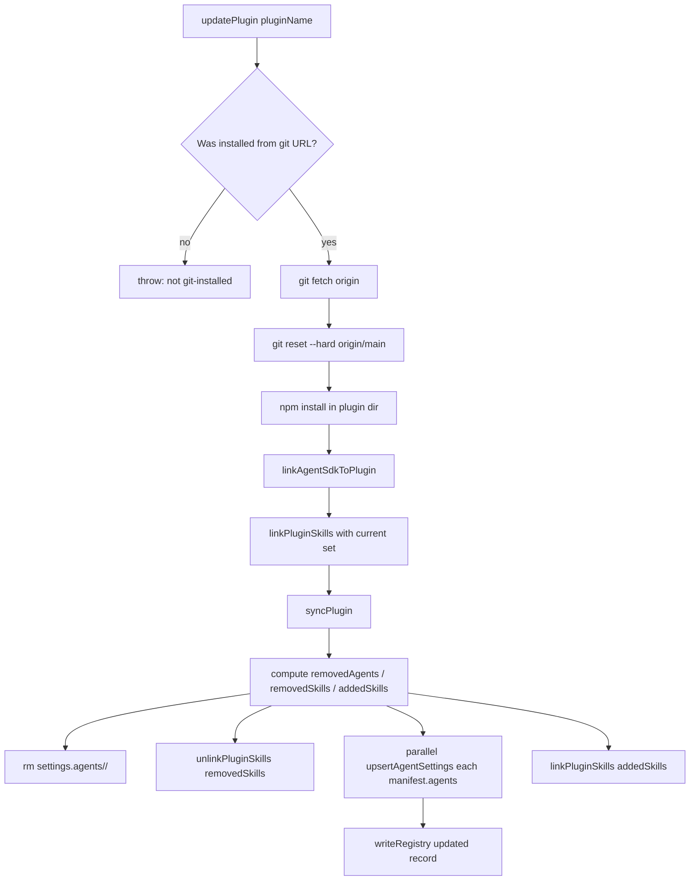
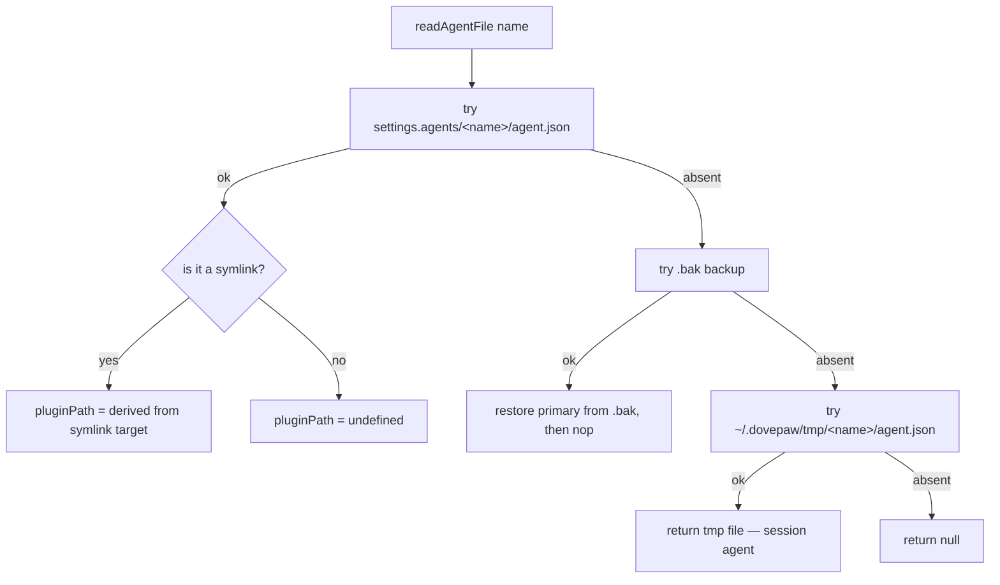
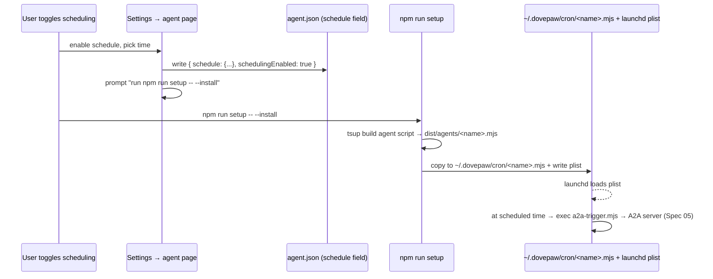
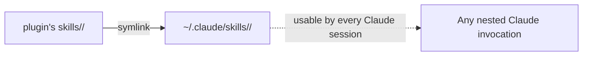

# Spec 08 · Plugin Lifecycle & Agent Registry

How DovePaw discovers, installs, and updates agent code. No agent ships in the DovePaw repo — everything is a plugin.

## 1. Plugin shape



`dovepaw-plugin.json` is small:

```text
{
  "name": "<unique-plugin-name>",
  "version": "1.0.0",
  "agents": ["agent-1", "agent-2"],
  "skills": ["skill-1"]
}
```

`agents/<name>/agent.json` follows `agentConfigEntrySchema` ([`lib/agents-config-schemas.ts`](../../lib/agents-config-schemas.ts)) — every UI/runtime field for the agent including suggestion cards, schedule, envVars seed list, repo IDs seed list, icon, persona, doveCard, etc.

## 2. Install — `addPlugin`



Key correctness moves:

- **`agent.json` in `settings.agents/` is a symlink** — UI edits write through the symlink directly into the plugin source. They survive `git pull` because they _are_ the source.
- **`upsertAgentSettings` reads the existing file before re-linking** so user customisations (repos, envVars values, locked, notifications) are preserved on plugin update.
- **`pluginPath` is omitted from disk** — derived from the symlink target at read time. Avoids machine-specific paths leaking into committed plugin repos.
- **`linkAgentSdkToPlugin`** links DovePaw's compiled `@dovepaw/agent-sdk` into the plugin's `node_modules` so the plugin can import it without redownloading.

## 3. Registry — `plugins.json`



Stored at `~/.dovepaw/plugins.json`. Synced to S3 via `pushConfig()` (if configured) — same hook used by `agent-links.json` and `settings.agents/*/agent.json` writes.

## 4. Update flow



`syncPlugin` is also exposed standalone — re-syncs manifest without pulling from git. Useful when the plugin path is a local checkout the user edits directly.

## 5. Per-agent file lookup — `readAgentFile`



Three classes of agent in this scheme:

| Class             | Storage                                                                             | Who creates it                                   |
| ----------------- | ----------------------------------------------------------------------------------- | ------------------------------------------------ |
| **Plugin**        | `settings.agents/<name>/agent.json` symlinks to `<plugin>/agents/<name>/agent.json` | Plugin install                                   |
| **Tmp / session** | `~/.dovepaw/tmp/<name>/agent.json`                                                  | Dove at runtime (via `/sub-agent-builder` skill) |
| **Local-dev**     | `agent-local/` symlinked into `~/.dovepaw/plugins/` by `npm install`                | Developer                                        |

`readAllAgentConfigEntries()` combines permanent + tmp (tmp wins on duplicate name) — that's what every UI list uses ([MEMORY.md entry](../../.claude/projects/-Users-yang-liu-Envato-others-DovePaw/memory/project_read_all_agent_config_entries.md)).

## 6. Scheduler integration

Plugin install does **not** schedule anything by itself. Scheduling is a separate, per-agent concern:



The trigger script (`a2a-trigger.mjs`) sends an A2A message — same path as a user-initiated invocation ([ADR-0006](../adr/0006-orchestrate-agents-via-a2a-server-not-direct-script-spawn.md)).

Tool-triggered runs (from chat) use **tsx + TypeScript source**, not the compiled `.mjs` — so launchd issues don't affect them ([MEMORY.md](../../.claude/projects/-Users-yang-liu-Envato-others-DovePaw/memory/feedback_tsx_not_mjs_for_a2a.md)).

## 7. Skill linking



- `linkPluginSkills(pluginDir, skillNames)` is idempotent and called on every `addPlugin`/`updatePlugin`/`syncPlugin`.
- `unlinkPluginSkills` removes symlinks for skills no longer in the manifest.
- DovePaw's own skills live in `skills/` at repo root and are symlinked into `~/.claude/skills/` by `npm run install` ([MEMORY.md](../../.claude/projects/-Users-yang-liu-Envato-others-DovePaw/memory/project_skills_location.md)).

## 8. Failure surfaces

| Failure                              | What happens                                                           |
| ------------------------------------ | ---------------------------------------------------------------------- |
| `dovepaw-plugin.json` missing        | `readManifest` throws — addPlugin rejects                              |
| Manifest name ≠ URL-derived dir      | If the manifest-name dir is free, `mv` to it; else stay at URL-derived |
| `agents/<name>/agent.json` malformed | Zod parse throws — addPlugin rejects                                   |
| Symlink target file disappears       | Subsequent `readAgentFile` returns null; UI shows "missing definition" |
| `.bak` recovery                      | Broken symlink is unlinked before copying — avoids ENOENT loop         |
| `gh` not installed                   | The `npm install` and `gh repo clone` calls fail loudly                |

## 9. `addPlugin` from the UI vs CLI

Both call into `lib/plugin-manager.ts`. UI path is `/api/settings/plugins/route.ts`. CLI path is `scripts/plugin.ts`. Single source of truth — no duplication of clone/install/symlink logic.

## Related

- [Spec 00 — Topology overview](00-topology-overview.md) (where ~/.dovepaw/ paths live)
- [Spec 03 — Orchestrator behaviour](03-orchestrator-behaviour.md) (agents are routed through their A2A server)
- [Spec 05 — A2A spawn](05-a2a-spawn.md) (the runtime that picks up these definitions)
- [Spec 09 — Agent links & canvas](09-agent-links-canvas.md) (link topology references agent names)
