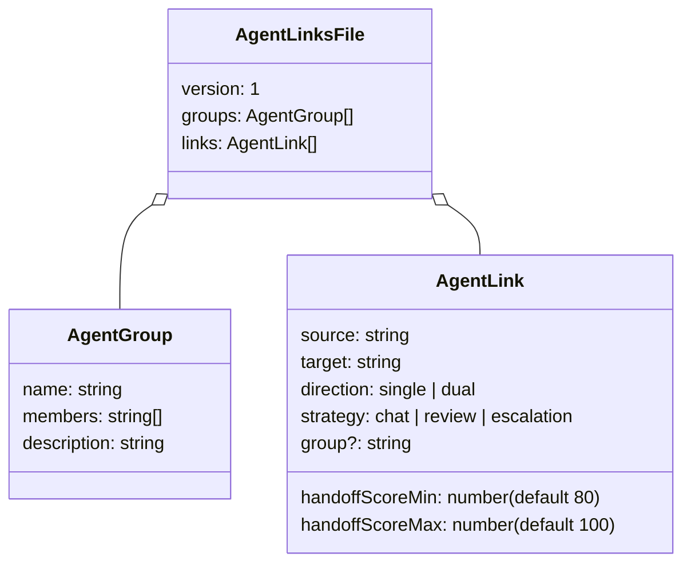
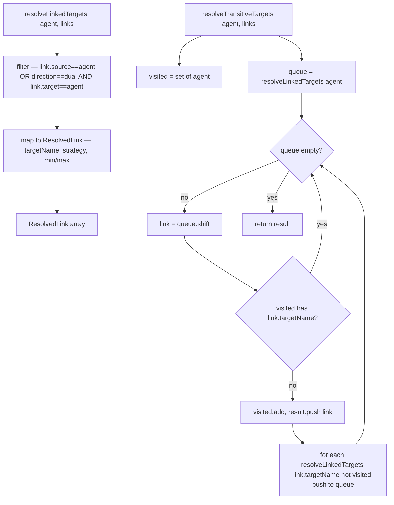
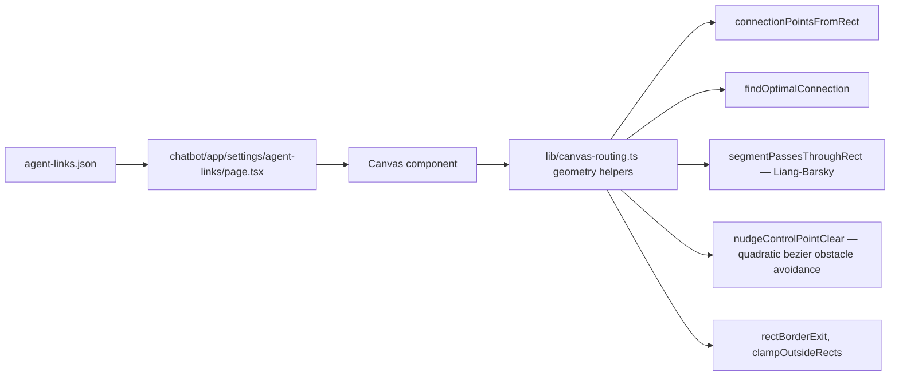
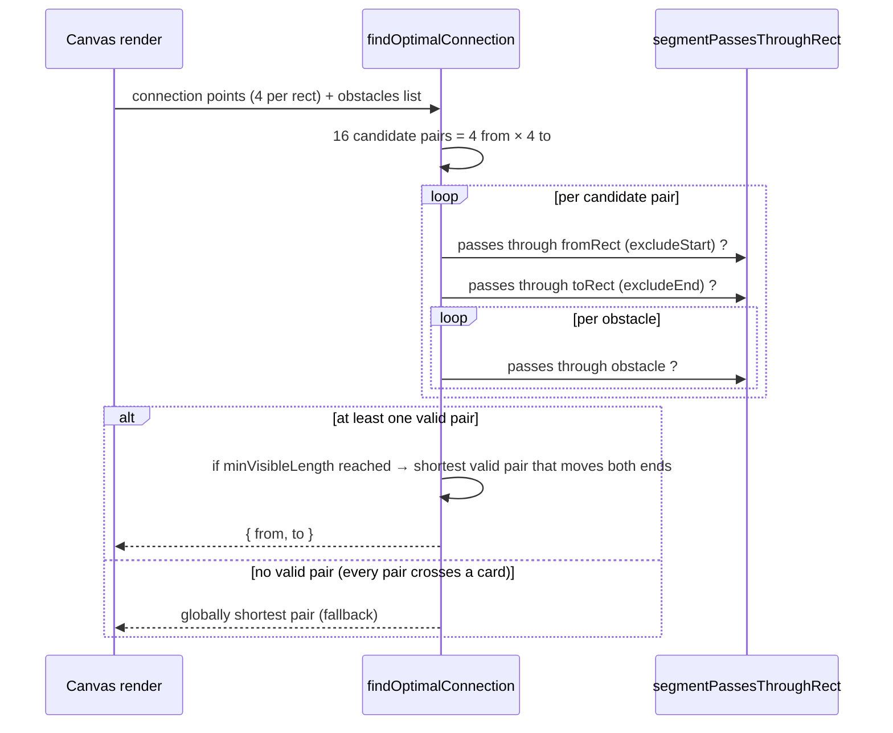
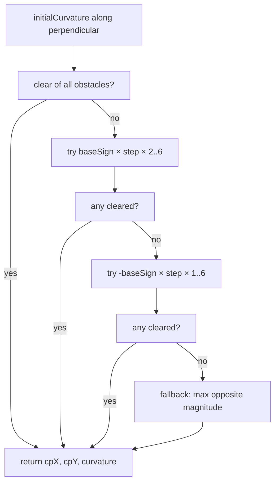
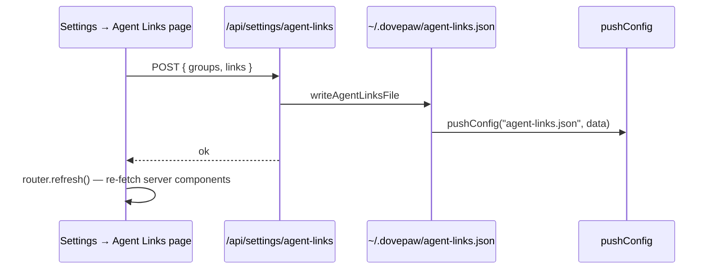

# Spec 09 · Agent Links & Canvas Routing

How agent-to-agent connections are stored, queried, and rendered visually. The link store powers handoff routing ([Spec 04](04-handoff-pattern.md)) and group selection ([Spec 07](07-group-vs-single.md)); the canvas routing helpers draw the resulting graph in the Settings → Agent Links page.

## 1. Storage shape

- Single file: `~/.dovepaw/agent-links.json`.
- Read/write in [`lib/agent-links.ts`](../../lib/agent-links.ts).
- Synced via `pushConfig()` on every write.
- Legacy string-only group entries are migrated on read by the union schema (`agentGroupInputSchema`).
- **Identity** for a link is the `(source, target, strategy)` tuple — the same pair can have multiple strategies. PATCH/DELETE must include strategy.

## 2. Link resolution

`resolveLinkedTargets` is used by:

- `buildLinksReminder` (Dove + direct-chat sub-agent PostToolUse)

`resolveTransitiveTargets` is used by:

- `AgentConfigReader.resolveLinkedTools` for mini-orchestrator mode — register every reachable agent's tools, not just direct neighbours

## 3. The Settings → Agent Links page

The canvas renders one node per agent (member-of-group or unaffiliated) and one edge per link. Edges are computed against rectangular obstacles (other cards) so they don't visually pass through unrelated nodes.

## 4. Edge routing — straight first, then nudged

The `excludeStart` / `excludeEnd` flags allow a border-touching point at the endpoint without flagging the segment as intersecting its own card. `minVisibleLength` thresholds short pairs and prefers pairs where both endpoints move — keeps the connector visually meaningful when nodes are close.

## 5. Bezier control-point nudging

When a straight line would clip an obstacle, the edge is drawn as a quadratic bezier. `nudgeControlPointClear` shifts the control point along the perpendicular until `quadBezierPassesThroughRect` reports no collision for any obstacle.

## 6. Canvas helpers — at a glance

| Helper                                                                            | Purpose                                                         |
| --------------------------------------------------------------------------------- | --------------------------------------------------------------- |
| `connectionPointsFromRect(r)`                                                     | 4 border-centre points for a rect                               |
| `segmentPassesThroughRect(p1, p2, rect, excStart, excEnd)`                        | Liang-Barsky line-rect test                                     |
| `findOptimalConnection(from, to, obstacles, minVisibleLength)`                    | Best straight-line border pair                                  |
| `rectBorderExit(rect, dirX, dirY)`                                                | Where a ray from rect centre exits                              |
| `pointInRect(p, r)`                                                               | Point membership                                                |
| `rectsOverlap(a, b)`                                                              | Rect overlap                                                    |
| `clampOutsideRects(node, obstacles)`                                              | Slide a rect along the nearest edge of any overlapping obstacle |
| `nudgeControlPointClear(p0, p2, perpX, perpY, initialCurvature, step, obstacles)` | Obstacle-avoiding bezier CP                                     |
| `quadBezierPassesThroughRect(p0, cp, p2, rect)`                                   | Sample-12 collision check                                       |

All pure functions; no React or DOM imports — they live in `chatbot/lib/canvas-routing.ts` and are unit-tested in `canvas-routing.test.ts`.

## 7. UI mutation flow

Edits are **whole-file** writes (no per-link PATCH currently). The UI assembles the full {groups, links} payload from local state and POSTs once.

## 8. Inter-agent link reachability + heartbeat

For direct-chat mini-orchestrator mode ([Spec 03](03-orchestrator-behaviour.md)), `resolveLinkedTools` filters to currently-online agents only. Online is checked via `resolveAgentPort(manifestKey) !== null`; optionally a heartbeat server can be consulted. The links file itself is the source of truth for _topology_; runtime port lookup determines _availability_.

## Related

- [Spec 04 — Handoff pattern](04-handoff-pattern.md) (consumes `resolveLinkedTargets`)
- [Spec 07 — Group vs single](07-group-vs-single.md) (consumes `linksFile.groups` and chat-strategy links)
- [Spec 03 — Orchestrator behaviour](03-orchestrator-behaviour.md) (mini-orchestrator uses `resolveTransitiveTargets`)
