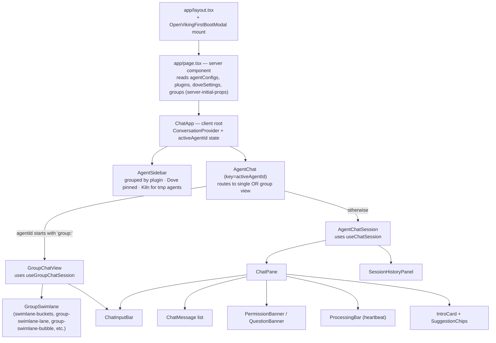
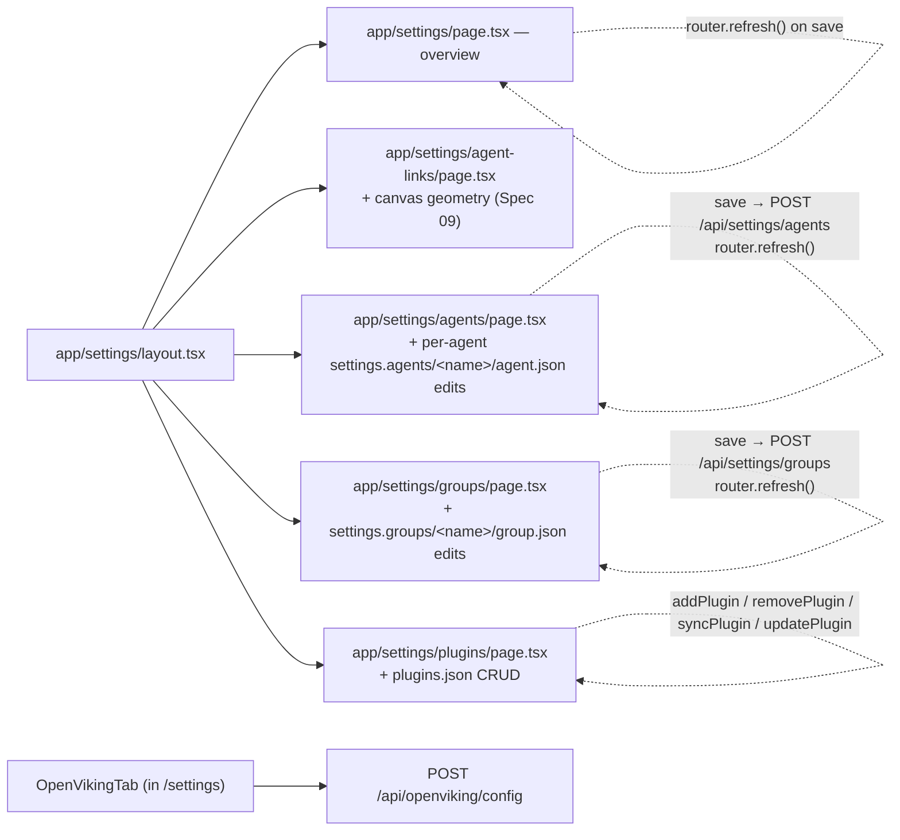
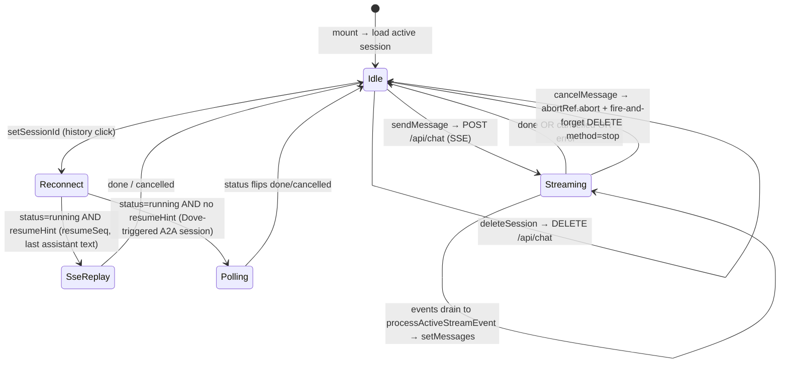
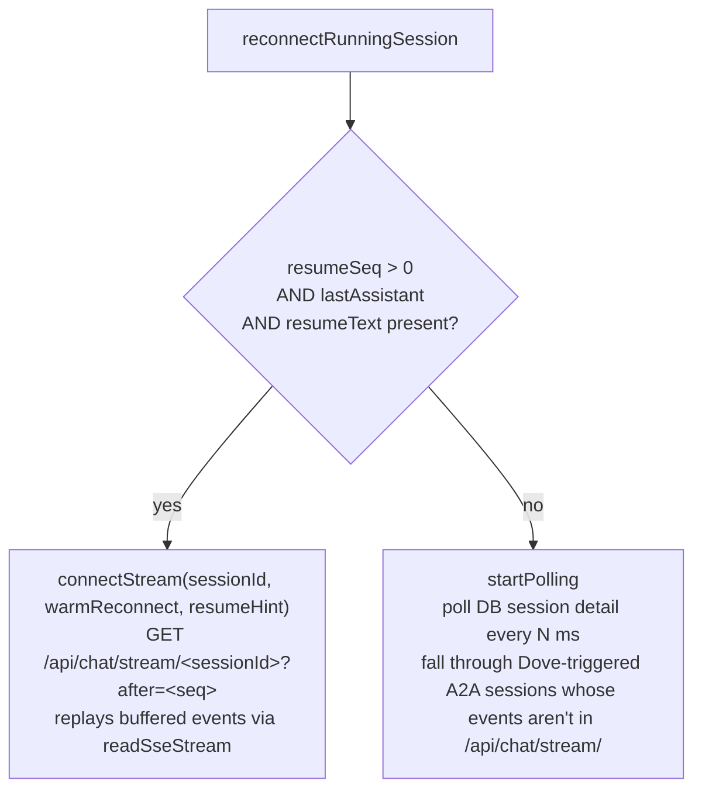
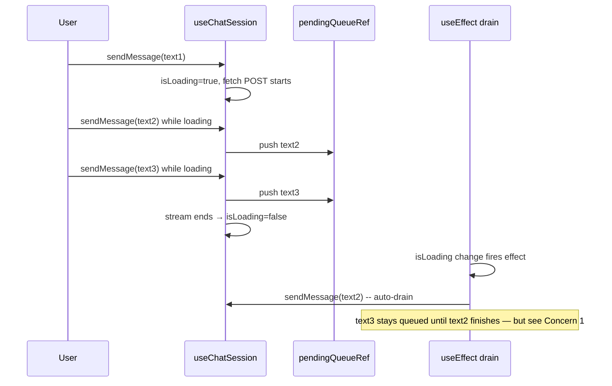
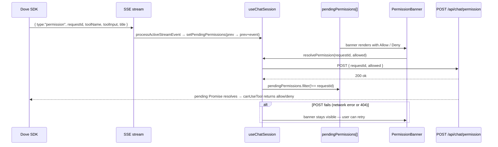
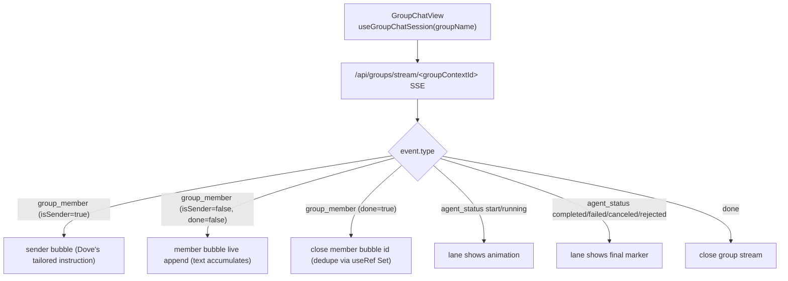

# Spec 10 · UI Surfaces — Chat Page, Settings, Dialogs

The browser surfaces and the React hooks that drive them. Covers the chat page, settings pages, permission/question dialogs, group swimlane, session history, and the SSE event taxonomy the UI consumes. Written under the **critical-reading rule** — Section 10 surfaces concrete UI bugs and design gaps rather than just transcribing the code.

## 1. Component tree (top-down)



The `key={activeAgentId}` on `<AgentChat>` is load-bearing: switching agents fully remounts the chat, so each `useChatSession` instance owns its own refs and timers. (Same identity-key reasoning the server-side `MessageAccumulator` uses for stable message IDs.)

## 2. Settings pages



Every settings page follows the same pattern:

1. **Server component reads from disk** and passes `initialX` props (the project's standard "no hydration flash" pattern).
2. **Client component owns form state** prefilled from `initialX`.
3. **Save POSTs to an `/api/settings/*` route**; server writes through `lib/settings.ts` → optionally to S3 via `pushConfig()`.
4. **`router.refresh()` after success** re-renders server components without a full reload (sidebar, agent lists pick up the change).

The agent-links canvas is the one exception: its geometry is pure client-side (Spec 09 §6) and the edge layout responds live to drag without going through the server.

## 3. SSE event taxonomy (browser consumption)

```mermaid
classDiagram
  class ChatSseEvent {
    discriminated by `type`
  }
  class Session {
    type: session
    sessionId: string
  }
  class Text {
    type: text
    content: string
  }
  class Thinking {
    type: thinking
    content: string
  }
  class ToolCall {
    type: tool_call
    name: string
  }
  class ToolInput {
    type: tool_input
    content: string (JSON)
  }
  class Done {
    type: done
    content?: string (fallback when no text deltas)
  }
  class Cancelled {
    type: cancelled
  }
  class Error_ {
    type: error
    content: string
  }
  class Progress {
    type: progress
    result: StreamedResult
  }
  class Permission {
    type: permission
    requestId
    toolName, toolInput, title?
  }
  class Question {
    type: question
    requestId
    questions[]
  }
  class GroupMember {
    type: group_member
    agentId
    text, done
    isSender?
  }
  class AgentStatus {
    type: agent_status
    agentKey, id, status
  }

  ChatSseEvent <|.. Session
  ChatSseEvent <|.. Text
  ChatSseEvent <|.. Thinking
  ChatSseEvent <|.. ToolCall
  ChatSseEvent <|.. ToolInput
  ChatSseEvent <|.. Done
  ChatSseEvent <|.. Cancelled
  ChatSseEvent <|.. Error_
  ChatSseEvent <|.. Progress
  ChatSseEvent <|.. Permission
  ChatSseEvent <|.. Question
  ChatSseEvent <|.. GroupMember
  ChatSseEvent <|.. AgentStatus
```



Effort levels filter what reaches the browser:

| Effort | text                                                  | thinking     | tool_call                          | tool_input   | progress     | structural events |
| ------ | ----------------------------------------------------- | ------------ | ---------------------------------- | ------------ | ------------ | ----------------- |
| `none` | suppressed                                            | suppressed   | suppressed                         | suppressed   | suppressed   | pass-through      |
| `low`  | pass-through (with `\n\n` separator after tool calls) | suppressed   | inserts separator, then suppressed | suppressed   | suppressed   | pass-through      |
| `high` | pass-through                                          | pass-through | pass-through                       | pass-through | pass-through | pass-through      |

`structural events` = session, error, cancelled, done, permission, question, group_member, agent_status.

## 4. `useChatSession` — the central client hook



### Two reconnect strategies



The buffered `/api/chat/stream/` endpoint has a 60-second TTL (session-events.ts). After 60s of no subscribers, the buffer is cleared. A reconnect attempt that arrives after that falls into the DB-polling path. This is why long-running Dove-A2A sessions can be reopened from history without losing prior content.

### Message queue while loading



## 5. Permission / question dialog flow



`AskUserQuestion` flow is identical but with `pendingQuestions` and `/api/chat/question`. Both endpoints look up the request in the shared `globalThis.__dovePending*` map (see Spec 02 §5) and resolve the SDK-side Promise.

## 6. Group swimlane



The swimlane uses `useSwimlaneSteps` to group bubbles into per-member lanes, and `swimlane-buckets.ts` to bucket sequential steps. The dedupe `useRef Set` is critical — without it, stream reconnects would create duplicate sender bubbles for the same `start_*` dispatch.

## 7. Session history

`SessionHistoryPanel` reads from `useAgentSessions(agentId)`, which fetches `GET /api/sessions?agentId=<id>`. Each session row has `id`, `label`, `status`, `startedAt`. The panel:

- Shows the active session ID highlighted
- Shows `runningSessionIds` (from DB + live `isLoading`) with a spinner
- Click → `session.setSessionId(id)` → reconnect flow ([§4](#4-usechatsession--the-central-client-hook))
- Trash icon → `session.deleteSession(id)` → DELETE `/api/chat` → DB row + workspace deleted (Spec 11 Concern 1)

```mermaid
sequenceDiagram
  participant U as User
  participant Hist as SessionHistoryPanel
  participant Hook as useChatSession
  participant API as fetch
  participant DB as SQLite (via API)

  U->>Hist: click session row
  Hist->>Hook: setSessionId(id)
  Hook->>Hook: abort current stream, clear state
  Hook->>API: GET /api/sessions/&lt;agentId&gt;/&lt;id&gt;
  API->>DB: SELECT messages, status, resumeSeq
  API-->>Hook: stamped messages
  alt status == running
    Hook->>Hook: reconnectRunningSession → SSE or polling
  else
    Hook->>Hook: setMessages(stamped) — done view
  end
```

## 8. ConversationContext

`ConversationProvider` lives in `chat-app.tsx` and exposes `isLoading`, `activeAgentId`, `doveIsRunning`. Consumers read it for cross-cutting UI state (e.g. agent-button shimmer, sidebar processing badges).

A consumer call **outside** the provider returns a fallback `{ isLoading: false, ... }` instead of throwing — components that may render outside the provider don't need null-checks at every call site.

## 9. SSR-safe `localStorage` reads

Per the project convention, every component that reads `localStorage` must use a static SSR-safe default in `useState` and apply the persisted value inside `useEffect`. Otherwise hydration mismatches occur.

## 10. Bugs / flaws / open concerns

### Concern 1 · ★★★ — STOP doesn't stop the message queue

`cancelMessage()` aborts the current fetch and sets `setIsLoading(false)`. The drain `useEffect` fires immediately on the `isLoading` transition and sends the next queued message. From the user's perspective: I click STOP, the current response stops, and the _next queued message starts running_. Intent was almost certainly to stop everything.

Fix shape: `cancelMessage` should also clear `pendingQueueRef` (or the drain effect should check a "cancel requested" flag and bail). Three lines.

### Concern 2 · ★★ — `cancelMessage` server call is fire-and-forget

```ts
void fetch(agentChatUrl(agentId), {
  method: "DELETE",
  ...
  body: JSON.stringify({ sessionId, method: "stop" }),
});
```

No `await`, no error handling. If the network call fails (Next.js process restart between client abort and DELETE arriving), the server-side `sessionRunner.abort(sessionId)` never runs. The subprocess keeps going. The UI shows "cancelled" but the next user turn will see the previous PendingRegistry blocking, ghost SSE events flowing in, etc.

Fix shape: await the DELETE, surface a banner on failure with a retry button. Or at least log the failure to the console so server-side state inconsistency is observable.

### Concern 3 · ★★ — `clearAllHistory` doesn't abort running sessions

```ts
const handleClearAllHistory = React.useCallback(async () => {
  await fetch("/api/sessions/all", { method: "DELETE" });
  newSessionRef.current?.();
}, []);
```

`DELETE /api/sessions/all` clears the DB. If a Dove session was running, its subprocess keeps running with no DB row, no UI representation, no way to stop it short of restarting the Next.js process. Orphan subprocess until natural completion or SIGTERM.

Fix shape: server side, iterate `sessionRunner.getRunningSessionIds()` and `sessionRunner.abort()` each before `deleteAllSessions()`. Cross-link: [Spec 11 Concern 1](11-abort-pipeline.md#concern-1--★★★--stop-deletes-sub-agent-workspaces) compounds this — every "running" session's workspace gets wiped on the cascade.

### Concern 4 · ★★ — `cancelled` clears banners, `error` does not

In `processActiveStreamEvent`, the `cancelled` branch does `setPendingPermissions([])` + `setPendingQuestions([])`. The `error` branch does not. After an error:

- Permission banner stays visible
- User clicks Allow → POST `/api/chat/permission` → server-side map already cleared by `abortPendingPermissions` from route.ts catch → 404
- The Hook's `resolvePermission` catch path "leaves the banner visible so the user can retry" — so the user clicks again, same 404, banner stays forever

Fix shape: clear pending permissions/questions on `error` too. Or change `resolvePermission` to remove the banner on 404 specifically.

### Concern 5 · ★★ — `processActiveStreamEvent` silently drops `agent_status` and `group_member`

The function dispatches on `event.type` for 9 known types, and ignores anything else. `agent_status` and `group_member` arrive on the active SSE stream when Dove dispatches members in a group — but neither is handled in the single-agent hook. They're handled by `useGroupChatSession`'s separate group SSE stream subscription, so the loss is OK in practice — but if a single-agent session ever received an `agent_status` event (e.g. through some accidental relay), it would be silently swallowed with no log.

Fix shape: log unknown event types in development. Add an exhaustiveness check on the discriminated union (the existing `ChatSseEvent` union has these as members, so TS won't catch the omission).

### Concern 6 · ★ — `removeFromQueue(index)` is index-based and racey

```ts
const removeFromQueue = useCallback((index: number) => {
  const next = pendingQueueRef.current.filter((_, i) => i !== index);
  pendingQueueRef.current = next;
  setPendingQueue(next);
}, []);
```

If the drain effect fires between the user's click event and this callback, the queue may have shifted by one. The user clicks the X on row 2; row 0 dispatches; row 2 becomes the "old row 3". The X click removes the new row 2, not the intended message.

Fix shape: key by message text + a generated id rather than positional index. Tracked by users frequently enough that it's worth fixing.

### Concern 7 · ★ — `messageReady` lazy creation can lose the assistant bubble

`connectStream` with `messageReady=false` only creates the assistant message on the first `text` event or `done` with `content`. If a session completes with no text output and `done` without `content` (e.g. a sub-agent that emits only tool calls and finishes), the user sees no assistant bubble at all — the cold-reconnect branch never runs the creator. The polling fallback handles this differently (always creates a bubble on first poll).

Verifying: spec 06's group flow says members emit moments via tool calls and may have no final text. In group mode this goes through `useGroupChatSession`, not `connectStream`, so the bug surface is small. But sub-agent direct-chat sessions that produce only tool-call output would have this issue.

Fix shape: also create the bubble on the first non-text event (tool_call, tool_input, progress), not just text/done-with-content.

### Concern 8 · ★ — `connectStream` `after=<seq>` race with mid-replay events

The reconnect URL is `?after=<lastSeqRef.current>`. While the GET response is being assembled on the server, new events may be appended to the session_events log with seq > after. The server's stream endpoint should atomically snapshot + subscribe, but no spec describes this contract. If the snapshot is racy, the client might miss events between `seq=after+1` and the moment the subscription actually starts.

Fix shape: verify `/api/chat/stream/[sessionId]` handler does snapshot-then-subscribe atomically. If not, fix server-side. Not in the UI surface but worth flagging from here so the next person investigates.

### Concern 9 · ★ — `pendingQueue` doesn't survive page reload

`pendingQueue` lives in `useState` only. Reload the page and queued messages are gone. For long Dove turns where the user queues multiple follow-ups, an accidental reload silently discards them.

Fix shape: persist to `localStorage` keyed by agentId. Restore in mount effect.

## 11. Things that are well-designed (audit pass)

- **Component remount via `key={activeAgentId}`** — no manual ref/state reset needed on agent switch.
- **Server-initial-props pattern** — avoids hydration flash for settings + active agent state.
- **`useLayoutEffect` for isLoading propagation to ConversationContext** — shimmer animation stays in sync with the chat area, no one-frame trailing flash.
- **`useRef Set` for group sender-bubble dedup across stream reconnects** — fixes the duplicate-bubble class of bugs that come from messages-state-based dedupe.
- **`abortPermissions` scoped to per-query Set** — Spec 02 §5; never affects other tabs.
- **`messageReady` lazy creation pattern** — solves the "(no response)" placeholder for cold reconnects with no buffered events. (Has Concern 7 edge case, but the base idea is sound.)
- **Two reconnect strategies (SSE vs polling) chosen by `resumeHint` presence** — naturally falls through for Dove-triggered A2A sessions whose buffered SSE expired after 60s.

## Related

- [Spec 02 — Security guardrails](02-security-guardrails.md) §5 (server side of permission round-trip)
- [Spec 03 — Orchestrator behaviour](03-orchestrator-behaviour.md) (Dove route.ts, session lifecycle)
- [Spec 06 — Memory management](06-memory-management.md) §9 (OpenViking first-boot modal + settings tab)
- [Spec 07 — Group vs single mode](07-group-vs-single.md) §7 (pool SSE stream the swimlane consumes)
- [Spec 08 — Plugin lifecycle](08-plugin-lifecycle.md) (settings → plugins page)
- [Spec 09 — Agent links & canvas](09-agent-links-canvas.md) (settings → agent-links page)
- [Spec 11 — Abort pipeline](11-abort-pipeline.md) Concerns 1 and 7 (compound effects in the UI)
