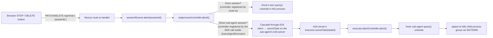
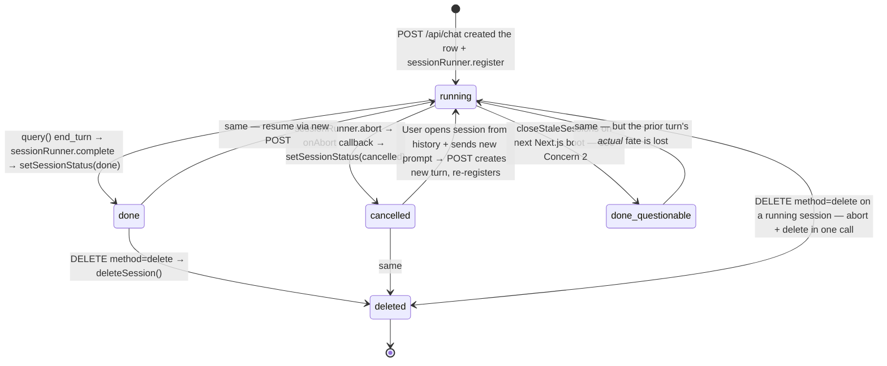
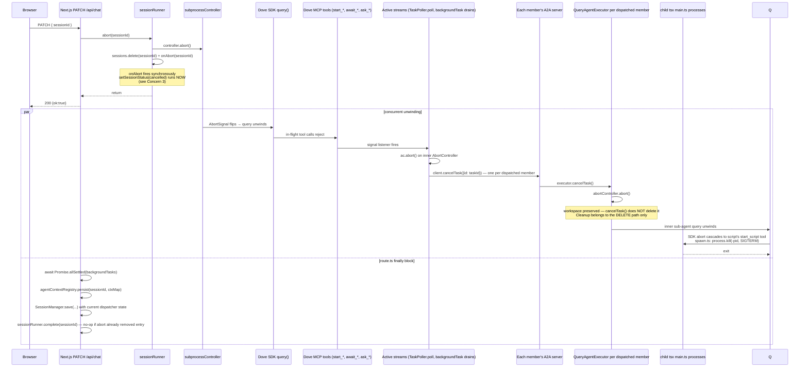
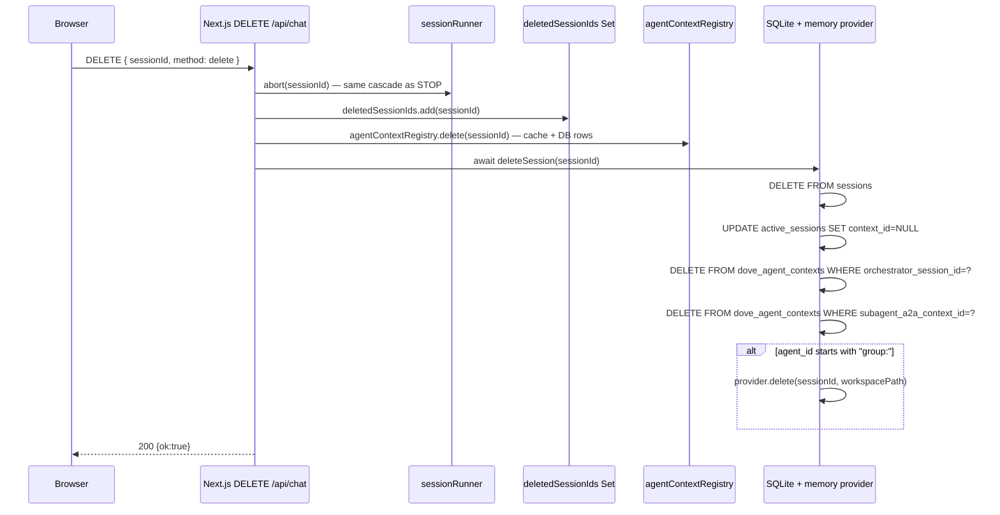
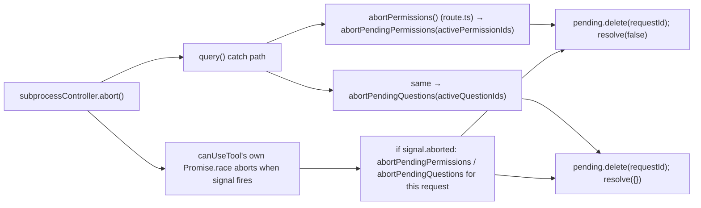
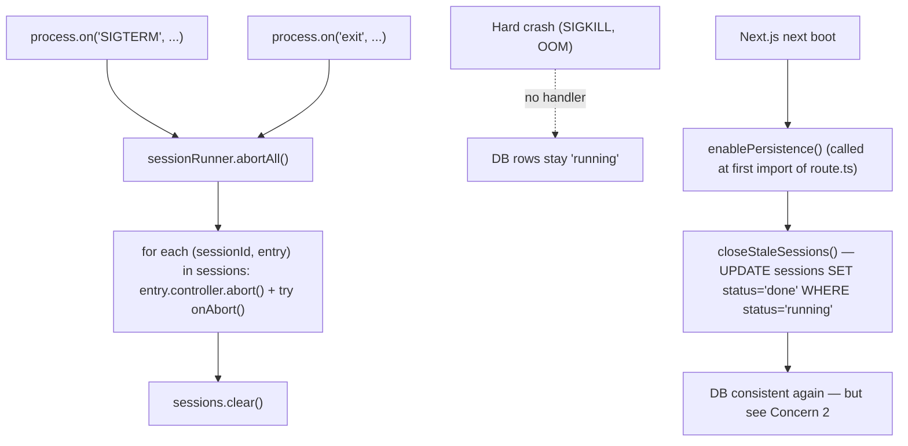

# Spec 11 · Abort Pipeline

How a session ends when it isn't allowed to finish — user-initiated **STOP** vs **DELETE**, Dove vs direct sub-agent chat, plus the SIGTERM/exit paths. End-to-end cascade across the Next.js process and every A2A server it dispatched to.

> **Read with care.** Section 11 ("Bugs / flaws / open concerns") flags things that look wrong in the current code. This spec was written under the **critical-reading rule** — diagrams reflect what the code _does_, not necessarily what is _correct_.

## 1. Two triggers, two intents

| User action                                                                | HTTP                                               | What's supposed to happen                                                                            | Touches                                                                                |
| -------------------------------------------------------------------------- | -------------------------------------------------- | ---------------------------------------------------------------------------------------------------- | -------------------------------------------------------------------------------------- |
| **STOP** (square button on a running session)                              | `PATCH /api/chat { sessionId }`                    | Kill the running subprocess but **preserve** the session so it can be resumed. Status → `cancelled`. | `sessionRunner.abort` only                                                             |
| **DELETE** (trash icon, or pre-emptive delete during a running session)    | `DELETE /api/chat { sessionId, method: "delete" }` | Kill the subprocess AND erase the session row and dove_agent_contexts cascade. Workspace removed.    | `sessionRunner.abort` + `agentContextRegistry.delete` + `deleteSession` + buffer clear |
| **DELETE-as-stop**                                                         | `DELETE /api/chat { sessionId, method: "stop" }`   | Identical to PATCH STOP — alias for legacy callers.                                                  | same as STOP                                                                           |
| **Process SIGTERM / `exit`**                                               | OS signal                                          | Best-effort abort every running session row, then exit.                                              | `sessionRunner.abortAll`                                                               |
| **A2A `client.cancelTask({id})`** (from any inner stream's abort listener) | A2A JSONRPC                                        | Tell the A2A server's executor to abort its own SDK query.                                           | A2A `executor.cancelTask()`                                                            |

## 2. Two abort surfaces, one button

The STOP/DELETE buttons live in the browser. The targeted subprocess may be Dove (Next.js process) or a directly-chatted sub-agent (A2A process). Both paths use the **same** Next.js endpoint — `PATCH/DELETE /api/chat`. The endpoint identifies the session by ID and aborts the right controller; if the controller lives in an A2A process, the SDK-side stream subscription cascades the abort over A2A protocol.

## 3. Session-row state machine

## 4. STOP — full cascade (Dove orchestrator scenario)

## 5. DELETE — full cascade

DELETE is a strict superset of STOP. Everything STOP does, plus three more steps in the route handler **before** the abort actually completes:

In the POST finally block, the `deletedSessionIds.has(cleanupId)` check makes the request handler skip its own SessionManager.save — the row is already gone.

## 6. Process and storage cleanup matrix

Source-of-truth for "what does each operation touch?"

| Operation                               | Subprocess controller aborted | Session row in DB         | Workspace dir | Memory provider | dove_agent_contexts   | session-events buffer | active_sessions.context_id | agentContextRegistry cache |
| --------------------------------------- | ----------------------------- | ------------------------- | ------------- | --------------- | --------------------- | --------------------- | -------------------------- | -------------------------- |
| **PATCH STOP**                          | ✅                            | status → `cancelled`      | ❌ preserved¹ | ❌ untouched    | ❌ preserved          | ❌ kept (60s TTL)     | ❌ preserved               | ❌ preserved               |
| **DELETE method=delete**                | ✅                            | row gone                  | ❌ preserved² | ✅ if group     | ✅ cascaded both ways | ✅ cleared            | ✅ NULL'd                  | ✅ removed                 |
| **DELETE method=stop**                  | ✅                            | status → `cancelled`      | ❌ preserved¹ | ❌ untouched    | ❌ preserved          | ❌ kept               | ❌ preserved               | ❌ preserved               |
| **Session ended normally**              | (n/a — finished)              | status → `done`           | ❌ preserved  | ❌ untouched    | persisted             | kept (60s TTL)        | preserved                  | persisted to DB            |
| **SIGTERM / exit**                      | ✅ best-effort (`abortAll`)   | status untouched here³    | ❌ untouched  | ❌ untouched    | untouched             | untouched             | untouched                  | untouched                  |
| **Next.js boot — `closeStaleSessions`** | (n/a)                         | every `running` → `done`⁴ | untouched     | untouched       | untouched             | gone (new process)    | untouched                  | gone (new process)         |

¹ `cancelTask()` aborts the controller only — workspace is **not** deleted. Resume path is intact.
² `deleteSession` in the DB layer does not touch the workspace directly; workspace cleanup is handled separately per provider (group workspaces only, via `provider.delete`).
³ `closeStaleSessions()` flips them later, not the SIGTERM handler.
⁴ `done`, not `cancelled` — see Concern 2.

## 7. Stop hook + Pending-registry interplay

Spec 01 §5 covers the happy path. On abort:

- The SDK's `query()` rejects with an `AbortError`-ish error. The `query-events` consumer catches it and falls into the error callback in `withMcpQuery`.
- `PendingRegistry` is **not** explicitly drained — entries remain in the per-execution registry until the query rejects. But the registry instance is a closure variable of that execution only; when the execution unwinds, the registry is GC'd.
- The `Stop` hook never fires on abort (only on natural `end_turn`), so the "you have pending operations" reminder is not delivered. This is correct — there's no future turn to remind.

## 8. Permission and question cleanup

Both the route-level cleanup and the per-`canUseTool` cleanup target the same `globalThis.__dovePendingPermissions` / `__dovePendingQuestions` maps. They're idempotent — the second call no-ops on already-resolved entries. The scope is the specific Set of requestIds for this query, never all entries — so cancelling one tab can't deny prompts open in another. ✅

## 9. SIGTERM, exit, and crash recovery

## 10. Group abort — implicit cascade

There is **no explicit "abort the group" path**. When Dove aborts:

1. Dove's `subprocessController.abort()` flips the signal.
2. Every `TaskPoller.start()` in the current turn had `startAgentStream(..., signal, ...)`. `startAgentStream` registered a listener: `signal → ac.abort() + client.cancelTask({id})`.
3. Each dispatched member's A2A task receives `cancelTask`. The A2A server's `activeExecutors.get(taskId)?.cancelTask()` fires.
4. Member's `QueryAgentExecutor.cancelTask` → its own `abortController.abort()` → its inner SDK query unwinds → script process killed.

So group cascade works **by accident** of every member having been started through `startAgentStream` in Dove's signal scope. There is no explicit "for each member in groupMemberCounters, cancel" loop. If a future code path dispatches members without going through `startAgentStream(signal)`, the cascade silently breaks. The `groupMemberCounters` entry stays in the in-memory map and never decrements.

## 11. Bugs / flaws / open concerns

The previous sections describe what the code **does**. This section flags things that look wrong, contradictory, or under-defended. Confidence is graded ★★★ (confirmed bug) → ★ (worth a second look).

### Concern 5 · ★ — `enablePersistence()` is deferred to first POST

`enablePersistence()` is called at module-load time of `chatbot/app/api/chat/route.ts`. Next.js compiles routes lazily; in dev mode, the first POST is when the module loads and `closeStaleSessions` runs. Between server start and the first chat request, the DB still holds the previous process's `running` rows. Any `/api/sessions` list call in that window shows them as running. Click STOP and `sessionRunner.abort(sessionId)` no-ops (the Map is empty in this process), the row stays as 'running' forever — until eventually a POST triggers `closeStaleSessions`.

Fix shape: call from `instrumentation.ts` (Next.js's documented startup hook) so it runs at boot regardless of which route is hit first.

### Concern 6 · ★ — `deletedSessionIds` Set leaks entries

`deletedSessionIds.add(sessionId)` in DELETE; the only `.delete()` call is in the POST finally block when the cleanup path sees the session was deleted. If a session is created+deleted with no in-flight POST (e.g. immediate delete from history view), the entry never leaves. Bounded growth — one entry per delete with no concurrent POST — but unbounded over time.

Fix shape: time-bound the Set entries, or delete in the DELETE handler itself once `deleteSession` has finished (the POST finally check would need an "and the deletion already happened" guard, which is moot since the row is already gone).

### Concern 7 · ★ — STOP does not clear `agentContextRegistry`

DELETE calls `agentContextRegistry.delete(sessionId)`. STOP does not. After a STOP, the user resumes the Dove session with a new turn. `agentContextRegistry.getOrLoad(sessionId)` returns the persisted map. Dove calls `ask_<key>` — the auto-passed `contextId` points to a sub-agent A2A task that was just cancelled.

The A2A server typically accepts a new message on a cancelled context (creates a new task with the same contextId). Whether the agent's `SessionManager` correctly restores from disk vs starts fresh in this scenario is **not covered by an explicit test**; the path exists but its correctness depends on `SessionManager.restore` finding the workspace dir intact — which, per Concern 1, may have been wiped.

Combined effect of Concerns 1 + 7: STOP → resume of Dove session → ask\_\* with auto-resumed contextId → A2A task accepts → `restore` finds no workspace → starts fresh → sub-agent loses its prior conversation history. Silent data loss on resume.

### Concern 8 · ★ — `cancelProcessing(manifestKey)` appears unused

`chatbot/a2a/lib/processing-registry.ts` exports `cancelProcessing(manifestKey)` which aborts ALL taskIds for an agent. No call site found in non-test code. Either:

- Dead code that should be deleted, or
- Intended for an unimplemented "kill all tasks for agent X" UI affordance.

If kept, document the intent; if not, remove (single-purpose utilities tend to bit-rot).

### Concern 12 · ★ — Process-group descendants can escape

`spawn.ts` uses `detached: true` + `process.kill(-pid, "SIGTERM")` — the kill reaches every process in the spawned tsx's group. But any descendant that itself uses `detached: true` and `setsid()` (or equivalent) becomes its own process-group leader and **escapes** the parent's group kill. Current code paths likely don't do this, but the SDK's Bash tool subprocesses, or any future nested `claude` CLI invocation, could.

Verifying takes a small audit of every `spawn()` call reachable from agent scripts. Not done in this spec.

### Concern 9 · ★ — Group abort is implicit, not enforced

Section 10 above: the cascade works only because every member is started through `startAgentStream(signal)`. There is no `groupMemberCounters.forEach(cancel)` loop. A future change that dispatches members via a different code path silently leaks the cascade — the `groupMemberCounters` entry stays in the in-memory Map, the group SSE stream stays open, and the user sees the swimlane hang indefinitely. This is also flagged in ADR-0009.

Fix shape: add an explicit "cancel all members of this group context" pass when Dove aborts inside a group session.

## 12. Things that are well-designed (audit pass found these OK)

- **Per-execution `PendingRegistry`** — never module-global, GC'd with the query closure. Prevents cross-session false-blocking.
- **`subprocessController` ≠ `connectionController`** — browser disconnect closes only the SSE stream; subprocess keeps running as a "background session". Cleanly enables tab switching mid-run.
- **Permission/question abort scope** — `abortPendingPermissions(activePermissionIds)` is a `Set<string>` scoped to this query alone. Cancelling one tab can't deny prompts open in another.
- **`startAgentStream` signal wiring** — abort fires both inner `ac.abort()` AND `client.cancelTask({id})`. Server-side task cancellation is not relied on stream closure alone.
- **`streamCollect` always yields a final snapshot** — drain callers always get a usable `CollectedStream` even for empty or aborted streams.
- **`undici.setGlobalDispatcher` with 0 timeouts** — prevents spurious `SocketError: terminated` mid-stream when a blocking MCP tool runs for many minutes.
- **`deleteSession` cascade to `dove_agent_contexts` in both directions** — no orphans whether the deleted session was the orchestrator or the subagent target.

## Related

- [Spec 01 — Hook injection](01-hook-injection.md) (Stop hook, PendingRegistry)
- [Spec 03 — Orchestrator behaviour](03-orchestrator-behaviour.md) (session lifecycle state diagram, sessionRunner usage in route.ts)
- [Spec 05 — A2A spawn](05-a2a-spawn.md) §11 (process-group SIGTERM)
- [Spec 07 — Group vs single](07-group-vs-single.md) (groupMemberCounters + Concern 9)
- [ADR-0009](../adr/0009-orchestrator-owned-await-chain.md) (group barrier)
