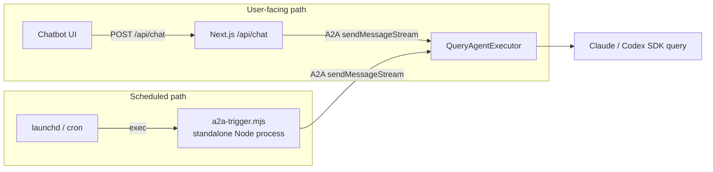
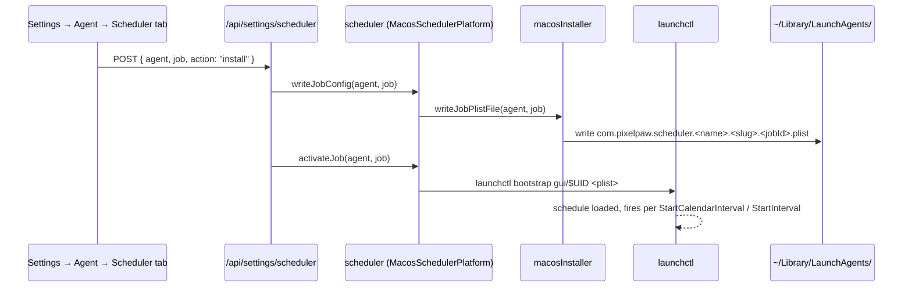
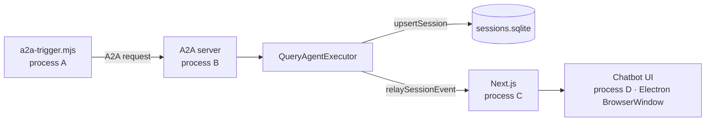
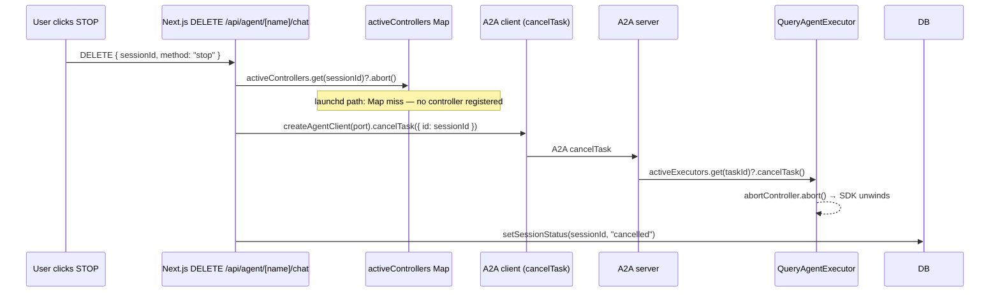
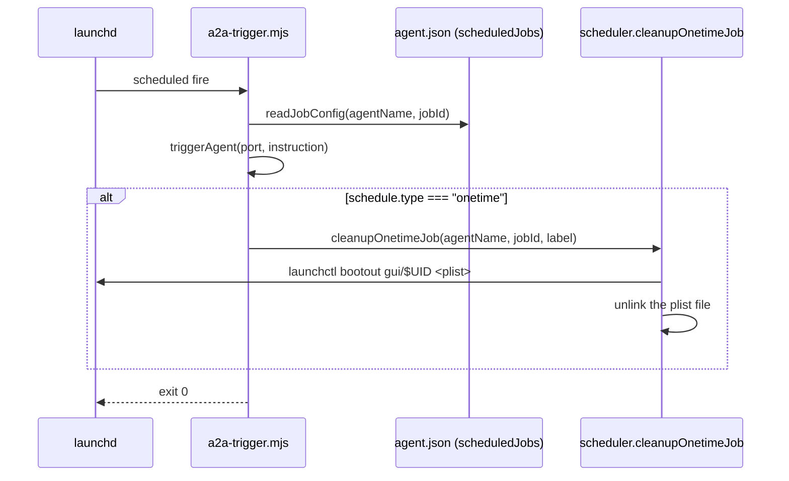

# Spec 12 · Scheduler (launchd / cron)

How DovePaw runs agents on a schedule. The scheduler lives **outside** the three runtime processes (Spec 00) — it's the host OS firing a standalone Node script that then talks to the running A2A server.

> **Why this matters.** Scheduled runs and tool-triggered runs share the same A2A executor but reach it through completely different code paths. STOP, abort, and session resume all behave differently in the scheduled path because the chatbot process is not in the call stack. Misreading this gap is the #1 source of "I clicked STOP and the agent didn't stop" bugs.

## 1. Two trigger paths to the same executor



Both paths land in the same `QueryAgentExecutor.execute()` on the A2A server. The difference: in the user path Next.js holds an `AbortController` registered in `activeControllers[sessionId]`. In the scheduled path **no controller is registered anywhere in Next.js** — `a2a-trigger.mjs` is its own process and never calls `startAgentStream(signal)`.

## 2. Platform strategy

`lib/scheduler.ts` exports a `SchedulerPlatform` interface implemented by two concrete classes:

| Platform | Class                    | Storage                          | Activation                         |
| -------- | ------------------------ | -------------------------------- | ---------------------------------- |
| macOS    | `MacosSchedulerPlatform` | `~/Library/LaunchAgents/*.plist` | `launchctl bootstrap gui/$UID …`   |
| Linux    | `LinuxSchedulerPlatform` | user `crontab` entries           | crontab installs are always active |

The exported `scheduler` constant resolves to whichever platform matches `process.platform` at module load. Every call site uses the abstract interface — no platform branches outside `lib/scheduler.ts`, `lib/macos/`, and `lib/linux/`.

## 3. Agent.json schedule shape

```text
{
  "name": "my-agent",
  "scheduledJobs": [
    {
      "id": "a1b2c3d4",            // 8-char hex, unique per agent
      "label": "Daily standup",    // shown in UI; slug becomes part of launchd label
      "instruction": "Run the daily standup roll-up.",
      "schedule": { … },           // discriminated union, see below
      "runAtLoad": false           // fire immediately on load
    }
  ]
}
```

The schedule is a discriminated union from [`lib/agents-config-schemas.ts`](../../lib/agents-config-schemas.ts):

```text
interval  → { type: "interval", seconds }                      // every N seconds
calendar  → { type: "calendar", hour, minute, weekday? }       // ISO weekday 1=Mon..7=Sun
onetime   → { type: "onetime",  year, month, day, hour, minute }
```

> Legacy: `agent.json` also accepts top-level `schedule` + `runAtLoad`. `scheduledJobs` is the current model — every job gets its own scheduler entry. Treat top-level as deprecated.

## 4. Install flow



For Linux, the `writeJobConfig` step is a no-op — `activateJob` (called via `linuxInstaller.installAgent`) writes the crontab line directly. macOS materialises a plist on disk and `launchctl bootstrap`s it; Linux materialises a crontab entry. `crontab` entries have no separate load step, so `loadAgent` / `unloadAgent` are no-ops on Linux.

## 5. Trigger script — `a2a-trigger.mjs`

The plist/cron entry invokes a single deployed script:

```bash
exec '<node>' '/Users/<you>/.dovepaw/cron/a2a-trigger.mjs' '<manifestKey>' '<agentName>' '[jobId]'
```

Source: [`lib/a2a-trigger.ts`](../../lib/a2a-trigger.ts), bundled to `~/.dovepaw/cron/a2a-trigger.mjs` by `npm run install`.

Responsibilities, in order:

1. Read `~/.dovepaw/.ports.<port>.json` (where `<port>` defaults to `DOVEPAW_PORT=7473`) to resolve the agent's A2A server port.
2. If a `jobId` is given, look up `scheduledJobs[id].instruction` from the agent's `agent.json` and use it as the A2A message body.
3. Call `startAgentStream(port, instruction)` from [`lib/a2a-client.ts`](../../lib/a2a-client.ts) — **without a signal argument**.
4. Iterate the SSE stream to completion. Exit `0` on `completed`, `1` otherwise.
5. For one-time jobs, call `scheduler.cleanupOnetimeJob()` after firing — unloads the plist and removes the file (macOS) or removes the crontab entry (Linux).

Every scheduled run is tagged with `DOVEPAW_SCHEDULED=1` in the environment block of the plist / crontab entry. Agent code can branch on this to differentiate scheduled invocations from tool-triggered ones.

## 6. Session ownership



For a scheduled run there are **four distinct OS processes**:

- A — `a2a-trigger.mjs` (launchd child, dies when the run finishes)
- B — the agent's A2A server (long-lived, started by `npm run chatbot:servers`)
- C — Next.js (long-lived, the chatbot HTTP server)
- D — the Electron BrowserWindow (long-lived UI)

A holds the SSE consumer end of the A2A stream. B owns the actual executor. C is not in the call stack — its `activeControllers` map (the `sessionRunner` registry from Spec 11) **never sees the session**.

Consequence: the session shows up in the UI (it's in the DB via `upsertSession`), and any STOP from the UI hits Next.js — but the controller it would abort lives in process A, not C. Next.js has to call `client.cancelTask({ id })` directly via A2A to reach B.

## 7. STOP / abort behaviour for scheduled sessions



This is the post-fix shape. Before [Spec 11 Concern 1 was fixed](11-abort-pipeline.md), the DELETE handler only checked `activeControllers` — a miss meant the abort was silently a no-op and the agent ran to completion despite the UI saying "cancelled". The current DELETE handler always issues an A2A `cancelTask` so the executor is reached regardless of which path started the session.

`/api/sessions/all` (clear-all-history) follows the same pattern: it iterates `getRunningSessions()` from the DB and issues `cancelTask` for each before deleting rows.

## 8. Onetime job cleanup



The trigger script self-cleans only onetime jobs. Interval/calendar jobs stay loaded for their next firing. Cleanup is best-effort — failures log but do not block exit.

## 9. Plist labels and file naming

```text
Primary agent plist:     com.pixelpaw.scheduler.<agentName>
Job plist:               com.pixelpaw.scheduler.<agentName>.<labelSlug>.<jobId>
                         or com.pixelpaw.scheduler.<agentName>.<jobId>     (no label)
```

The label slug is `slugifyJobLabel(label)` — lowercase, non-alphanum collapsed to `-`. The `jobId` is the schema's 8-char hex, ensuring uniqueness even when two jobs share the same label.

## 10. Deployed artefacts under `~/.dovepaw/cron/`

```text
~/.dovepaw/cron/
├── a2a-trigger.mjs                — bundled trigger script (single source for all agents)
├── node_modules/
│   ├── @a2a-js/sdk/               — A2A client SDK
│   ├── undici/                    — required by @a2a-js/sdk for streaming fetch
│   └── uuid/                      — A2A message IDs
└── <agentName>.mjs                — bundled agent code (when needed by main.ts agents)
```

`deployTriggerScript()` from [`lib/installer.ts`](../../lib/installer.ts) runs once at install time. `copyNativePackages` deploys the SDK plus its peers. Note that the trigger script is **not** rebuilt on every agent change — only when the trigger source itself changes, which is rare.

## 11. Cron-specific quirks (Linux)

- `interval.seconds` is rounded to nearest minute (minimum 1) when generating the cron expression. Sub-minute intervals are not supported.
- `onetime.year` is **ignored** in crontab generation — crontab has no year field, so a onetime job fires annually on its month/day. The year is preserved in agent.json for display only; the calling code is expected to also call `cleanupOnetimeJob` after the first firing to prevent re-runs in subsequent years.
- ISO weekday (`1..7`, Mon..Sun) is mapped to cron weekday (`0..6`, Sun..Sat) by `% 7`.
- Linux activation has no separate load step; `loadAgent` / `unloadAgent` are intentional no-ops.

## 12. macOS-specific quirks

- All plists are user-scope (`~/Library/LaunchAgents/`) — never `/Library/LaunchDaemons/`. `getUid()` resolves the current user's numeric UID for `launchctl bootstrap gui/$UID …`.
- `RunAtLoad` defaults to `false` — set per job to fire immediately on load.
- `ProcessType` is `Interactive` so the job is treated as user-foreground work (priority and resource policies).
- The shell invocation is `/bin/zsh -l -c "<cmd>"` so `~/.zshrc` initialisation (asdf, node version) runs before the trigger script.

## 13. Bugs / flaws / open concerns

The previous sections describe what the code **does**. This section flags things that look wrong, contradictory, or under-defended.

### Concern 1 · ★ — Onetime jobs fire annually on Linux without explicit cleanup

`toCronExpression` for `onetime` returns `<minute> <hour> <day> <month> *` — no year field. The `cleanupOnetimeJob` call in `a2a-trigger.mjs` (after the first firing) is the only thing preventing re-firing next year. If that cleanup fails (e.g., crontab write permission lost between fire-and-clean), the job will fire again exactly one year later. macOS has the same logical issue but `StartCalendarInterval` also lacks a Year field — same exposure.

### Concern 2 · ★ — `a2a-trigger.mjs` exits before the A2A task fully terminates

The trigger iterates the SSE stream until it sees a final `status-update`. After that it `process.exit(state === "completed" ? 0 : 1)`. The A2A server has likely written final state by then, but any post-final cleanup the executor does (workspace teardown, persistence flush) races against process exit. In practice harmless, but means the launchd `lastExitCode` does not reflect the agent's own outcome — only whether the A2A task reached a terminal state.

### Concern 3 · ★ — Trigger script bypasses Next.js DB hooks

Scheduled sessions hit the A2A server directly. Next.js never sees the start of the session — it only knows about it via the DB row that `QueryAgentExecutor` writes through the persistence interface. So any Next.js-side instrumentation (analytics, error reporting, observability) misses scheduled runs by default unless it polls the DB.

## Related

- [Spec 00 — Topology](00-topology-overview.md) — three-process picture
- [Spec 05 — A2A spawn](05-a2a-spawn.md) — how `QueryAgentExecutor` ends up running the script
- [Spec 08 — Plugin lifecycle](08-plugin-lifecycle.md) §6 — scheduler integration in the install flow
- [Spec 11 — Abort pipeline](11-abort-pipeline.md) — STOP cascade, why scheduled sessions used to escape it
