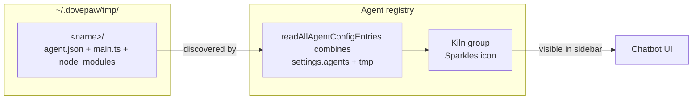
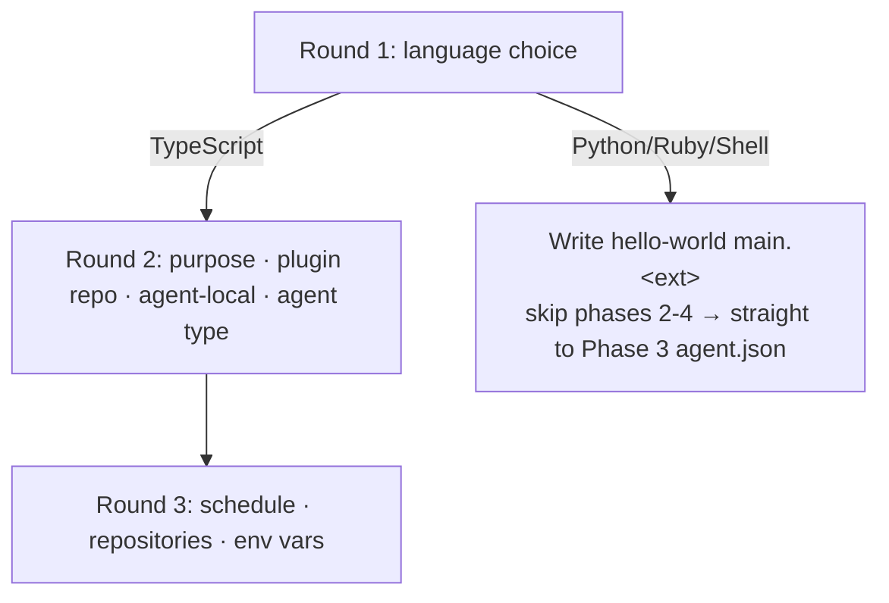
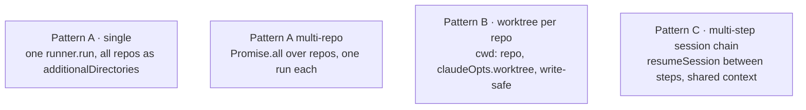

# Spec 13 · Sub-Agent Builder Skill

The `/sub-agent-builder` skill is the canonical way to scaffold a new DovePaw agent. It produces a runnable agent in `~/.dovepaw/tmp/<name>/` that appears immediately in the Kiln sidebar group, then optionally publishes it to a plugin repo. This spec documents the workflow so reviewers and contributors know what to expect when reading skill output, and so anyone maintaining the skill itself has a single map of how its phases fit together.

> **Why this matters.** New agents are the most common form of "user code" added to DovePaw at runtime. The skill is the only entry point that gets every required artefact correct — agent.json schema, SDK linkage, Kiln visibility, spawning pattern, security mode. Bypassing it (writing the files by hand) is the most common cause of agents that load partially or fail silently.

## 1. Phases at a glance

```mermaid
flowchart TB
  Start([User: "/sub-agent-builder &lt;hint&gt;"]) --> P1
  P1[Phase 1 · Requirements gathering<br/>language, type, schedule, repos, env vars] --> P2
  P2[Phase 2 · Source files<br/>main.ts and modules per SOLID split] --> P3
  P3[Phase 3 · agent.json<br/>schema fields, icon, suggestions] --> P4
  P4[Phase 4 · Skill body<br/>SKILL.md if Static/Dynamic Skill type] --> P5
  P5[Phase 5 · Integration check<br/>read-back, lint, confidence score] -->|score &ge; 90| P6
  P5 -- score &lt; 90 --> P2
  P6[Phase 6 · Publish<br/>Kiln → plugin repo, git push, npm run install] --> Done([Agent registered in registry])
```

Each phase is a separate markdown file under `.claude/skills/sub-agent-builder/steps/`. The SKILL.md frontmatter declares a `Stop` hook (`hooks/quality-gate.js`) that parses the Phase 5 confidence score and blocks Stop until `confidence >= 90`. That gate is why Phase 5 is non-optional even when the user just wants a "quick" agent — there is no escape valve.

## 2. Where new agents live before publish — the Kiln group



`~/.dovepaw/tmp/<name>/agent.json` is enough to register an agent. The registry helper `readAllAgentConfigEntries()` ([Spec 08](08-plugin-lifecycle.md)) merges permanent agents from `~/.dovepaw/settings.agents/` with the tmp ones; tmp entries always win on name collision. A2A servers pick them up the next time `npm run chatbot:servers` boots.

There is no "draft" or "staging" mode. The moment `agent.json` lands in tmp, the agent is real — it can be invoked from chat, scheduled, linked to other agents. Refreshing the chatbot page is enough to see it in Kiln.

## 3. Round-by-round question flow (Phase 1)



`AskUserQuestion` is used because each round is dependent on the previous (the type chosen in R2 determines whether Phase 4 even runs). The skill explicitly never silently picks options — every branching choice is surfaced.

> The "language" gate at R1 is significant: non-TypeScript agents lose access to `@dovepaw/agent-sdk` (runner, worktrees, `publishStatusToUI`). The skill warns about this before continuing.

## 4. Agent types

```mermaid
classDiagram
  class Simple {
    main.ts only
    Inline prompt &lt; 15 lines
    Single runner.run()
  }
  class StaticSkill {
    main.ts thin launcher
    skills/&lt;name&gt;/SKILL.md
    Skill("/&lt;name&gt; ${INSTRUCTION}")
  }
  class DynamicSkill {
    main.ts pre-fetches runtime data
    Temp skill written + run + deleted
    Only when data must structurally embed
  }
  class Stateful {
    Lock file + state dir
    Mutual exclusion via flock
    Designed for recurring schedules
  }
```

The skill enforces these as distinct templates (`references/template-*.md`) so structural mistakes (e.g. inline-prompting a 50-line task, or pre-fetching CI logs in `main.ts`) are caught at scaffold time. The Static Skill type is the recommended default for anything multi-phase.

## 5. Spawning patterns — chosen explicitly, never inferred

Every TypeScript agent must pick one of four spawning patterns ([Spec 05](05-a2a-spawn.md) backs the actual A2A → `tsx` → SDK flow). The skill presents them as previewed options:



The skill rule is: **never silently choose**. The user is asked which fits, with one recommended default derived from the agent's purpose. Pattern B is the only safe choice when the agent writes to repos (Claude Code manages the worktree lifecycle, the skill never calls `git worktree add/remove`).

Alongside the spawning pattern, the user is asked:

- **Claude permission mode** — `default` / `acceptEdits` (recommended for most agents) / `bypassPermissions`. This maps to the Spec 02 mode strategy applied for this agent's runs.
- **Codex sandbox mode** — only asked when the agent's `model` is `gpt-*`. Choices: `workspace-write` or `danger-full-access`. Codex does not support worktrees, so the skill steers agents that need worktree isolation back to the Claude runner.

## 6. agent.json fields touched by the skill (Phase 3)

The schema is in [`lib/agents-config-schemas.ts`](../../lib/agents-config-schemas.ts) (`agentConfigEntrySchema`). The skill fills:

| Field                                 | Source                                          | Notes                                                                                             |
| ------------------------------------- | ----------------------------------------------- | ------------------------------------------------------------------------------------------------- |
| `name`                                | user (kebab-case)                               | also becomes the dir name `~/.dovepaw/tmp/<name>/`                                                |
| `alias`                               | user (2–3 chars)                                | used for workspace dir name `<alias>-<taskId8>`                                                   |
| `displayName`                         | user                                            | shown in sidebar and Dove suggestion grid                                                         |
| `description`                         | user                                            | the MCP tool description Dove uses when deciding to call `ask_/start_/await_*`                    |
| `personality`                         | user (1–3 sentences, 2nd person)                | replaces the generic "You are one of Dove's mice…" opening                                        |
| `schedulingEnabled` / `scheduledJobs` | Phase 1 R3                                      | absent or `false` for on-demand; populated for interval/calendar — see [Spec 12](12-scheduler.md) |
| `repos` (UUIDs)                       | Phase 1 R3 multi-select against `settings.json` | resolved at spawn time to actual paths in `REPO_LIST` env var                                     |
| `envVars`                             | Phase 1 R3                                      | every entry needs `{ id, key, value, isSecret }` — **missing `id` silently drops the agent**      |
| `iconName` / `iconBg` / `iconColor`   | Phase 3                                         | drawn from `references/agent-registration.md` palette                                             |
| `doveCard`                            | skill                                           | title + description + starter prompt for Dove's intro grid                                        |
| `suggestions` (exactly 3+1)           | skill                                           | fixed order: "How does it work?", "Last run logs", "Run the agent", "What does it need?"          |
| `pluginPath`                          | **not set** in tmp                              | added by Phase 6 when copying to the plugin repo                                                  |

> **Invisible coupling.** `envVars[].id` is the most common silent-fail point: Zod's `agentConfigEntrySchema` drops entries without `id`, which means the whole agent file fails validation and the agent disappears from the Kiln group with no error. The skill generates a fresh UUID per entry.

## 7. node_modules bootstrap (end of Phase 3)

After writing `agent.json`, the skill creates a symlink so the agent can resolve the SDK at runtime:

```text
~/.dovepaw/tmp/<name>/node_modules/@dovepaw/agent-sdk → ~/.dovepaw/sdk
```

`~/.dovepaw/sdk` is the deployed SDK source ([`packages/agent-sdk/`](../../packages/agent-sdk/)) — same one used by published plugin agents. Skipping this step is the second-most common failure mode after missing `envVars[].id`.

## 8. Integration check (Phase 5) — the confidence gate

```mermaid
flowchart LR
  P5[Phase 5 reads each created file back] --> CHECK[Manual checklist:<br/>placeholders, SDK reuse, spawning, runner opts, ids]
  CHECK -->|fix issues| CHECK
  CHECK --> SCORE[Emit JSON line:<br/>'{"confidence": N, "issues": [...]}']
  SCORE --> HOOK[Stop hook · quality-gate.js<br/>parses last JSON line]
  HOOK -- confidence &ge; 90 --> ALLOW[Allow Stop]
  HOOK -- confidence &lt; 90 --> BLOCK[Block Stop with reason]
```

The Stop hook is in [`hooks/quality-gate.js`](../../.claude/skills/sub-agent-builder/hooks/quality-gate.js). It parses the LAST `{"confidence": N, …}` JSON line emitted by the skill. The skill is expected to emit the score only after all known issues are resolved — so the score reflects post-fix state, not initial state.

## 9. Publish flow (Phase 6)

```mermaid
sequenceDiagram
  participant Skill
  participant TMP as ~/.dovepaw/tmp/&lt;name&gt;/
  participant PLUGIN as &lt;plugin-repo&gt;/agents/&lt;name&gt;/
  participant MANIFEST as &lt;plugin-repo&gt;/dovepaw-plugin.json
  participant GIT as plugin repo git
  participant DP as DovePaw

  Skill->>PLUGIN: mkdir agents/&lt;name&gt;/
  Skill->>PLUGIN: cp main.ts + agent.json (set pluginPath)
  Skill->>MANIFEST: append "&lt;name&gt;" to agents[]
  Skill->>GIT: git add + commit + push
  Skill->>TMP: rm -rf — drops from Kiln
  Skill->>DP: prompt: npm run install + restart servers
```

The `pluginPath` field is added at publish time, not in tmp. That's the field DovePaw uses to resolve the agent's source directory ([Spec 08 §3](08-plugin-lifecycle.md)). Once tmp is removed, the agent exits the Kiln group; on next `npm run chatbot:servers` it appears under its plugin's accordion in the sidebar instead.

> The skill does **not** call `npm run install` itself — it prompts the user to. This is deliberate: install runs scheduler config writes, plist deployment, and SDK redeploy, which the user may want to defer.

## 10. Cross-cutting rules the skill enforces

These are spelled out across phase 1 / 2 instructions but worth surfacing in one place since reviewers see their consequences in PRs:

- **`INSTRUCTION` is never parsed.** `main.ts` reads `process.argv[2]`, passes it to the runner as plain text, never splits/regexes/extracts. Multi-target work is discovered from `REPO_LIST` or external APIs.
- **Always provide both `claudeOpts` AND `codexOpts`** in every `runner.run()` call. The runner picks one based on `AGENT_SCRIPT_MODEL`; if only one is supplied, switching models leaves the new runner unconfigured (no permission mode, no sandbox). This is an invisible-coupling trap the skill closes by template.
- **`AGENT_WORKSPACE` is always fresh.** It is recreated empty per run — never assume anything persists. Long-lived state goes under `agentPersistentStateDir()`.
- **No `REPO_LIST` in `agent.json` envVars.** It is auto-injected by the executor from the `repos` field. Adding it manually causes a double-injection that produces malformed paths.

## 11. Bugs / flaws / open concerns

### Concern 1 · ★★ — Skill is the only path to a correctly-registered agent

There is no "agent linter" that can be run independently — the only validation a hand-authored `agent.json` gets is Zod parse failure at registry-read time, which silently drops the agent rather than reporting _why_. A user who copy-pastes from another agent and forgets `envVars[].id` will see no agent and no error message; the only feedback channel is "it's not in Kiln." A linter that reports the dropped reason on registry read would close this.

### Concern 2 · ★ — Templates can drift from the live SDK

`references/template-*.md` are markdown templates the skill substitutes into. When `@dovepaw/agent-sdk` adds or renames an export (e.g. `publishStatusToUI` was renamed at one point), the templates are not automatically updated. Phase 2 mitigates by telling the LLM to read `~/.dovepaw/sdk/src/index.ts` for the current export list — but a stale template can still emit a deprecated symbol that compiles today and breaks at next SDK release. A snapshot test that builds every template against the live SDK would catch this.

### Concern 3 · ★ — Tmp agents survive uninstall

Removing a plugin removes everything under `~/.dovepaw/plugins/<plugin>/` and the relevant entries in `settings.agents/`. Tmp agents are unaffected — they live in `~/.dovepaw/tmp/`. A user testing an agent that they later abandon will see it lingering in the Kiln group across DovePaw restarts. A "clean tmp" action in Settings would be the smallest UI addition that addresses this.

## Related

- [Spec 03 — Orchestrator behaviour](03-orchestrator-behaviour.md) — how Dove discovers and calls a new agent via `ask_/start_/await_*`
- [Spec 05 — A2A spawn](05-a2a-spawn.md) — what happens when `main.ts` is actually spawned by the A2A server
- [Spec 08 — Plugin lifecycle](08-plugin-lifecycle.md) — registry, `pluginPath`, fresh-install seeding, the `~/.dovepaw/tmp` group
- [Spec 12 — Scheduler](12-scheduler.md) — what `scheduledJobs` in `agent.json` actually configures
