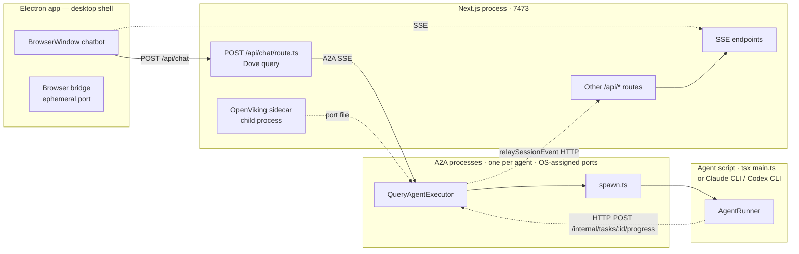

# DovePaw Architecture Specs

End-to-end specifications for the major runtime flows in DovePaw. Each spec covers a single concern in depth, with multiple Mermaid diagrams (flow / sequence / state / class as appropriate) and cross-links to related specs.

> **Scope.** This is a description of how the code works _today_ (commit at time of writing). For the _why_ behind a decision, follow the linked ADR (`docs/adr/`). For tactical change history, see git log.

---

## Reading order

| #   | Spec                                                          | What it covers                                                                                                  |
| --- | ------------------------------------------------------------- | --------------------------------------------------------------------------------------------------------------- |
| 0   | [Topology overview](00-topology-overview.md)                  | The three-process picture (Electron · Next.js · A2A), data dirs, and how everything talks                       |
| 1   | [Hook injection](01-hook-injection.md)                        | SessionStart / UserPromptSubmit / PreToolUse / PostToolUse / Stop wiring, reminder layers, determinism gates    |
| 2   | [Security & permission guardrails](02-security-guardrails.md) | Mode strategies (read-only / supervised / autonomous), 2-layer disallow gate, browser↔A2A permission round-trip |
| 3   | [Orchestrator behaviour](03-orchestrator-behaviour.md)        | Dove vs sub-agent orchestrator, ask/start/await trios, the orchestrator-owned await chain                       |
| 4   | [Handoff pattern](04-handoff-pattern.md)                      | Strategies (chat / review / escalation), justification gate, score windows, the links-reminder loop             |
| 5   | [A2A spawn → child process](05-a2a-spawn.md)                  | Dynamic ports, executor → spawn.ts → script, env sanitation, progress relay back                                |
| 6   | [Memory management](06-memory-management.md)                  | MemoryProvider interface, OpenViking sidecar lifecycle, markdown fallback, group moments                        |
| 7   | [Group vs single agent mode](07-group-vs-single.md)           | `start_group_*`, topology fallback (ADR-0010), shared workspace, member completion counter                      |
| 8   | [Plugin lifecycle & agent registry](08-plugin-lifecycle.md)   | `dovepaw-plugin.json`, symlinked agent.json, fresh-install seeding, sync/update, scheduler                      |
| 9   | [Agent links & canvas routing](09-agent-links-canvas.md)      | Link topology storage, transitive BFS, the canvas geometry helpers                                              |

---

## Process boundaries (one-screen recap)

**Key invariant.** The Next.js process owns the browser-facing SSE. A2A processes never publish SSE directly — they go through `relaySessionEvent` over HTTP loopback (see [ADR-0004](../adr/0004-a2a-to-chatbot-event-relay-via-http.md)).

---

## Cross-cutting glossary

| Term                | Lives in                            | Meaning                                                                                       |
| ------------------- | ----------------------------------- | --------------------------------------------------------------------------------------------- |
| `manifestKey`       | `AgentDef`                          | Underscore-form agent name, used in MCP tool names: `ask_<key>`, `start_<key>`, `await_<key>` |
| `runId`             | `start_script_*` / `await_script_*` | UUID for one _child-process_ execution of an agent script (inside an A2A process)             |
| `taskId`            | A2A protocol                        | UUID for one _A2A task_ — wraps a query() sub-agent inside an A2A process                     |
| `contextId`         | A2A protocol                        | Session ID for an agent — multiple taskIds across turns share one contextId                   |
| `groupContextId`    | `start_group_*`                     | UUID per group-chat session — also keys group SSE stream and member counter                   |
| `PendingRegistry`   | `chatbot/lib/pending-registry.ts`   | Per-execution registry of outstanding `await_*` operations; powers Stop hook                  |
| `senderAgentId`     | A2A metadata                        | `"dove"` or sub-agent name. **Undefined ⇒ direct user chat ⇒ mini-orchestrator mode**         |
| `isGroupMode`       | `QueryAgentExecutor` flag           | Switches reminder text, disables peer-tool injection, enables moment-save hook                |
| `additionalContext` | SDK hook output                     | String injected as `<system-reminder>` block — only delivery channel for reminders            |

---

## How to navigate

Every spec ends with a **Related** section that lists the other specs (and ADRs) most often co-changed with it. If a change touches more than one concern (e.g. "add a new MCP tool that needs a hook gate"), open every spec it cross-links and verify each invariant still holds.
